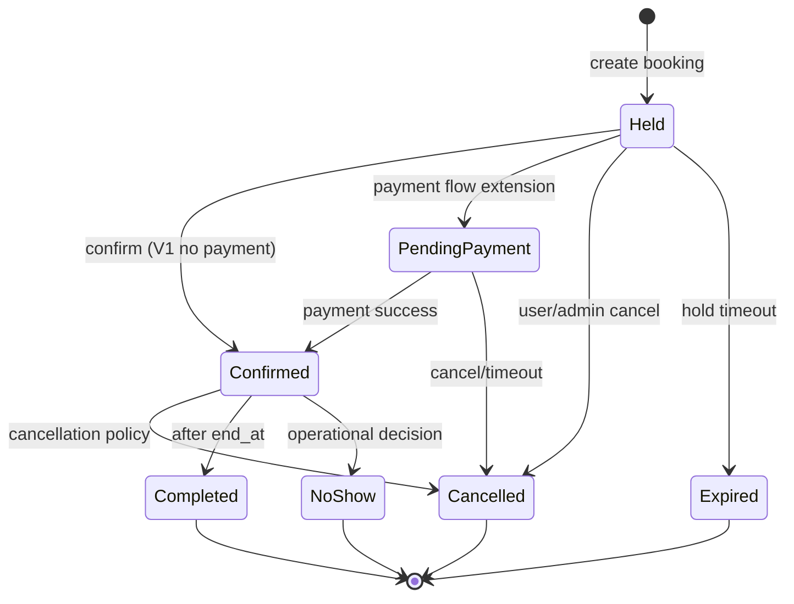
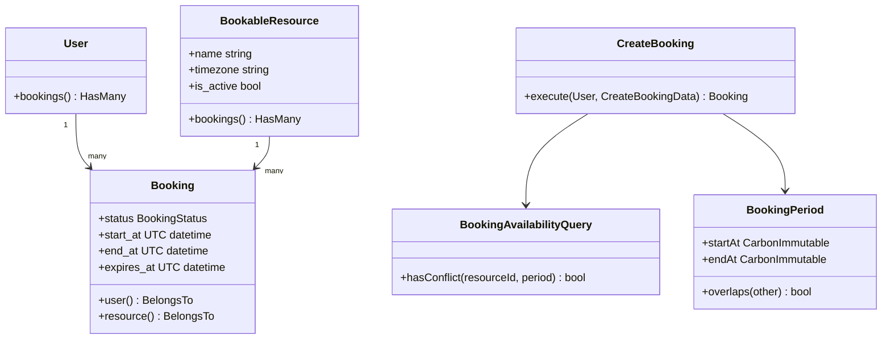
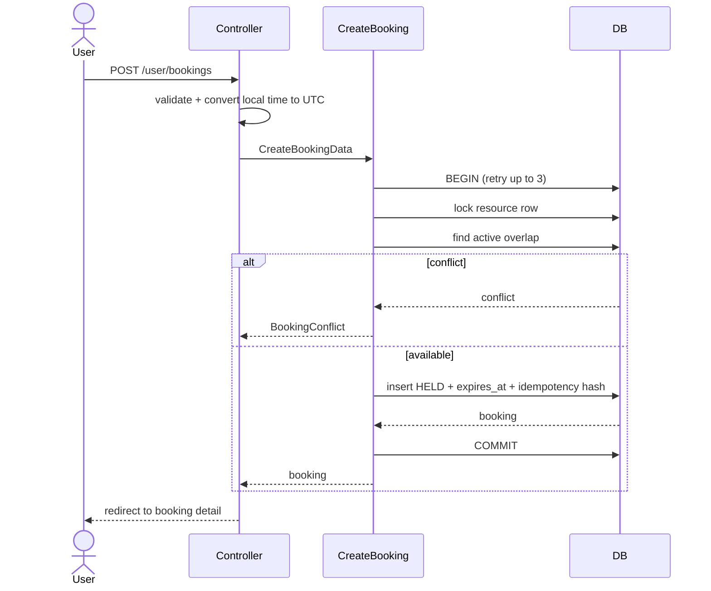

# Booking module implementation

Tài liệu này mô tả implementation booking theo `laravel-booking-architecture-implementation-playbook.md` trong Laravel Blade hiện tại. Module được triển khai như một bounded context trong modular monolith, không thay đổi stack Blade/Tailwind hiện hữu.

## 1. Phạm vi đã triển khai

- `BookableResource`: tài nguyên có thể đặt, soft delete, active flag và timezone.
- `Booking`: lịch đặt theo period nửa mở `[start_at, end_at)`.
- User UI: xem tài nguyên, tạo hold, xác nhận, hủy và xem lịch sử.
- Admin UI: nhóm sidebar `Booking`, CRUD tài nguyên và màn hình theo dõi/hủy booking.
- Concurrency: transaction + `lockForUpdate()` trên resource trước khi check overlap.
- Idempotency: unique `(user_id, idempotency_key)` và hash payload để retry an toàn.
- Expiry: command `booking:expire-holds`, scheduler mỗi phút.
- Authz: policy giới hạn owner/admin ở boundary HTTP.

Payment provider, webhook, outbox và notification chưa được giả lập. Confirm hiện hoàn tất booking trực tiếp cho V1 không-payment; khi thêm payment, transition này phải chuyển thành `held -> pending_payment -> confirmed` trong một adapter riêng.

## 2. Cấu trúc module

```text
app/
├── Booking/
│   ├── Actions/        # use case và transaction boundary
│   ├── Data/           # input contract cho use case
│   ├── Enums/          # state machine
│   ├── Exceptions/     # lỗi domain
│   ├── Models/         # Booking aggregate persistence model
│   ├── Policies/       # authorization của booking
│   ├── Queries/        # read model/query object
│   └── ValueObjects/   # BookingPeriod
├── Http/Controllers/User/
└── Models/BookableResource.php
```

Controller chỉ chuyển HTTP input thành DTO và map lỗi domain thành validation error. Query object chỉ select cột cần dùng và eager-load quan hệ cần render, tránh N+1.

## 3. State machine



Chỉ `held`, `pending_payment`, `confirmed` chiếm resource. Hold đã quá `expires_at` không còn tạo conflict; command expiry cập nhật trạng thái để dữ liệu lịch sử phản ánh đúng.

## 4. UML class diagram



## 5. Sequence tạo booking



## 6. Business logic và lý do tồn tại

### `CreateBooking`

Đây là transaction boundary duy nhất của thao tác tạo. Resource bị lock trước khi check overlap để hai request cùng resource không cùng vượt qua check rồi insert. Redis không được dùng làm source of truth.

```php
$resource = BookableResource::query()
    ->whereKey($data->resourceId)
    ->where('is_active', true)
    ->lockForUpdate()
    ->firstOrFail();

if ($this->availability->hasConflict($resource->id, $data->period)) {
    throw new BookingConflict(...);
}
```

### `BookingPeriod`

Period dùng UTC và overlap strict:

```php
$start < $otherEnd && $end > $otherStart;
```

Vì vậy `10:00–11:00` và `11:00–12:00` không conflict. Đây là quy ước phải giữ nguyên trong query, test và báo cáo.

### Transition actions

`ConfirmBooking`, `CancelBooking` và `ExpireBooking` đều lock lại booking trong transaction và đọc raw value rồi convert về enum. Cách này làm rõ contract với PHPStan, đồng thời không cho phép state bị thay đổi giữa lúc đọc và ghi.

### Idempotency

Payload hash ngăn việc dùng lại cùng key cho period khác. Cùng user + cùng key + cùng hash trả lại booking cũ; request khác payload trả lỗi. Đây là cơ chế chống double-click/retry mạng, không phải cơ chế chống gian lận.

## 7. Database/index

`bookings` có các index:

- `(resource_id, status, start_at, end_at)` cho overlap query.
- `(user_id, created_at)` cho lịch sử user.
- `(status, expires_at)` cho expiry command.
- unique `(user_id, idempotency_key)` cho retry.

Trên MySQL production cần chạy `EXPLAIN` với dữ liệu thực tế. Nếu workload lớn, kiểm tra optimizer có dùng composite index cho `resource_id + status` hay không; không tạo index riêng cho mọi cột vì tăng chi phí write.

## 8. HTTP/UI routes

```text
GET    /user/resources
GET    /user/bookings
GET    /user/bookings/create
POST   /user/bookings
GET    /user/bookings/{booking}
POST   /user/bookings/{booking}/confirm
PATCH  /user/bookings/{booking}/cancel
GET    /admin/bookings
```

User sidebar dùng layout riêng `x-layouts.user`, không expose user-management/admin navigation. Admin sidebar có group Booking riêng để theo dõi dữ liệu vận hành.

UI dùng semantic token (`bg-card`, `border-border`, `text-muted-foreground`, `bg-primary`, `bg-destructive`), label rõ ràng cho input và progressive enhancement: form vẫn hoạt động khi JavaScript chưa tải.

## 9. Edge cases

- `start_at >= end_at`: Form Request và `BookingPeriod` từ chối.
- Quá khứ/quá xa: action áp dụng lead time và booking horizon từ `config/booking.php`.
- Resource inactive/đã soft delete: validation và query không cho chọn; action kiểm tra lại.
- Overlap đồng thời: resource row lock + transaction retry.
- Hold hết hạn trước confirm: trạng thái chuyển `expired`, UI nhận validation error.
- Hủy lặp lại: idempotent nếu đã `cancelled`; terminal state khác bị từ chối.
- Xác nhận lặp lại: idempotent nếu đã `confirmed`.
- Retry cùng idempotency key: cùng payload trả booking cũ; payload khác bị từ chối.
- Guest truy cập: route group `auth` redirect về login.
- User xem booking của người khác: policy trả 403.
- Delete user: `user_id` nullable và `nullOnDelete()` giữ lịch sử booking.
- Cùng thời điểm sát boundary: half-open interval cho phép booking liền kề.

## 10. Chạy và deploy

```bash
php artisan migrate
php artisan booking:expire-holds
php artisan schedule:work

# seed 4 resource mẫu, có thể chạy lặp an toàn theo slug
php artisan db:seed --class=BookableResourceSeeder

# kiểm tra chất lượng
php artisan test --compact
vendor/bin/phpstan analyse --memory-limit=512M --debug
vendor/bin/pint --dirty --format agent
npm run lint
npm run build
```

Production nên đặt `BOOKING_HOLD_MINUTES`, `BOOKING_MINIMUM_LEAD_MINUTES`, `BOOKING_MAXIMUM_HORIZON_DAYS` trong environment, chạy scheduler duy nhất qua server/worker có lock phân tán, và giám sát số hold hết hạn, conflict rate, deadlock/retry và latency của overlap query.

## 11. Việc cần làm khi mở rộng

1. Thêm `Payment` + webhook idempotency, không gọi external API bên trong transaction.
2. Thêm outbox/event sau commit cho notification và audit.
3. Thêm integration concurrency trên MySQL production-like, không chỉ SQLite.
4. Bổ sung policy cancellation deadline nếu nghiệp vụ yêu cầu.
5. Chạy `EXPLAIN ANALYZE` theo cardinality thật trước khi thay đổi index.
6. Thêm retention policy cho booking/audit theo yêu cầu pháp lý và vận hành.
