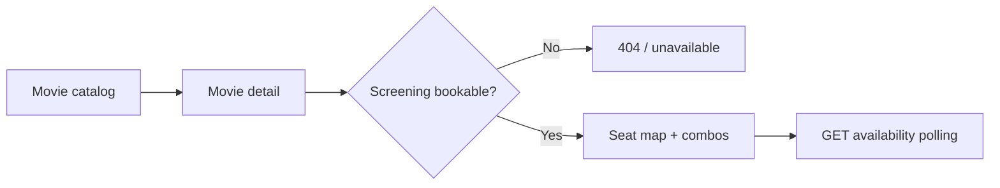
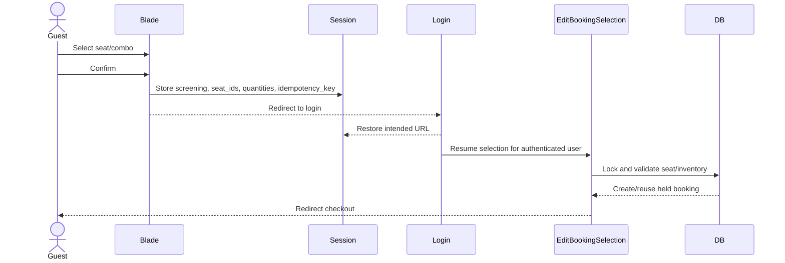
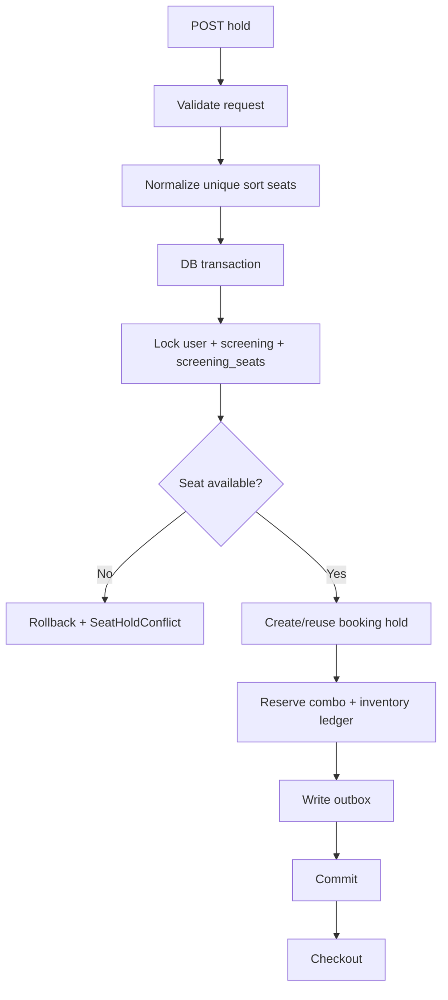
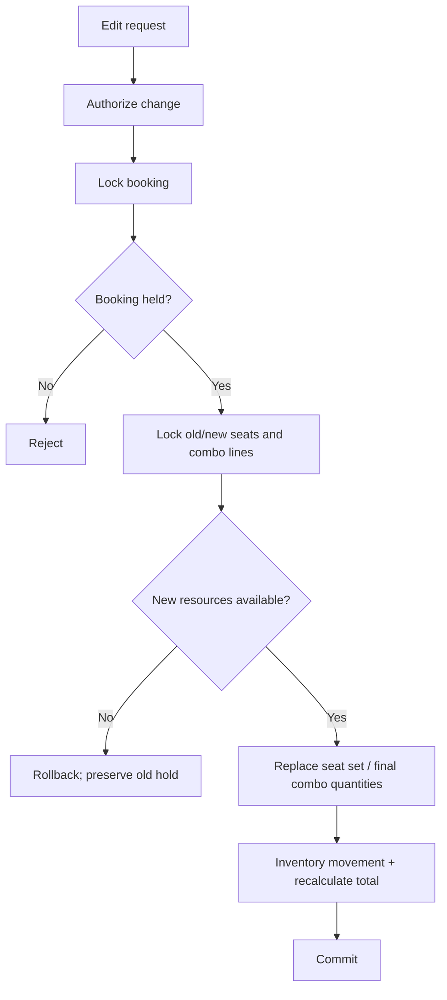
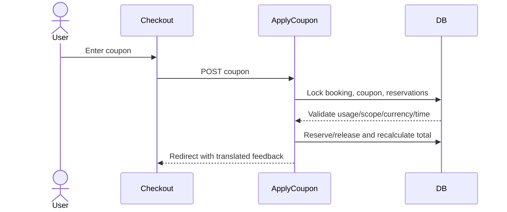
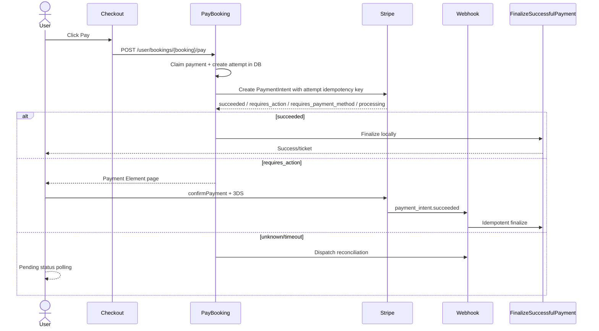
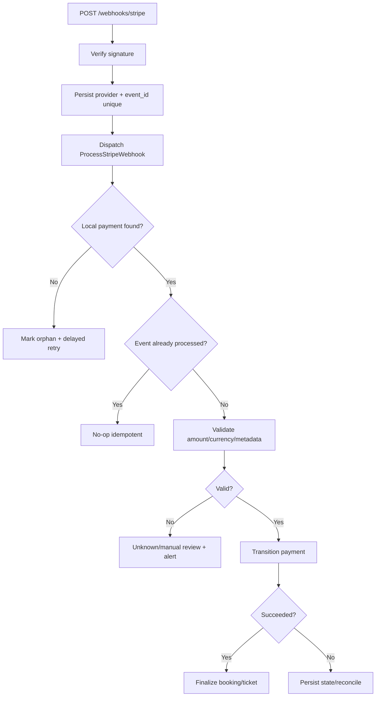
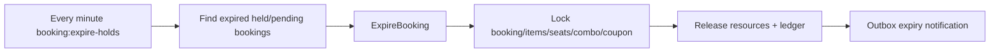
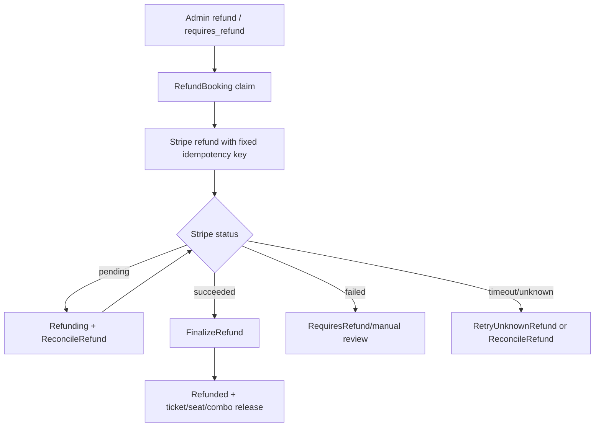

# 02 — Flow từng luồng booking

Mỗi flow bên dưới có entrypoint, code owner, trạng thái, lỗi quan trọng và điểm test cần kiểm tra.

## 1. Browse movie → seat map

**Entry points**

- `GET /movies` — `routes/web.php:17` → `MovieController@index`.
- `GET /movies/{movie:slug}` — `routes/web.php:18` → `MovieController@show`.
- `GET /movies/{movie:slug}/showtimes/{screening}` — `routes/web.php:22` → `MovieController@screening`.

`ScreeningPageQuery` tải movie, room, screening seats, active hold của user và concessions: `app/Queries/Catalog/ScreeningPageQuery.php:24-48`.

## 2. Guest chọn ghế → login → resume hold

**Entry points**

- `POST /movies/{movie}/showtimes/{screening}/hold` — `routes/web.php:27-30`.
- `GET /user/cinema/hold/resume` — `routes/user.php:21`.

Code: `MovieController::hold()` `app/Http/Controllers/MovieController.php:143-177`; guest session `:151-164`; resume `:179-225`. Frontend selection/modal: `resources/js/modules/seat-picker.js:250-438`.

Failure cases:

- Login bỏ dở: không tạo booking.
- Ghế bị user khác lấy: giữ nguyên dữ liệu session, trả validation conflict.
- Combo hết hàng khi resume: rollback toàn bộ resume, không tạo booking một phần.
- Resume lặp: idempotency key không tạo duplicate.

## 3. Hold ghế trực tiếp của user

Code owner: `HoldSeats.php:24-151`; public/user wrappers: `MovieController::hold()` and `User\ScreeningController::hold()`.

## 4. Edit seat và combo

**Seat edit**: public seat page submit lại hold route; **combo edit**: `POST /user/bookings/{booking}/combos` (`routes/user.php:44-45`).

Code: `EditBookingSelection.php:36-119`, `SyncBookingConcessions.php:23-136`, controller `BookingConcessionController.php:31-61`.

## 5. Checkout và coupon

Checkout view: `resources/views/user/bookings/checkout.blade.php:1-196`.

Coupon button và payment button là hai submit intent khác nhau. Payment JS chỉ disable `[data-payment-submit]`; code `resources/js/modules/booking.js:38-63` dùng `event.submitter` để không disable nhầm coupon.

## 6. Pay → PaymentIntent → 3DS

Code:

- Claim/charge: `PayBooking.php:37-255`.
- Provider REST call/idempotency: `app/Support/Payment/StripePaymentGateway.php:20-70`.
- Payment action view: `BookingPaymentController.php:24-43` and `resources/views/user/bookings/payment-action.blade.php`.
- Stripe.js confirmation/polling: `resources/js/modules/payment-status.js:2-154`.
- Webhook: `ProcessStripeWebhook.php:44-314`.

## 7. Webhook delayed/duplicated/orphan

Code: `StripeWebhookController`, `IngestStripeWebhook`, `ProcessStripeWebhook.php:56-198`; replay command `app/Console/Commands/ReplayStripeWebhooks.php`.

## 8. Expiry

Frontend countdown chỉ là UX (`resources/js/modules/booking.js:9-53`). Server expiry vẫn là authority. Các payment state `requires_action`, `requires_payment_method`, `unknown` không được giữ ghế vô hạn; expiry command phải xử lý TTL độc lập.

## 9. Refund và reconciliation

Code: `RefundBooking.php`, `FinalizeRefund.php`, `ProcessStripeWebhook::handleRefundWebhook()` `:201-274`, `ReconcileRefund.php:23-90`, `RetryUnknownRefunds.php`.

## 10. Check-in ticket

1. Signed ticket URL kiểm tra signature/TTL.
2. Check-in admin authorize permission.
3. Lock ticket/payment/booking.
4. Reject refunded/refunding ticket.
5. Chỉ `issued -> checked_in` một lần.

Code: `app/Actions/Ticketing/CheckInTicket.php`, `app/Http/Controllers/Admin/TicketController.php`, route `routes/admin.php:50`.

## 11. Scheduler và queue vận hành

| Tác vụ | Tần suất | Code |
|---|---:|---|
| Expire holds | 1 phút | `routes/console.php:14` |
| Publish outbox | 1 phút | `routes/console.php:15` |
| Reconcile payment | 1 phút | `routes/console.php:16` |
| Recover stuck payment | 1 phút | `routes/console.php:17` |
| Alert anomalies | 5 phút | `routes/console.php:18` |
| Retry refunds | 5 phút | `routes/console.php:19` |
| Booking reminder | 1 phút | `routes/console.php:20` |

Development stack hiện chạy scheduler/queue qua `DevCommands::artisan()` tại `routes/console.php`; Stripe CLI vẫn cần webhook forward riêng nếu không có public endpoint.
