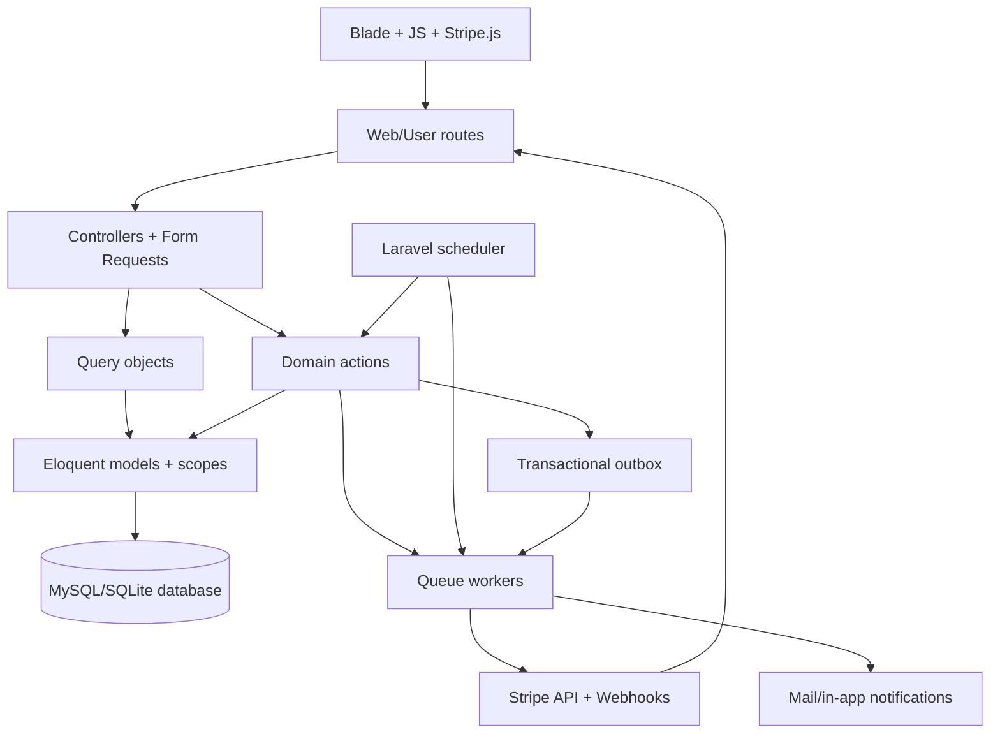
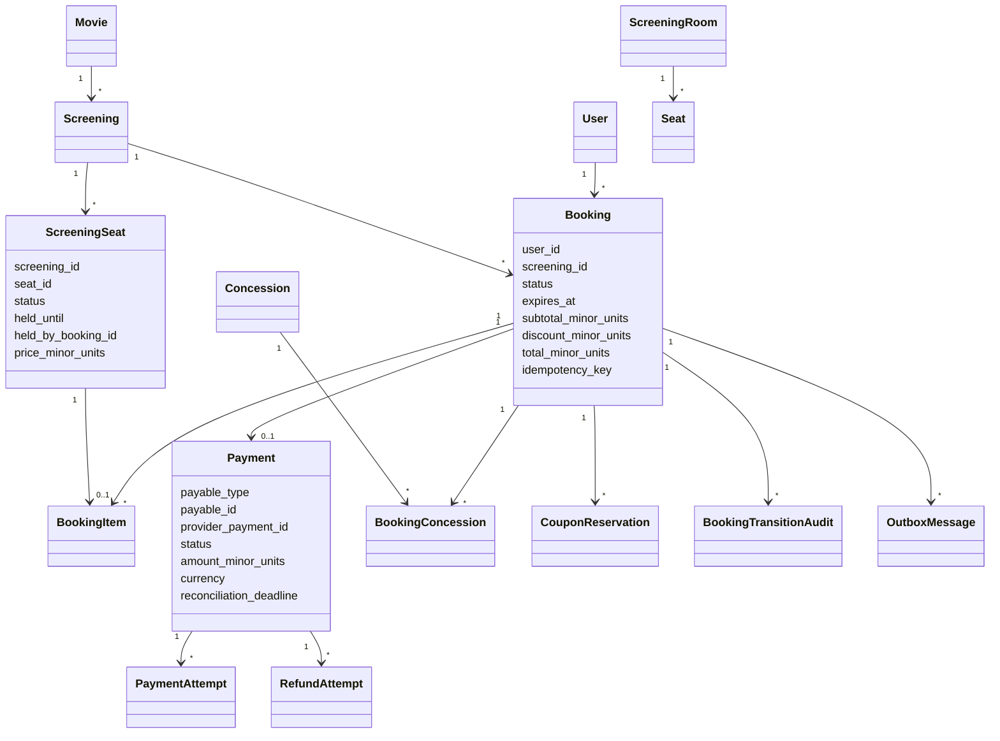
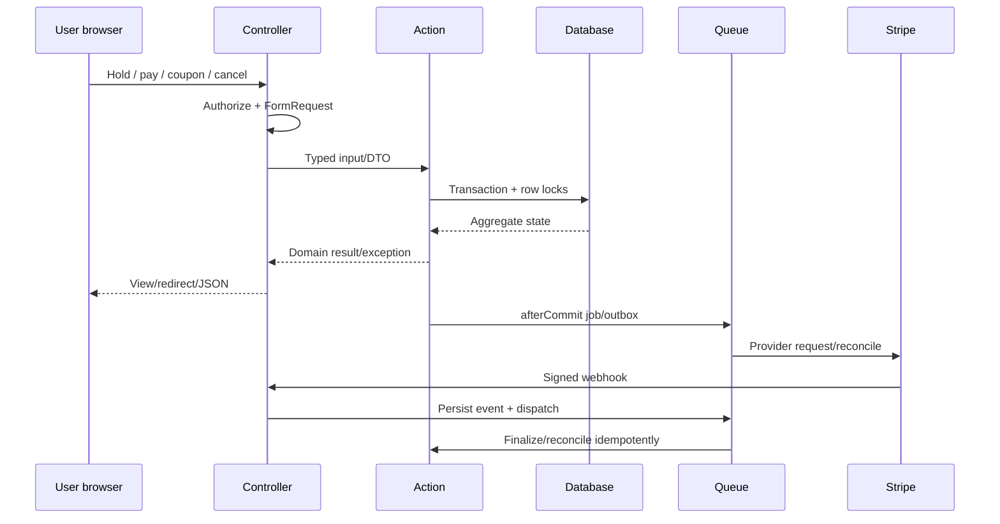
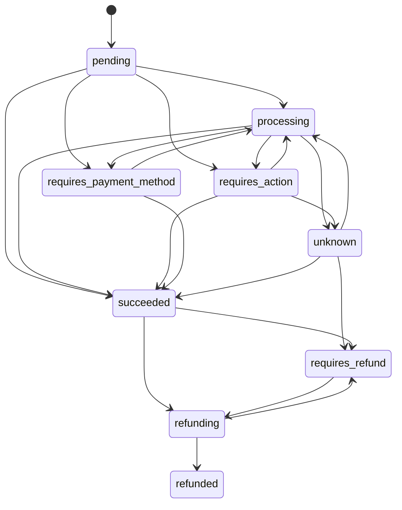

# 04 — Kiến trúc tổng thể, flow chart và UML

## 1. Tổng quan kiến trúc

Hệ thống là modular monolith Laravel. Booking là orchestration context; catalog, commerce, inventory, payment và infrastructure sở hữu invariant riêng.



## 2. Code boundary

```text
app/
├── Actions/
│   ├── Booking/Checkout|Lifecycle|Payment
│   ├── Commerce/Concessions|Coupons
│   ├── Payment
│   └── Ticketing
├── DTO/Booking
├── Enums/
│   ├── Booking|Catalog|Commerce|Ticketing
│   ├── Inventory
│   ├── Payment
│   └── Infrastructure
├── Http/
│   ├── Controllers/Admin|User + public MovieController
│   ├── Requests
│   └── Middleware
├── Jobs/
├── Models/
│   ├── Booking|Catalog|Commerce
│   ├── Inventory|Payment|Infrastructure
│   └── User
├── Policies/Booking
├── Queries/Booking|Catalog|Commerce
└── Support/Booking|Payment
```

Boundary rules:

- Controller: authorize, validate, call query/action, return view/redirect/JSON.
- Query: read-only, eager loading/selected columns/payload.
- Action: mutation, transaction, lock, idempotency, state invariant.
- Job: at-least-once, idempotent handler, retry/backoff.
- Model scope: reusable query predicate, no side effect.
- Provider adapter: Stripe REST only; không quyết định booking lifecycle trực tiếp.

## 3. UML domain class



Database schema source: `database/migrations/2026_09_10_130001_create_movie_domain_schema.php:1-400`, `130002_create_inventory_domain_schema.php`, `130007_create_payment_domain_schema.php:1-130`.

## 4. Booking sequence UML



## 5. Payment state UML



Implementation: `app/Enums/Payment/PaymentStatus.php`, `app/Enums/Payment/PaymentAttemptStatus.php`, `app/Actions/Payment/TransitionPayment.php`.

## 6. Deployment/runtime topology

### Local

```text
composer run dev
├─ php artisan dev
│  ├─ Laravel HTTP server
│  ├─ schedule:work
│  └─ queue:work --tries=3 --timeout=90
└─ npm run dev:stripe
   └─ stripe listen --forward-to http://127.0.0.1:8000/webhooks/stripe
```

Script source: `composer.json:scripts.dev`, `package.json:scripts.dev:stack`, `routes/console.php:22-23`.

### Production

- HTTP workers xử lý request.
- Queue worker xử lý webhook, reconciliation, outbox và notification.
- Một scheduler leader chạy các command định kỳ.
- MySQL/PostgreSQL phải hỗ trợ transaction/row lock đúng production engine.
- Stripe Dashboard webhook endpoint hoặc relay ổn định; không phụ thuộc Stripe CLI local.

## 7. Availability data contract

Public screening availability response:

```json
{
  "seats": {
    "101": {
      "available": true,
      "owned_by_current_booking": false
    }
  },
  "concessions": {
    "5": {
      "stock": 4,
      "selected": 0,
      "max": 4
    }
  },
  "availability_version": "sha256...",
  "server_now": "2026-09-14T...+07:00"
}
```

Endpoint: `routes/web.php:24-26`; implementation `MovieController@availability` and `ScreeningAvailabilityQuery`; response `Cache-Control: no-store`.

Booking combo availability contract tương tự nhưng `selected` lấy từ booking hiện tại: `routes/user.php:43`, `BookingConcessionController.php:21-35`.

