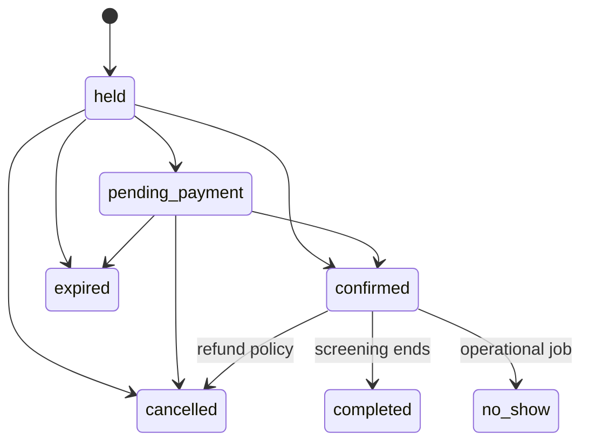

# Movie booking architecture

Tài liệu chuẩn cho developer, QA và operator của hệ thống đặt vé phim. Booking không còn là đặt một resource theo khoảng thời gian; `Booking` là order nhiều vé cho một `Screening`, còn inventory cạnh tranh nằm ở từng `ScreeningSeat`. Behavior được mô tả bên dưới là implementation hiện tại; mục `Future work` không phải tính năng đã triển khai.

## 1. Boundary và cấu trúc mã nguồn

```text
app/
├── Models/
│   ├── Infrastructure/
│   │   └── OutboxMessage.php       # generic transactional outbox
│   ├── Payments/
│   │   ├── Payment.php              # shared payable payment record
│   │   └── PaymentWebhookEvent.php
│   └── Cinema/
│       ├── Booking.php              # cinema order aggregate
│       ├── BookingTransitionAudit.php
│       ├── Movie.php
│       ├── ScreeningRoom.php
│       ├── Seat.php
│       ├── Screening.php
│       ├── ScreeningSeat.php       # inventory row, source of truth
│       ├── BookingItem.php          # ticket seat-specific
│       ├── ScreeningPrice.php
│       ├── Concession.php
│       └── BookingConcession.php
├── Actions/
│   ├── Booking/                    # hold, pay, cancel, expire, refund
│   └── Cinema/                     # schedule, combo, check-in
├── Queries/Cinema/                 # read/report queries
├── Http/Controllers/Cinema/        # public read-only storefront
├── Http/Controllers/User/          # authenticated customer actions
└── Support/{Cinema,Payment,Booking}/
```

### Vì sao Booking nằm trong Cinema?

Tên Booking nghe có vẻ dùng chung, nhưng aggregate hiện tại phụ thuộc trực tiếp vào screening, ScreeningSeat, ticket code, QR, check-in và quy tắc hold ghế. Đưa nó ra app/Models/Booking.php làm developer dễ tưởng đây là order chung cho mọi sản phẩm. Vì vậy booking phim thuộc namespace App\\Models\\Cinema\\Booking; các action workflow hiện tại vẫn ở Actions/Booking để giữ namespace use-case ổn định, nhưng chỉ được gọi bởi flow cinema.

Blog không cần booking. Ecommerce nên có App\\Models\\Commerce\\Order và OrderItem, không tái sử dụng Cinema Booking. Nếu sau này có subscription hoặc event reservation, tạo aggregate riêng thay vì thêm nullable foreign keys vào Cinema Booking.

Payment đã tách thành capability dùng chung dưới App\\Models\\Payments và dùng payable_type/payable_id, nên ecommerce có thể thanh toán Order mà không phụ thuộc bảng bookings. OutboxMessage là infrastructure model, không thuộc cinema/payment; payload phải chứa aggregate type/id và event version ổn định.

Resource cũ (`BookableResource`) và flow đặt period đã được loại khỏi runtime. Migration lịch sử vẫn giữ để database đã migrate có thể nâng cấp; migration cuối `remove_legacy_resource_booking_schema` xoá bảng resource và các cột legacy khỏi schema hiện tại.

## 2. Model và quan hệ

```mermaid
classDiagram
    User "1" --> "many" Booking
    Movie "1" --> "many" Screening
    ScreeningRoom "1" --> "many" Seat
    ScreeningRoom "1" --> "many" Screening
    Screening "1" --> "many" ScreeningSeat
    Seat "1" --> "many" ScreeningSeat
    Screening "1" --> "many" Booking
    Booking "1" --> "many" BookingItem
    ScreeningSeat "1" --> "0..1" BookingItem
    Booking "1" --> "0..1" Payment
    Booking "1" --> "many" BookingConcession
    Concession "1" --> "many" BookingConcession
    Booking "1" --> "many" BookingTransitionAudit
    Movie { int id; string title; string slug; int duration_minutes; bool is_active }
    Screening { int id; int movie_id; int screening_room_id; datetime starts_at; datetime ends_at; enum status; int base_price_minor_units }
    Seat { int id; int screening_room_id; string row_label; int seat_number; enum seat_type; int price_minor_units }
    ScreeningSeat { int id; int screening_id; int seat_id; enum status; uuid hold_token; datetime held_until; int price_minor_units }
    Booking { int id; int user_id; int screening_id; enum status; int total_minor_units; string idempotency_key }
    BookingItem { int id; int booking_id; int screening_seat_id; string ticket_code; enum status; string qr_token_hash }
```

Một `Seat` là ghế vật lý trong phòng. `ScreeningSeat` là bản materialized của ghế cho từng suất, vì vậy mỗi suất có trạng thái và giá độc lập. Không kiểm tra availability bằng `Seat` hoặc cache; luôn khóa `ScreeningSeat`.

## 3. Luồng nghiệp vụ

```mermaid
sequenceDiagram
    actor Guest
    participant Web as Public storefront
    participant Auth as Auth
    participant Hold as HoldSeats
    participant DB as Database
    participant Pay as PaymentGateway
    participant Outbox as Outbox worker

    Guest->>Web: Browse movie/showtime/seat map
    Guest->>Web: Submit selected seat IDs
    Web->>Auth: Require login at hold boundary
    Web->>Web: Store screening, seats and idempotency in session
    Auth-->>Web: Redirect to authenticated resume endpoint
    Auth->>Hold: Authenticated user + seat IDs + idempotency key
    Hold->>DB: BEGIN; lock user, screening, seats ordered by seat_id
    DB-->>Hold: available rows or conflict
    Hold->>DB: Create held Booking + BookingItems
    Hold->>DB: COMMIT
    Guest->>Pay: Pay order
    Pay->>DB: Charge with provider idempotency key
    Pay->>DB: Lock order/seats; mark confirmed/sold; issue tickets
    Pay->>Outbox: booking.paid / ticket.issued
    Outbox-->>Guest: Email notification (at-least-once)
```

### Hold và concurrency

1. Request bắt buộc `seat_ids` và `idempotency_key`, giới hạn tối đa 10 ghế.
2. Action khóa user để serialize retry cùng user, khóa screening, rồi khóa các seat theo thứ tự tăng dần để giảm deadlock.
3. Hold hết hạn được giải phóng trong transaction khi có request hoặc bởi scheduler.
4. Unique `(screening_id, seat_id)` bảo vệ inventory không nhân bản.
5. Availability conflict trả lỗi nghiệp vụ; không retry vô hạn ở HTTP layer.

SQLite chỉ phù hợp kiểm tra logic. Cần chạy multi-process integration test trên MySQL/PostgreSQL để xác nhận lock/deadlock behavior production.

### Payment, refund và ticket

- Fake gateway được dùng khi chưa có Stripe secret; Stripe gateway dùng PaymentIntent/provider idempotency.
- Chỉ payment thành công mới chuyển seat `held -> sold`, order `pending_payment/held -> confirmed` và cấp ticket code.
- Webhook kiểm tra signature và event idempotency; không tin redirect từ client.
- Refund gọi gateway trước; sau khi thành công mới transaction cập nhật payment/order/items và trả inventory/combo theo policy.
- QR chứa signed verification URL có TTL, token hash lưu trong database; check-in khóa ticket và chỉ cho `issued -> checked_in` một lần.

### Cancellation và trạng thái



Mọi transition phải đi qua domain action và `Booking::transitionTo()`. Controller không được mass-assign status. Quyền xem order/ticket không bị chặn sau giờ chiếu; cancellation deadline chỉ áp dụng cho cancel unpaid (`held`/`pending_payment`) và được kiểm tra trong `BookingPolicy`. Đã check-in thì không refund tùy tiện. Cancel độc lập chỉ áp dụng cho `held` và `pending_payment`; booking đã thanh toán phải đi qua Refund: gateway refund thành công trước, sau đó transaction mới mark payment/ticket refunded, release seat/combo và chuyển order sang cancelled.

## 4. Public và user UI

```text
GET  /                         landing
GET  /movies                   public movie catalog
GET  /movies/{movie:slug}      movie detail + showtimes
GET  /showtimes/{screening}   public seat map
POST /showtimes/{id}/hold    public boundary; guest state lưu session
GET  /user/cinema/hold/resume authenticated resume sau login
GET  /user/bookings            customer order history
GET  /user/tickets/{ticket}    QR ticket
```

Guest được xem/chọn ghế bằng UI; seat selection chỉ là client state và phải được revalidate server-side. Khi guest submit, screening, seat IDs và idempotency key được lưu trong session; sau login endpoint resume tiếp tục hold một lần. Nếu ghế đã bị lấy trong lúc login, user nhận conflict và quay lại seat map. `x-layouts.storefront` phục vụ catalog/seat map, `x-layouts.user` phục vụ lịch sử order/ticket, admin layout phục vụ vận hành rạp. Movie detail hiển thị available/total; seat map hiển thị cùng summary. `ScreeningSeat::isAvailableForSelection()` coi hold có `held_until <= now` là available trên read UI; mutation vẫn lock và release row trong `HoldSeats`.

## 5. Pricing và inventory

- Tiền dùng integer minor units, currency uppercase ISO code.
- Giá ticket snapshot tại `ScreeningSeat.price_minor_units` và `BookingItem.price_minor_units`.
- Giá VIP/couple có thể override theo `ScreeningPrice`; giá hiện tại không được làm thay đổi order cũ.
- Combo snapshot quantity/unit/total ở `BookingConcession`; stock lock trong `AddConcessions`.
- Với capacity nhiều hơn 1, mô hình hiện tại đã materialize từng ghế; không dùng counter tổng để tránh oversell.

## 6. Seed và vận hành

```bash
php artisan migrate
php artisan db:seed
php artisan booking:expire-holds
php artisan app:outbox-publish
php artisan schedule:work
```

`CinemaSeeder` tạo phim, phòng, ghế thường/VIP, suất chiếu, combo, order paid có QR và order held. Seeder dùng `updateOrCreate`, nhưng dữ liệu order demo chỉ tạo một lần cho user `user@gmail.com`.

Production cần Redis/SQS cho queue, shared cache cho scheduler, Stripe webhook secret, worker outbox, alert dead-letter, structured logs và metrics cho hold conflict, payment failure, refund, check-in, queue lag và booking latency.

## 7. Invariants và trust boundary

Các quy tắc sau phải được giữ nguyên khi mở rộng code:

- Một cặp `screening_id + seat_id` chỉ có một `screening_seats` nhờ unique index.
- Chỉ `ScreeningSeat` là nguồn sự thật về inventory. Không quyết định availability bằng `Seat`, số đếm ở UI hoặc cache.
- Client không được quyết định user, giá, currency, trạng thái screening hay quyền sở hữu booking.
- Tiền dùng integer minor units; ticket, seat và combo đều lưu giá snapshot.
- Mọi mutation booking phải qua action và transaction; không mass-assign `status` trong production flow.
- Retry phải idempotent: hold theo `user_id + idempotency_key + idempotency_hash`, webhook theo provider/event ID, refund theo payment status.
- Public chỉ đọc catalog/seat map. Ownership được kiểm tra ở Form Request và Policy; admin route được bảo vệ bởi admin middleware.

Trust boundary quan trọng là: browser -> Laravel HTTP -> domain action -> database/payment provider -> webhook/outbox. Không tin redirect payment, hidden input giá, hoặc trạng thái disabled của HTML.

## 8. Bảng dữ liệu và ownership

| Bảng | Owner và ý nghĩa | Bảo vệ dữ liệu |
|---|---|---|
| `movies` | Catalog phim, slug public | unique slug, active index, soft delete |
| `screening_rooms` | Phòng và timezone business | unique code |
| `seats` | Ghế vật lý của phòng | unique room/row/number |
| `screenings` | Suất chiếu, UTC start/end, giá cơ sở | room/time và movie/time indexes |
| `screening_seats` | Inventory ghế theo suất | unique screening/seat, status/held_until indexes |
| `bookings` | Order của user | screening, status, totals, idempotency fields |
| `booking_items` | Ticket từng ghế | ticket code và QR hash unique |
| `payments` | Payment một-một với booking | provider payment ID unique |
| `booking_concessions` | Combo snapshot theo order | unique booking/concession |
| `payment_webhook_events` | Deduplicate webhook | unique provider/event ID |
| `outbox_messages` | Side effect sau commit | attempts, available/published/failed timestamps |
| `booking_transition_audits` | Audit trạng thái | from/to, actor, reason |

Không xóa room/seat đã được dùng bởi screening nếu foreign key restrict không cho phép; dữ liệu lịch sử phải giữ để đối soát ticket và report.

## 9. HTTP contract và thư mục theo flow

```text
GET    /                         landing
GET    /movies                   public catalog
GET    /movies/{movie:slug}      movie detail + showtime summary
GET    /showtimes/{screening}   public seat map + available/total
POST   /showtimes/{id}/hold     guest/auth hold boundary
GET    /user/cinema/hold/resume authenticated resume từ session
GET    /user/bookings            order history của user
GET    /user/bookings/{booking}  order/ticket detail của owner
POST   /user/bookings/{id}/pay  payment của owner
PATCH  /user/bookings/{id}/cancel unpaid cancel của owner
POST   /admin/bookings/{id}/refund admin refund
POST   /admin/tickets/check-in  admin check-in
POST   /webhooks/stripe          signed provider callback
```

Controller chỉ làm HTTP orchestration: authorize, nhận validated input, gọi action, map exception và trả response. Business write nằm trong `app/Actions`; read nằm trong controller/query tương ứng. `resources/views/cinema` là public storefront, `resources/views/user` là dashboard/order/ticket, `resources/views/admin` là vận hành.

## 10. Nghiệp vụ chi tiết và edge cases

### Guest resume

Guest có thể xem và chọn ghế mà chưa login. Selection chỉ nằm trên browser cho đến khi submit. Server validate lại seat IDs, lưu `screening_id`, seat IDs và idempotency key vào session rồi redirect login. Endpoint resume dùng `session()->pull`, do đó dữ liệu chỉ được dùng một lần. Nếu login kéo dài, suất hết hạn hoặc ghế đã bị user khác giữ, hold trả conflict và user phải chọn lại; không giữ ghế trong lúc login.

### Hold hết hạn

Hold mặc định 10 phút (`BOOKING_HOLD_MINUTES`). Scheduler `booking:expire-holds` chuyển booking sang expired và trả ghế. Đồng thời `HoldSeats` chủ động release row held đã quá hạn trong transaction mới. Vì vậy scheduler trễ không làm ghế bị khóa vĩnh viễn. UI dùng `ScreeningSeat::isAvailableForSelection()` để coi `held_until <= now` là available, nhưng write path vẫn lock và revalidate.

### Cancel/refund

- `held` và `pending_payment`: user có thể cancel nếu qua cancellation deadline; action trả seat và đánh dấu item cancelled.
- `confirmed`: user/admin không được cancel trực tiếp như unpaid; phải gọi Refund.
- Refund gọi gateway trước. Chỉ response `refunded` mới mở transaction cập nhật payment, item, seat, combo và booking.
- Đã check-in thì không refund.
- Refund lặp lại sau khi payment đã refunded trả kết quả hiện tại, không trả inventory lần hai.
- `BOOKING_CANCELLATION_DEADLINE_MINUTES=0` nghĩa là không áp deadline; giá trị dương áp cho unpaid cancel trước `starts_at - deadline`.

Thiết kế hiện tại không auto-refund khi cancel vì refund là tác vụ tài chính có thể timeout/fail và cần audit/reconcile. `confirmed -> cancelled` chỉ hợp lệ trong Refund action sau khi gateway thành công.

### Payment/webhook failure

Payment gateway có fake adapter để local/test và Stripe adapter khi có secret. Charge không chạy trong database transaction. Nếu timeout hoặc pending, booking/seat không được tự động coi là confirmed. Webhook phải kiểm tra signature, timestamp tối đa 5 phút và event ID; event lặp không được phát ticket/email lặp. Provider callback mới là nguồn xác nhận cuối cùng.

### Pricing/combo

Khi tạo screening, ghế active được materialize và nhận giá theo seat type hoặc base price. Giá ticket được snapshot vào `booking_items`; combo snapshot quantity/unit/total vào `booking_concessions`. Stock được lock trước khi trừ. Không sửa order cũ khi admin đổi giá/concession. Một order hiện chỉ dùng currency của screening; multi-currency chưa hỗ trợ.

### Timezone/DST

`CreateScreening` parse input theo `screening_rooms.timezone`, sau đó lưu UTC. UI format theo timezone của room. Không dùng timezone của browser để quyết định nghiệp vụ. Cần test giờ mùa hè (DST), midnight và các boundary `starts_at/ends_at` trên timezone thật của từng rạp; operating-hours config hiện chưa có holiday/exception entity.

## 11. Vận hành outbox, queue và email

Booking tạo event `booking.created`; payment success tạo `booking.payment_succeeded`. `app:outbox-publish` dispatch `PublishOutboxMessage`. Job retry 3 lần, gửi `BookingCreatedMail` hoặc `PaymentSucceededMail`, ghi `published_at`; lỗi ghi `failed_at`, `last_error`, `attempts`.

Đây là at-least-once delivery. Email phải chấp nhận duplicate delivery; không gửi email trực tiếp trong transaction nghiệp vụ. Khi có nhiều publisher, cần claim/lease row hoặc queue-native dedup để giảm dispatch trùng. Operator phải theo dõi failed outbox/failed jobs và có quy trình retry/reconcile.

```bash
php artisan booking:expire-holds
php artisan app:outbox-publish --limit=100
php artisan queue:work --tries=3
php artisan schedule:work
```

Production nên dùng Redis/SQS cho queue, supervisor/Horizon để restart worker, shared cache/session và alert khi queue lag, outbox failed hoặc expiry command không chạy.

## 12. Triển khai và cấu hình

Local mặc định SQLite, fake payment, database session/cache/queue và mail log. Production nên chạy MySQL/PostgreSQL; SQLite không chứng minh được row-lock concurrency. Các biến quan trọng:

```dotenv
DB_CONNECTION=mysql                 # hoặc pgsql
BOOKING_HOLD_MINUTES=10
BOOKING_MINIMUM_LEAD_MINUTES=15
BOOKING_MAXIMUM_HORIZON_DAYS=90
BOOKING_CANCELLATION_DEADLINE_MINUTES=0
BOOKING_CHECK_IN_OPEN_MINUTES=120
BOOKING_PAYMENT_PROVIDER=stripe
BOOKING_CURRENCY=VND
STRIPE_SECRET=...
STRIPE_WEBHOOK_SECRET=...
QUEUE_CONNECTION=redis
CACHE_STORE=redis
SESSION_DRIVER=redis
```

Release checklist:

1. Migrate trên staging bằng cùng database engine với production.
2. Xác nhận server UTC và timezone từng room hợp lệ.
3. Cấu hình Stripe webhook secret/endpoint và sandbox payment.
4. Chạy worker, scheduler, outbox publisher và kiểm tra failed jobs.
5. Kiểm tra mail, refund, QR/check-in và session resume trên HTTPS.
6. Load test nhiều process cùng screening/seat set; kiểm tra deadlock retry.
7. Có backup, restore drill, retention cho audit và alert nghiệp vụ.

## 13. Testing và quality gates

Feature tests hiện có trong `tests/Feature/CinemaBookingFeatureTest.php`: guest browse, auth resume, hold conflict, idempotency, expired hold, payment, combo stock, paid-cancel guard, ownership, QR và check-in. Admin flow nằm trong `AdminCinemaManagementTest.php`.

Trước production cần bổ sung:

- MySQL/PostgreSQL multi-process test cùng một ghế, deadlock và rollback.
- Stripe invalid signature, stale timestamp, duplicate/out-of-order events.
- Provider timeout, pending rồi webhook success, refund retry/failure.
- Cancellation deadline, DST/timezone và screening boundary.
- Rate-limit, CSRF, IDOR cho booking/ticket/admin endpoint.
- Outbox duplicate dispatch, failed job và reconciliation.
- Load test seat map/report và `EXPLAIN` các query lớn.

```bash
vendor/bin/pint --dirty --format agent
php artisan test --compact
vendor/bin/phpstan analyse --memory-limit=1G --debug --no-progress
php artisan view:cache
npm run lint
npm run build
```

## 14. Future work và giới hạn đã biết

- Database exclusion constraint cho overlap screening tùy engine; hiện dùng room row lock + overlap query.
- Capacity hiện được biểu diễn bằng từng ghế; capacity tổng/ghế không đánh số cần inventory aggregate riêng.
- Operating hours mới ở config, chưa có lịch nghỉ/lễ/exception persistent.
- `completed`/`no_show` đã có enum nhưng chưa có operational job tự động.
- Refund hiện là full payment refund; chưa có partial refund, phí, voucher hoặc policy theo thời điểm.
- Outbox đã transactional nhưng cần claim/lease và dead-letter dashboard khi scale publisher.
- Metrics/tracing nên có cho hold conflict, payment/refund latency, conversion, check-in, queue lag.
- Khi traffic lớn, có thể tách read model/report hoặc cache seat map có version/invalidation; tuyệt đối không cache quyết định availability.

Mọi mở rộng phải giữ nguyên bốn điểm: lock inventory, snapshot tiền, idempotency và audit transition.
# 15. Chi tiết implementation nâng cấp Booking/Cinema

Tài liệu này mô tả logic đã triển khai cho backend, payment, tiền tệ, webhook, giao diện và kiểm thử. Các ví dụ bám theo code thật trong repository.

## 1. Kiến trúc luồng booking

Luồng chính:

    Chọn phim
      -> chọn suất chiếu
      -> chọn ghế
      -> giữ ghế có thời hạn
      -> thêm combo
      -> tạo payment
      -> xác thực Stripe nếu cần
      -> webhook xác nhận
      -> finalize booking
      -> phát hành ticket và QR

Server là nguồn sự thật duy nhất cho booking, payment, amount và seat. Frontend chỉ phản hồi nhanh và cải thiện trải nghiệm; không được tự xác nhận thanh toán hoặc tự coi ghế là đã giữ.

Các mutation quan trọng cần có:

- Policy authorization.
- Form Request validation.
- Transaction cho nhiều ghi nhận liên quan.
- Lock/idempotency cho dữ liệu cạnh tranh.
- Translation cho lỗi hiển thị người dùng.

## 2. State machine

Booking:

    held -> pending_payment -> confirmed -> completed
      |           |
      v           v
    expired    expired/cancelled

Payment:

    pending -> processing -> succeeded
                         -> requires_action -> pending/succeeded
                         -> failed
                         -> requires_refund -> refunded

Booking::transitionTo() là nơi kiểm tra transition và tạo audit/outbox. Không gán trực tiếp status trong controller nếu transition có business rule.

PaymentStatus hiện gồm:

    Pending, Processing, RequiresAction, Succeeded,
    Failed, Refunded, RequiresRefund

Ý nghĩa:

| Status | Ý nghĩa |
|---|---|
| pending | Chưa có kết quả cuối hoặc đang chờ provider |
| processing | Một request đang giữ quyền gọi gateway |
| requires_action | Cần user hoàn tất 3DS/SCA |
| succeeded | Payment thành công |
| failed | Provider từ chối rõ ràng |
| requires_refund | Đã nhận tiền nhưng booking không thể finalize |
| refunded | Đã refund thành công |

## 3. Chống charge đồng thời

### 3.1 Database

Migration add_payment_processing_fields_to_payments_table thêm:

    $table->unsignedInteger('attempts')->default(0);
    $table->timestamp('processing_started_at')->nullable();
    $table->timestamp('last_attempt_at')->nullable();
    $table->index(['status', 'processing_started_at']);

PayBooking lock booking trước khi đọc hoặc tạo payment, rồi claim trong transaction.

    $booking = Booking::query()
        ->whereKey($booking->id)
        ->lockForUpdate()
        ->firstOrFail();

    $payment = Payment::query()->firstOrCreate(
        [
            'payable_type' => Booking::class,
            'payable_id' => $booking->id,
        ],
        [
            'provider' => config('booking.payment.provider', 'fake'),
            'status' => PaymentStatus::Pending,
            'amount_minor_units' => $booking->amount_minor_units,
            'currency' => $booking->currency,
        ],
    );

Nếu payment đã succeeded, requires_action, hoặc pending nhưng đã có provider id thì không charge lại:

    if ($paymentStatus === PaymentStatus::Succeeded
        || $paymentStatus === PaymentStatus::RequiresAction
        || ($paymentStatus === PaymentStatus::Pending
            && filled($payment->provider_payment_id))) {
        return ['payment' => $payment, 'should_charge' => false];
    }

Payment mới được claim:

    $payment->forceFill([
        'status' => PaymentStatus::Processing,
        'attempts' => ((int) $payment->attempts) + 1,
        'processing_started_at' => now()->utc(),
        'last_attempt_at' => now()->utc(),
    ])->save();

Chỉ request nhận should_charge = true mới gọi gateway. Nếu HTTP timeout, không reset mù processing về pending; cần reconciliation với provider trước khi retry.

## 4. Stripe requires_action

StripePaymentGateway map PaymentIntent status:

    $status = match ($response->json('status')) {
        'succeeded' => 'succeeded',
        'requires_action', 'requires_confirmation' => 'requires_action',
        'processing' => 'processing',
        default => 'failed',
    };

Controller chuyển requires_action và processing tới payment-action page:

    if ($status === PaymentStatus::RequiresAction->value
        || in_array($status, [
            PaymentStatus::Pending->value,
            PaymentStatus::Processing->value,
        ], true)) {
        return to_route('user.bookings.payment-action', $booking);
    }

Payment action page:

- Gọi Stripe.js nếu có publishable key và client secret.
- Poll payment-status mỗi 3 giây.
- Retry sau 5 giây nếu mạng lỗi.
- Chỉ redirect success khi server trả redirect cho trạng thái succeeded.

Route:

    GET /user/bookings/{booking}/payment-action
    GET /user/bookings/{booking}/payment-status

Cấu hình:

    STRIPE_SECRET=sk_...
    STRIPE_KEY=pk_...
    STRIPE_WEBHOOK_SECRET=whsec_...

Không đưa secret key vào Blade, JavaScript hoặc URL.

## 5. Webhook validation

### 5.1 Tìm payment

    $payment = Payment::query()
        ->where('provider', 'stripe')
        ->where('provider_payment_id', $object['id'] ?? null)
        ->lockForUpdate()
        ->first();

Webhook cần verify chữ ký, event id, provider, payable type và event type.

### 5.2 Amount, currency và metadata

Event succeeded dùng amount_received; event failed dùng amount vì amount_received có thể bằng 0:

    $amount = $successful
        ? ($object['amount_received'] ?? null)
        : ($object['amount'] ?? null);

    $currency = strtoupper((string) ($object['currency'] ?? ''));
    $metadata = is_array($object['metadata'] ?? null)
        ? $object['metadata']
        : [];

    $matches = is_numeric($amount)
        && (int) $amount === (int) $payment->amount_minor_units
        && $currency === strtoupper((string) $payment->currency)
        && (string) ($metadata['payable_id'] ?? $payment->payable_id)
            === (string) $payment->payable_id
        && (string) ($metadata['payable_type'] ?? Booking::class)
            === Booking::class;

Mismatch không được finalize. Event ghi failed_at và failure_message trong payment_webhook_events để audit.

### 5.3 Idempotency

    $event = PaymentWebhookEvent::query()->firstOrCreate(
        ['provider' => 'stripe', 'event_id' => $eventId],
        ['payload' => $data],
    );

    if ($event->processed_at !== null) {
        return;
    }

FinalizeSuccessfulPayment tiếp tục lock payment, booking, item và screening seat, vì vậy event gửi lặp không phát hành ticket lặp.

## 6. Xử lý tiền tệ

Quy tắc:

- Integer minor units.
- VND: 100000 nghĩa là 100.000 VND.
- USD: 1099 nghĩa là 10.99 USD.
- Không dùng float.
- Currency normalize uppercase.
- Không cộng Money khác currency.
- Combo phải cùng currency booking.

Ví dụ:

    $price = Money::fromMinorUnits(100000, 'VND');
    $total = $price->add(
        Money::fromMinorUnits(50000, 'VND')
    );

Money khác currency bị từ chối:

    private function assertSameCurrency(self $other): void
    {
        if ($this->currency !== $other->currency) {
            throw new InvalidArgumentException(
                'Money values must use the same currency.'
            );
        }
    }

USD/EUR format dùng intdiv và remainder, không chia float:

    $wholeUnits = intdiv($this->minorUnits, 100);
    $fractionalUnits = str_pad(
        (string) ($this->minorUnits % 100),
        2,
        '0',
        STR_PAD_LEFT,
    );

Combo kiểm tra currency:

    if (strtoupper((string) $booking->currency)
        !== strtoupper((string) $concession->currency)) {
        throw new BookingOperationFailed(
            __('booking.messages.currency_mismatch')
        );
    }

Unit price và total của booking concession là snapshot. Nếu cần conversion, phải lưu exchange rate, source, timestamp, rounding policy và snapshot.

## 7. Chuẩn hóa lỗi

Action dùng BookingOperationFailed cho lỗi người dùng có thể sửa:

    try {
        $checkInTicket->execute($ticketCode, $staffId);
    } catch (BookingOperationFailed $exception) {
        throw ValidationException::withMessages([
            'ticket_code' => $exception->getMessage(),
        ]);
    }

Các case:

- Ticket không tồn tại hoặc không hợp lệ.
- Booking chưa confirmed.
- Ngoài thời gian check-in.
- Refund không ở trạng thái succeeded.
- Ticket đã check-in không được refund.
- Combo khác currency hoặc không đủ stock.

Message phải tồn tại trong cả EN và VI:

    lang/en/booking.php
    lang/vi/booking.php
    lang/en/cinema.php
    lang/vi/cinema.php

Không hiển thị raw provider exception nếu có thể chứa dữ liệu nội bộ.

## 8. Seat availability và gợi ý ghế

Endpoint:

    Route::get(
        '/showtimes/{screening}/availability',
        [PublicCinemaController::class, 'availability']
    )->name('cinema.screenings.availability');

Response gồm seat id, trạng thái khả dụng, updated_at và Cache-Control no-store.

Frontend seat-picker.js poll mỗi 10 giây khi tab hoạt động. Nếu ghế đã chọn vừa bị mất:

1. Bỏ ghế khỏi selection.
2. Tạo lại hidden seat_ids.
3. Tính lại count và total.
4. Hiển thị cảnh báo localized.
5. Giữ ghế còn hợp lệ.

Polling là near-realtime; HoldSeats vẫn là authority cuối cùng và lock server-side.

Nút Suggest seats ưu tiên ghế available cùng hàng và giữ số lượng người dùng đang chọn. Đây là heuristic client-side; server vẫn validate toàn bộ khi hold.

## 9. Checkout và UI/UX

### 9.1 Price breakdown

Checkout hiển thị seat total, combo total, discount, grand total và currency từ snapshot:

    $comboTotal = (int) $booking->concessions
        ->sum('total_minor_units');

    $seatTotal = max(
        0,
        (int) $booking->subtotal_minor_units - $comboTotal
    );

Render qua Money::format, không đọc catalog price hiện tại.

### 9.2 Countdown

Ngưỡng:

    > 180 giây: primary
    61-180 giây: warning
    1-60 giây: destructive
    0 giây: disable payment + alert

Countdown chỉ là UX; backend vẫn kiểm tra expires_at trước payment.

### 9.3 Booking list

UserBookingsQuery whitelist status trước khi thêm where:

    $allowedStatuses = [
        'held', 'pending_payment', 'confirmed',
        'completed', 'cancelled', 'expired', 'no_show',
    ];

Desktop dùng table; mobile dùng card với movie, showtime, status và detail action.

### 9.4 Cancel modal

Modal có reason tối đa 500 ký tự, confirm rõ ràng, CSRF và PATCH. common.js chuyển reason thành hidden input trước submit:

    modal.querySelectorAll('[data-modal-input]')
        .forEach((field) => {
            if (field.name && field.value.trim() !== '') {
                appendHiddenInput(field.name, field.value.trim());
            }
        });

Policy và CancelBooking vẫn kiểm tra quyền hủy server-side.

## 10. Dashboard và ticket

Dashboard lấy booking kế tiếp trong tương lai, trạng thái confirmed/pending_payment, eager-load movie/room/seats và 5 booking gần nhất.

Khi join các bảng có cùng tên cột phải qualify:

    ->whereIn('bookings.status', [
        BookingStatus::Confirmed->value,
        BookingStatus::PendingPayment->value,
    ])
    ->join(
        'screenings',
        'bookings.screening_id',
        '=',
        'screenings.id',
    )
    ->orderBy('screenings.starts_at')
    ->select('bookings.*');

Nếu viết whereIn('status', ...) SQLite sẽ báo ambiguous column name: status.

Ticket hỗ trợ:

- Download QR SVG.
- Web Share API, fallback copy URL.
- Download file ICS.
- Service worker cache trang ticket đã mở.

Cache offline không kéo dài signed QR URL; server vẫn kiểm tra signature và expiry.

## 11. Outbox và production

Outbox là at-least-once delivery. claimed_at giảm duplicate worker nhưng chưa bảo đảm email không trùng trong mọi crash scenario.

Khuyến nghị tiếp theo:

- Delivery log unique theo outbox_message_id.
- Status processing/published/failed/dead_letter.
- Retry backoff.
- Reconciliation job cho provider timeout.
- Alert cho requires_refund và webhook mismatch.
- WebSocket broadcasting nếu cần realtime tức thời thay polling.

## 12. Migration và deploy

    php artisan migrate --force
    php artisan optimize:clear
    npm run build

Kiểm tra Stripe:

    STRIPE_SECRET=
    STRIPE_KEY=
    STRIPE_WEBHOOK_SECRET=

Kiểm tra queue/outbox worker và webhook endpoint sau deploy.

## 13. Test matrix

Test reliability:

    php artisan test --compact \
        tests/Feature/BookingPaymentReliabilityTest.php

Case được bao phủ:

- Payment pending không charge lần hai.
- Webhook sai amount/currency không finalize.
- Webhook đúng gửi lặp chỉ finalize một lần.
- Dashboard join không ambiguous.
- Seat conflict không cho giữ trùng.
- Booking hết hạn không phát hành ticket.
- Refund ticket đã check-in bị từ chối.
- Combo khác currency bị từ chối.

Verification:

    vendor/bin/pint --dirty --format agent
    git diff --check
    npm run lint
    npm run build
    php artisan test --compact

Kết quả hiện tại:

- Pest: 61 passed, 1 skipped, 237 assertions.
- Pint: passed.
- ESLint: passed.
- Vite production build: passed.
- git diff --check: passed.

## 16. Checkout layout và inline combo controls

Checkout hiện dùng layout responsive hai vùng:

```text
Desktop:
┌────────────────────────────────┬──────────────────────┐
│ Booking + seats + combo cards  │ Sticky order summary │
│                                │ Coupon UI            │
│                                │ Countdown            │
│                                │ Payment action       │
└────────────────────────────────┴──────────────────────┘

Mobile:
Booking details -> combo controls -> sticky/visible summary
```

View `resources/views/user/bookings/checkout.blade.php` dùng `max-w-6xl` và CSS grid:

```blade
<div class="grid items-start gap-6 lg:grid-cols-[minmax(0,1fr)_22rem]">
    <main class="space-y-6">
        {{-- booking, seats and combo editor --}}
    </main>
    <aside class="sticky bottom-4 z-20 h-fit space-y-4 lg:top-24 lg:bottom-auto">
        {{-- price summary, coupon, countdown and payment --}}
    </aside>
</div>
```

Sidebar chứa các thông tin quan trọng nhất để user không phải scroll dài:

- Currency.
- Giá ghế.
- Giá combo.
- Discount hiện tại.
- Grand total.
- Coupon input.
- Countdown giữ ghế.
- Nút thanh toán.

Trên mobile sidebar nằm sau nội dung chính và dùng `sticky bottom-4` để vùng thao tác vẫn dễ tiếp cận. Không nên dùng fixed height cho summary vì translation dài hoặc zoom có thể làm mất nội dung.

### 16.1 Combo inline trong checkout

Khi booking còn ở `held`, checkout render combo inline bên trong cùng payment form:

```blade
<form method="POST"
    action="{{ route('user.bookings.pay', $booking) }}"
    data-payment-form
    data-combo-form
    data-original-combo-total="{{ $comboTotal }}">
    @csrf
    {{-- quantity controls --}}
    {{-- sticky summary and payment button --}}
</form>
```

Không còn nút lưu combo hoặc redirect trung gian; quantity gửi thẳng cùng request pay. Route `bookings.combos.store` vẫn được giữ cho màn hình combo cũ/backward compatibility, nhưng checkout là flow chuẩn.

Trước đây controller chỉ cho phép hai destination cố định:

```php
$destination = $request->string('return_to')->toString() === 'checkout'
    ? 'user.bookings.checkout'
    : 'user.bookings.show';

return to_route($destination, $booking);
```

Không nhận URL redirect tùy ý từ client để tránh open redirect.

Mỗi combo hiển thị ảnh `image_url`, fallback icon, giá, tồn kho và quantity input. Quantity bị giới hạn bởi:

```php
$maxQuantity = $concession->stock === null
    ? 20
    : min(20, $selectedQuantity + $concession->stock);
```

`selectedQuantity + stock` là giới hạn hợp lý khi booking đã giữ một phần stock trước đó. Giá và stock vẫn phải validate lại ở `AddConcessions` trong transaction; giới hạn HTML chỉ là UX.

Migration hình ảnh:

```php
$table->string('image_url', 2048)
    ->nullable()
    ->after('name');
```

Admin request validate URL và model whitelist field `image_url`. Nếu không có ảnh, UI dùng fallback icon để tránh layout shift.

### 16.2 Tăng/giảm quantity và live total

Các button tăng/giảm dùng data hook, không dùng selector phụ thuộc vào class styling:

```html
<div data-combo-control>
    <button type="button" data-combo-decrease aria-label="Decrease combo">−</button>
    <input type="number" min="0" max="5" data-combo-price="75000">
    <button type="button" data-combo-increase aria-label="Increase combo">+</button>
</div>
```

Module `resources/js/modules/booking.js` clamp quantity trước khi tính:

```js
const current = Number(input.value ?? 0);
const step = button.hasAttribute('data-combo-increase') ? 1 : -1;
const minimum = Number(input.min ?? 0);
const maximum = Number(input.max ?? 20);

input.value = String(Math.min(
    maximum,
    Math.max(minimum, current + step),
));
input.dispatchEvent(new Event('input', { bubbles: true }));
```

Live preview tính delta so với snapshot hiện tại:

```js
const previewTotal = originalGrandTotal
    + editedComboTotal
    - originalComboTotal;
```

Checkout dùng một payment form duy nhất: quantity được gửi cùng request thanh toán, không còn bước `Lưu combo` riêng. Preview chỉ là dữ liệu tạm trên browser; tại thời điểm pay, `PayBooking` giữ lock booking, gọi `AddConcessions::executeForLockedBooking`, lock từng concession, kiểm tra currency/stock, cập nhật total và payment amount trong cùng transaction. Nếu request fail, transaction rollback và feedback Laravel hiển thị lỗi.

### 16.3 Coupon placeholder

Checkout đã có UI coupon nhưng nút apply đang disabled có chủ ý:

- Không làm user nghĩ coupon đã được áp dụng.
- Không thay đổi total khi backend chưa có coupon engine.
- Có thể mở rộng sau bằng Form Request, coupon policy, usage limit và audit.

Khi triển khai thật, coupon cần validate server-side và snapshot vào booking/payment:

```text
coupon code
-> lookup active rule
-> validate date, currency, minimum subtotal, usage limit
-> lock usage counter
-> calculate integer discount
-> save coupon_id/code/rule snapshot
-> recalculate total
```

Không bao giờ tin discount do browser gửi lên.

## 17. Quy ước cập nhật tài liệu

`docs/movie-booking-architecture.md` là tài liệu canonical duy nhất của tính năng movie booking. Mọi thay đổi liên quan business hoặc architecture bắt buộc cập nhật trong cùng file, tối thiểu gồm:

1. Business rule/state transition mới.
2. Database field/index/migration.
3. Route, authorization và trust boundary.
4. Logic action/query/controller tương ứng.
5. Frontend contract và trạng thái loading/error/empty.
6. Translation nếu có text hiển thị.
7. Test case và command verification.
8. Migration/deploy/rollback impact.

Mỗi phần tài liệu phải phân biệt rõ:

- Implementation hiện tại.
- Limitation đã biết.
- Future work chưa triển khai.

Không tạo thêm review hoặc architecture document riêng cho movie booking nếu nội dung có thể đặt trong file canonical này. Các tài liệu khác chỉ được link tới file canonical hoặc mô tả domain độc lập.

## 18. Combo checkout một bước và realtime inventory

### 18.1 Contract nghiệp vụ

Ở trạng thái `held`, người dùng được chọn combo trực tiếp trong checkout và bấm thanh toán. Form gửi:

```http
POST /user/bookings/{booking}/pay
quantities[concession_id]=quantity
```

Không tin tổng tiền hoặc stock từ browser. `quantities` chỉ là ý định cuối cùng của user; server luôn tính lại bằng integer minor units và kiểm tra tồn kho lần cuối.

### 18.2 Transaction chống oversell

`PayBooking` lock booking trước. Khi payment chưa bắt đầu và booking còn `held`, action đồng bộ combo trong transaction đó:

```php
$booking = Booking::query()
    ->whereKey($booking->id)
    ->lockForUpdate()
    ->firstOrFail();

$booking = $this->addConcessions->executeForLockedBooking(
    $booking,
    $quantitiesByConcession,
);

$payment->forceFill([
    'amount_minor_units' => $booking->amount_minor_units,
    'currency' => $booking->currency,
])->save();
```

`AddConcessions` lock từng concession, so sánh `desired - current` với stock và chỉ decrement phần delta. Thiếu stock hoặc sai currency ném `BookingOperationFailed`; transaction rollback cả line combo, booking total, payment claim và stock. Sau khi booking chuyển `pending_payment`, combo bị khóa để không thay đổi amount trong lúc gateway đang charge.

### 18.3 Realtime/near-realtime availability

Endpoint owner-authorized `GET /user/bookings/{booking}/combo-availability` trả `stock`, `selected` và `max` theo từng concession. Checkout polling mỗi 10 giây, bỏ qua khi tab background và dùng `Cache-Control: no-store`. Đây là tín hiệu UX, không phải cơ chế bảo mật cuối cùng.

Khi `stock = 0` và user chưa chọn item, card chuyển xám, input bị disable và hiện nhãn nhỏ `Bán hết`/`Sold out`. Quantity đã được booking giữ trước đó vẫn được giữ lại trong `max`, để user có thể giảm quantity và hoàn stock. Nếu stock thay đổi giữa hai lần polling và lúc pay, server lock/check sẽ quyết định kết quả.

### 18.4 Translation và test matrix

Các key `booking.combos.items_selected`, `booking.combos.sold_out` và `booking.checkout.combos_pay_hint` phải tồn tại đồng thời trong `lang/en/booking.php` và `lang/vi/booking.php`; không hard-code text trong Blade/JavaScript.

Test tối thiểu:

- checkout render combo và gửi quantity trong request pay;
- pay thành công tạo line combo, trừ stock và cập nhật amount;
- stock bằng 0 trả validation error, booking vẫn `held`, payment chưa được charge;
- availability chỉ truy cập được bởi owner, trả `no-store`, đúng `stock/max`;
- retry payment không sync/charge lại khi payment đã có provider id hoặc `requires_action`;
- currency mismatch rollback toàn bộ thay đổi.

## 19. Booking success và lịch sử đặt vé

Sau khi payment thành công, `BookingController::success` eager-load `concessions.concession` cùng screening và ticket items. Vì vậy trang success và trang chi tiết booking dùng cùng dữ liệu snapshot từ `booking_concessions`, không đọc lại giá catalog hiện tại.

Hai màn hình phải hiển thị nhất quán:

- Lịch chiếu: ngày, giờ bắt đầu/kết thúc, phòng chiếu và mã booking.
- Ghế: tổng tiền ghế và danh sách ticket/seat.
- Combo: tên combo, quantity, line total và tổng combo.
- Discount nếu có.
- Tổng đã thanh toán từ `bookings.total_minor_units` và currency snapshot.

Giá hiển thị dùng `Money::fromMinorUnits(...)->format()`; không tính lại tổng từ browser và không lấy `concessions.price_minor_units` để thay thế `booking_concessions.unit_price_minor_units`. Các label mới nằm trong `booking.bookings.*` và `booking.success.*` ở cả English/Vietnamese, tránh render literal translation key.

Regression test cần kiểm tra success và details đều render tên combo cùng tổng tiền sau payment. Khi thay đổi cấu trúc snapshot giá hoặc thêm phí, phải cập nhật cả breakdown ở checkout, success, details và test tương ứng.

## 20. Production hardening Sprint 1–3 (implementation hiện tại)

### 20.1 Payment lifecycle và chống charge trùng

`PayBooking` khóa bản ghi `payments` trước khi claim. Các trạng thái `processing`, `requires_action` và payment đã có provider id không được charge lại. Mỗi lần gọi gateway tạo một `payment_attempts` với `attempt_key` unique, amount/currency snapshot, provider id và trạng thái cuối. Gateway timeout được giữ ở trạng thái `processing`/`unknown` để reconciliation truy vấn provider thay vì thử charge mù lần hai.

Stripe lifecycle đã hỗ trợ `succeeded`, `processing`, `requires_action`, `payment_failed` và `canceled`; `requires_action` lưu `client_secret` để frontend tiếp tục xác thực. `ReconcilePayment` và command `payments:reconcile` đối soát các payment đang chờ theo provider status. `payments:alert-stuck` ghi cảnh báo các payment processing quá `BOOKING_PAYMENT_PROCESSING_TIMEOUT_MINUTES`.

Giới hạn: payment timeout không có `provider_payment_id` không thể tự đối soát với provider; cần dashboard vận hành hoặc quy trình tra soát thủ công. Việc gửi email vẫn là at-least-once nếu process chết ngay sau khi provider nhận email; unique queue job chỉ giảm duplicate dispatch, không thay thế idempotency key của email provider.

### 20.2 Refund, check-in và claim lock

`RefundBooking` dùng lock theo thứ tự payment → booking → booking items, tạo `refund_attempts` unique trước khi gọi provider và re-check `checked_in` sau khi provider trả kết quả. `CheckInTicket` khóa booking/item và từ chối khi refund đang `processing` hoặc `unknown`. Nhờ vậy check-in và refund không thể cùng xác nhận một quyền sử dụng.

Giới hạn: nếu provider đã refund thành công nhưng transaction cập nhật nội bộ gặp lỗi hạ tầng, attempt phải được reconciliation/manual review theo provider refund id; không được retry refund tự động nếu chưa đối soát.

### 20.3 Currency và tiền tệ

`Currency` là registry tập trung (`EUR`, `GBP`, `JPY`, `SGD`, `THB`, `USD`, `VND`) và request admin chỉ nhận currency trong registry. `Money` làm việc bằng integer minor units, chuẩn hóa currency và định dạng theo số chữ số thập phân của currency; JPY/VND không có phần thập phân, locale Việt dùng dấu chấm hàng nghìn và dấu phẩy thập phân. Mọi total từ browser đều bị bỏ qua; server tính lại từ snapshot booking.

Future work: bổ sung FX/rate snapshot nếu bán đa tiền tệ thực sự, cùng policy làm tròn riêng cho từng loại phí. Không dùng phép float cho amount.

### 20.4 Combo inventory ledger và audit

Mỗi thay đổi stock combo tạo `concession_inventory_movements` với loại `initial_stock`, `sale_reserve`, `release` hoặc `adjustment`, quantity delta, stock trước/sau, booking/reference và actor. Điều chỉnh stock từ admin bắt buộc reason và tạo `concession_stock_adjustment_audits`. Khi thanh toán, action khóa concession và kiểm tra lại quantity; polling availability chỉ phục vụ UX, lock transaction mới là hàng rào chống oversell.

Giới hạn: ledger hiện chưa có màn hình lịch sử audit riêng và release cần được giữ idempotent ở cấp reservation nếu có retry job phức tạp. Giai đoạn tiếp theo nên thêm reconciliation stock (`catalog stock` so với tổng movement) và báo cáo discrepancy.

### 20.5 Query, index và vận hành

Booking list eager-load screening/movie/room và dùng `withCount` cho seats/combos; dashboard eager-load breakdown. Payment/refund attempts và inventory movements có foreign key/index theo payment, concession, status và reference để scale tốt hơn truy vấn polling/audit. Webhook lưu lifecycle event, failure message và retry metadata; lỗi transient được để provider retry, mismatch amount/currency bị từ chối và cần replay có kiểm soát.

### 20.6 UI/UX và accessibility

Dashboard và booking list hiển thị ngày giờ, số ghế, số combo và tổng tiền; checkout giữ summary/sidebar sticky, combo quantity inline và trạng thái sold-out. Payment action có CTA tiếp tục xác thực, polling retry khi status endpoint lỗi, `aria-busy` và thông báo lỗi đã dịch. QR ticket hết hạn theo thời điểm kết thúc suất chiếu cộng grace period 24 giờ; ticket hỗ trợ cache offline qua service worker.

Giới hạn: realtime hiện là polling/near-realtime, chưa phải websocket; gợi ý ghế liền nhau, browser E2E đa trình duyệt và dashboard analytics nâng cao vẫn là future work. Khi phát triển tiếp cần kiểm tra keyboard navigation, focus modal, contrast, reduced motion và screen reader trên các luồng chọn ghế, checkout, payment, ticket.

### 20.7 Test và release gate

Đã bổ sung test gateway timeout/concurrent retry để chứng minh chỉ một charge được tạo. Release gate nên chạy thêm matrix lifecycle webhook, refund-vs-check-in race, inventory oversell, currency mismatch rollback, reconciliation provider status, mobile viewport và accessibility smoke test. Browser/E2E cần chạy trong CI với Stripe test mode hoặc fake gateway có hành vi `requires_action`, timeout và delayed webhook; không đưa secret thật vào test.

## 21. Implementation cookbook: lý do, logic và code mẫu

Phần này là hướng dẫn triển khai chi tiết cho các thay đổi ở Sprint 1–3. Code mẫu rút gọn để mô tả invariant; implementation đầy đủ nằm trong các class được nêu ở mỗi mục.

### 21.1 Chống charge trùng và xử lý gateway timeout

Hai request có thể cùng đọc payment là `pending` trước khi một request cập nhật trạng thái. Nếu không claim bằng database lock, cả hai đều gọi Stripe và tạo double charge. `PayBooking` khóa booking/payment, chuyển payment sang `processing`, rồi chỉ request claim thành công mới được gọi gateway.

```php
$claim = DB::transaction(function () use ($booking): array {
    $booking = Booking::query()
        ->whereKey($booking->id)
        ->lockForUpdate()
        ->firstOrFail();

    $payment = Payment::query()
        ->where('payable_type', Booking::class)
        ->where('payable_id', $booking->id)
        ->lockForUpdate()
        ->firstOrFail();

    $status = PaymentStatus::from($payment->getRawOriginal('status'));
    if (in_array($status, [
        PaymentStatus::Processing,
        PaymentStatus::RequiresAction,
        PaymentStatus::Succeeded,
    ], true) || filled($payment->provider_payment_id)) {
        return ['payment' => $payment, 'should_charge' => false];
    }

    $payment->update([
        'status' => PaymentStatus::Processing,
        'processing_started_at' => now()->utc(),
    ]);

    return ['payment' => $payment->refresh(), 'should_charge' => true];
}, 3);

if (! $claim['should_charge']) {
    return $claim['payment'];
}
```

Không giữ database lock trong lúc gọi HTTP tới Stripe. Nếu provider timeout, response có thể đã được Stripe nhận; vì vậy không chuyển ngay sang `failed` và không retry charge mù.

```php
try {
    $result = $this->gateway->charge($payment);
} catch (Throwable $exception) {
    $attempt->update([
        'status' => 'unknown',
        'failure_message' => 'Payment provider response was unknown.',
    ]);
    report($exception);

    return $payment->refresh();
}
```

### 21.2 Refund claim và check-in đồng thời

Refund và check-in cùng tác động tới quyền sử dụng ticket. Refund khóa theo thứ tự payment → booking → items, tạo `refund_attempts` trước khi gọi provider. Check-in khóa booking/item và từ chối nếu refund đang `processing` hoặc `unknown`.

```php
$payment = Payment::query()
    ->where('payable_type', Booking::class)
    ->where('payable_id', $booking->id)
    ->lockForUpdate()
    ->firstOrFail();

$booking = Booking::query()
    ->whereKey($booking->id)
    ->lockForUpdate()
    ->firstOrFail();

if ($payment->refundAttempts()
    ->whereIn('status', ['processing', 'unknown'])
    ->exists()) {
    throw new BookingOperationFailed(__('booking.messages.refund_in_progress'));
}
```

Sau khi provider refund thành công, action phải mở transaction mới, khóa lại payment/booking và kiểm tra `checked_in` lần cuối trước khi đánh dấu ticket `refunded`. Nếu provider đã refund nhưng transaction nội bộ lỗi, attempt phải được manual reconciliation theo provider refund id; không retry refund tự động.

### 21.3 Reconciliation và webhook lifecycle

Webhook có thể trễ/thất lạc; charge request cũng có thể timeout. Job `ReconcilePayment` truy vấn provider, cập nhật payment có lock và gọi finalize khi provider xác nhận `succeeded`.

```php
$provider = $retriever->retrieve($payment->provider_payment_id);

$payment = DB::transaction(function () use ($payment, $provider): Payment {
    $payment = Payment::query()
        ->whereKey($payment->id)
        ->lockForUpdate()
        ->firstOrFail();

    $payment->update([
        'status' => match ($provider->status) {
            'succeeded' => PaymentStatus::Succeeded,
            'requires_action' => PaymentStatus::RequiresAction,
            'processing' => PaymentStatus::Pending,
            'failed', 'canceled' => PaymentStatus::Failed,
            default => $payment->status,
        },
        'metadata' => $provider->metadata,
        'failure_message' => $provider->failureMessage,
    ]);

    return $payment->refresh();
}, 3);

if ($payment->status === PaymentStatus::Succeeded) {
    $finalizeSuccessfulPayment->execute($payment);
}
```

Webhook bắt buộc xác minh signature, provider payment id, amount, currency và payable metadata. Event id unique trong `payment_webhook_events`; event đã xử lý được trả idempotently.

```php
$amount = $successful
    ? ($object['amount_received'] ?? null)
    : ($object['amount'] ?? null);

$valid = is_numeric($amount)
    && (int) $amount === (int) $payment->amount_minor_units
    && strtoupper((string) ($object['currency'] ?? ''))
        === strtoupper((string) $payment->currency);
```

Mismatch phải đánh dấu failed và không finalize booking. Payment chưa tồn tại nên ném exception để provider retry, vì webhook có thể đến trước transaction tạo payment hoàn tất.

### 21.4 Currency registry và Money formatter

Currency registry tránh việc mỗi request/model/frontend hiểu một danh sách khác nhau. Money phải lưu integer minor units; không dùng float.

```php
final class Currency
{
    /** @return list<string> */
    public static function codes(): array
    {
        return ['EUR', 'GBP', 'JPY', 'SGD', 'THB', 'USD', 'VND'];
    }

    public static function normalize(string $currency): string
    {
        $currency = strtoupper(trim($currency));
        if (! in_array($currency, self::codes(), true)) {
            throw new InvalidArgumentException('Unsupported currency.');
        }

        return $currency;
    }
}
```

```php
$total = Money::fromMinorUnits(250000, 'VND');
$display = $total->format(); // 250,000 VND hoặc 250.000 VND theo locale
```

Request chỉ nhận currency từ registry; amount/currency trong browser chỉ là dữ liệu hiển thị. Server luôn tính lại từ seat price và booking concession snapshot.

### 21.5 Combo inventory ledger và admin audit

Frontend gửi quantity mong muốn; backend tính `delta = requested - current`, khóa concession và chỉ trừ phần delta. Đây là cách tránh trừ stock lặp khi user chỉnh quantity nhiều lần.

```php
$concession = Concession::query()
    ->whereKey($concessionId)
    ->lockForUpdate()
    ->firstOrFail();

$delta = $requestedQuantity - $currentQuantity;
if ($concession->stock !== null && $delta > (int) $concession->stock) {
    throw new BookingOperationFailed(__('booking.messages.concession_out_of_stock'));
}

$concession->decrement('stock', max(0, $delta));
ConcessionInventoryMovement::create([
    'type' => 'sale_reserve',
    'quantity_delta' => -$delta,
    'stock_before' => $stockBefore,
    'stock_after' => $stockAfter,
    'booking_id' => $booking->id,
]);
```

Mọi stock change phải có movement `initial_stock`, `sale_reserve`, `release`, `refund` hoặc `adjustment`. Admin adjustment bắt buộc reason và lưu actor/before/after:

```php
if ($stockDelta !== 0 && blank($data['stock_reason'] ?? null)) {
    throw ValidationException::withMessages([
        'stock_reason' => __('validation.required'),
    ]);
}

ConcessionStockAdjustmentAudit::create([
    'concession_id' => $concession->id,
    'actor_id' => auth()->id(),
    'quantity_delta' => $stockDelta,
    'stock_before' => $stockBefore,
    'stock_after' => $stockAfter,
    'reason' => $data['stock_reason'],
]);
```

Polling availability chỉ là UX. Lock transaction tại thời điểm pay mới là bảo vệ chống oversell. Future work là màn hình audit và job đối chiếu stock với tổng ledger movement.

### 21.6 Outbox idempotency và retry webhook

Outbox commit cùng domain transaction; worker chỉ set `published_at` sau khi xử lý thành công. `ShouldBeUnique` ngăn hai job cùng outbox id chạy đồng thời:

```php
final class PublishOutboxMessage implements ShouldQueue, ShouldBeUnique
{
    public int $uniqueFor = 3600;

    public function uniqueId(): string
    {
        return (string) $this->outboxMessageId;
    }
}
```

Đây là at-least-once, không phải exactly-once. Nếu process chết ngay sau khi email provider nhận mail, cần provider idempotency key dựa trên outbox id để tránh duplicate tuyệt đối.

### 21.7 Query, UI/UX và accessibility

Booking list dùng `withCount(['items', 'concessions'])` và eager-load screening/movie/room để tránh N+1. Dashboard hiển thị lịch chiếu, số ghế, số combo và Money total. Checkout giữ sidebar summary sticky, quantity combo inline, sold-out disabled và coupon UI đã dịch.

Payment action phải disable CTA, đặt `aria-busy`, hiển thị lỗi translation và tiếp tục polling kể cả khi status endpoint tạm trả 5xx:

```js
try {
    const result = await stripe.confirmCardPayment(clientSecret);
    if (result.error) showError(result.error.message ?? fallbackMessage);
} catch {
    showError(fallbackMessage);
} finally {
    button.disabled = false;
    button.setAttribute('aria-busy', 'false');
}
```

QR ticket hết hạn theo `screening.ends_at` cộng grace period. Mobile cần compact sticky CTA; các trạng thái không được chỉ biểu diễn bằng màu, phải có text/ARIA label. Browser E2E, keyboard navigation, focus trap cho modal, contrast và reduced-motion là release gate tiếp theo.

### 21.8 Test matrix bắt buộc

```php
it('does not charge again after gateway timeout', function (): void {
    $payment = payWithGatewayThatThrowsTimeout();

    expect($payment->status)->toBe(PaymentStatus::Processing)
        ->and($gateway->charges)->toBe(1)
        ->and($payment->attempts()->where('status', 'unknown')->count())->toBe(1);
});
```

Tối thiểu phải kiểm tra: payment concurrent/timeout, refund-vs-check-in, webhook lifecycle và mismatch, reconciliation provider state, combo oversell, stock audit reason, JPY/VND formatting, success/detail/list breakdown, `requires_action`, mobile layout và accessibility smoke test. Không dùng Stripe secret thật trong test; fake gateway phải mô phỏng succeeded, pending, requires-action, timeout và delayed webhook.

## 22. Performance hardening Batch 1–3

### 22.1 Service worker và dữ liệu riêng tư

Service worker chỉ cache public navigation. Các route `/user`, `/admin`, `/checkout`, `/payment`, `/tickets` và `/ticket-verify` luôn đi qua network, tránh lưu HTML chứa booking/payment/QR riêng tư vào cache trình duyệt.

```js
const isPrivateRoute = /^\/(user|admin|login|register|forgot-password|reset-password|ticket-verify)/.test(url.pathname)
    || /\/checkout|\/payment|\/tickets\//.test(url.pathname);

if (event.request.mode === 'navigate' && !isPrivateRoute) {
    // cache public pages only
}
```

Khi đổi cache version, `activate` xóa cache cũ. Offline ticket trong tương lai phải cache payload QR có chủ đích, không bật fallback cho toàn bộ trang authenticated.

### 22.2 Money formatter frontend/backend

Backend và frontend cùng quy ước amount là integer minor units. VND/JPY có zero decimal; USD/EUR/GBP/SGD/THB có hai chữ số. Frontend không được format raw minor units như amount nguyên.

```js
const fractionDigits = new Set(['JPY', 'VND']).has(currency) ? 0 : 2;
const amount = minorUnits / (10 ** fractionDigits);
return new Intl.NumberFormat(locale, {
    minimumFractionDigits: fractionDigits,
    maximumFractionDigits: fractionDigits,
}).format(amount) + ` ${currency}`;
```

Test backend kiểm tra `1250 USD = 12.50 USD`, `250000 VND = 250,000 VND` và reject currency không hỗ trợ. Test Node frontend kiểm tra cùng contract; browser test thật chưa được thêm vì project không cài browser runner.

### 22.3 Index-friendly currency query

Currency được normalize uppercase ở boundary. Do đó query phải dùng trực tiếp column để database sử dụng index:

```php
Concession::query()
    ->where('is_active', true)
    ->where('currency', $currency)
    ->orderBy('name')
    ->get(['id', 'name', 'price_minor_units', 'currency', 'stock']);
```

Không dùng `whereRaw('UPPER(currency) = ?')` trên hot path. Migration `concessions_active_currency_name_index` hỗ trợ các query lọc active/currency/sort name. Nếu dữ liệu cũ có lowercase, phải migrate data một lần trước khi bật constraint/đường query mới.

### 22.4 Availability rate limit và polling lifecycle

Seat/combo availability là endpoint đọc nhưng có tần suất cao. Limiter `availability` giới hạn theo user hoặc IP ở mức 120 request/phút. Đây không thay thế lock ở mutation; nó chỉ bảo vệ tài nguyên.

Frontend sử dụng `AbortController`, dừng khi tab background/pagehide và dùng recursive timeout thay vì `setInterval`, nhờ đó không tạo request overlap. Khi polling thất bại, UI hiện trạng thái nhẹ bằng `role="status"`; payment/hold vẫn kiểm tra authoritative ở server.

```js
availabilityController?.abort();
availabilityController = new AbortController();
const response = await fetch(url, { signal: availabilityController.signal });

window.addEventListener('pagehide', () => {
    availabilityController?.abort();
});
```

Future work: ETag/delta payload và websocket khi traffic lớn hơn polling threshold.

### 22.5 Dashboard và movie detail query

Dashboard chỉ cần screening/movie/room, tổng tiền và số lượng. Vì vậy dùng `withCount(['items', 'concessions'])`, select columns cần thiết và không load từng seat/concession line.

```php
$recentBookings = $user->bookings()
    ->select(['id', 'user_id', 'screening_id', 'status', 'total_minor_units', 'pricing_currency'])
    ->with([
        'screening:id,movie_id,screening_room_id,starts_at,ends_at',
        'screening.movie:id,title',
        'screening.room:id,name,timezone',
    ])
    ->withCount(['items', 'concessions'])
    ->latest()
    ->limit(5)
    ->get();
```

Movie detail không load toàn bộ `screeningSeats`; dùng `withCount` và conditional count cho seat available/expired hold. Full seat map chỉ load ở trang chọn ghế, nơi UI thực sự cần từng seat.

### 22.6 Admin pagination và giới hạn dữ liệu

Admin cinema không còn `Movie::latest()->get()` hoặc `ScreeningRoom::latest()->get()` không giới hạn. Các danh sách dùng paginator riêng (`movies_page`, `rooms_page`, screenings page) và select chỉ lấy các column cần thiết.

```php
'movies' => Movie::query()
    ->select(['id', 'title'])
    ->latest()
    ->paginate(20, pageName: 'movies_page'),
```

Khi catalog lớn, bước tiếp theo là endpoint search-as-you-type cho movie/room thay vì đưa cả catalog vào HTML select.

### 22.7 Shared screening context query

Public screening và authenticated screening dùng chung `ScreeningBookingContextQuery` để tìm active hold và seat ids. Điều này loại bỏ duplicate query logic, giữ authorization ở controller/policy và đảm bảo hai flow có cùng behavior.

```php
$activeHold = $bookingContext->activeHold($user, $screening);
$activeHoldSeatIds = $bookingContext->seatIds($activeHold);
```

### 22.8 Dynamic JavaScript và image performance

Global app chỉ load theme/navigation. Seat picker, checkout, payment và ticket module được dynamic import khi DOM có marker tương ứng:

```js
if (document.querySelector('[data-seat-picker]')) {
    import('./modules/seat-picker.js').then(({ initSeatPickers }) => initSeatPickers());
}
```

Poster/combo image có `width`, `height`, `loading`, `decoding`; ảnh đầu trang dùng `fetchpriority="high"`, ảnh dưới fold dùng lazy loading. Điều này giảm layout shift và JavaScript parse cost ở public movie pages.

### 22.9 Mobile checkout và accessibility

Checkout có desktop right summary và mobile bottom CTA cố định. Mobile CTA dùng cùng form id, hiển thị total đã format và bị disable khi hold hết hạn. Dialog xác nhận seat có `role="dialog"`, `aria-modal`, Escape close, focus return và focus trap khi Tab/Shift+Tab.

Availability error dùng `role="status" aria-live="polite"`; trạng thái seat vẫn có text/ARIA, không phụ thuộc chỉ vào màu. Các test thủ công phải bao phủ keyboard-only, zoom 200%, viewport 320px, long translation và reduced motion.

### 22.10 Slow query observability

Ngưỡng `BOOKING_SLOW_QUERY_MS` mặc định 200ms được cấu hình ở `booking.observability.slow_query_ms`. `AppServiceProvider` ghi connection, duration và raw SQL cho query vượt ngưỡng.

```php
DB::listen(function (QueryExecuted $query) use ($threshold): void {
    if ($query->time >= $threshold) {
        Log::warning('database.slow_query', [
            'connection' => $query->connectionName,
            'duration_ms' => $query->time,
            'sql' => $query->toRawSql(),
        ]);
    }
});
```

Production nên chuyển event này sang APM/metrics, sampling theo route và redact dữ liệu nhạy cảm nếu query có user input. Không bật verbose SQL logging vô hạn trên hệ thống traffic cao.
