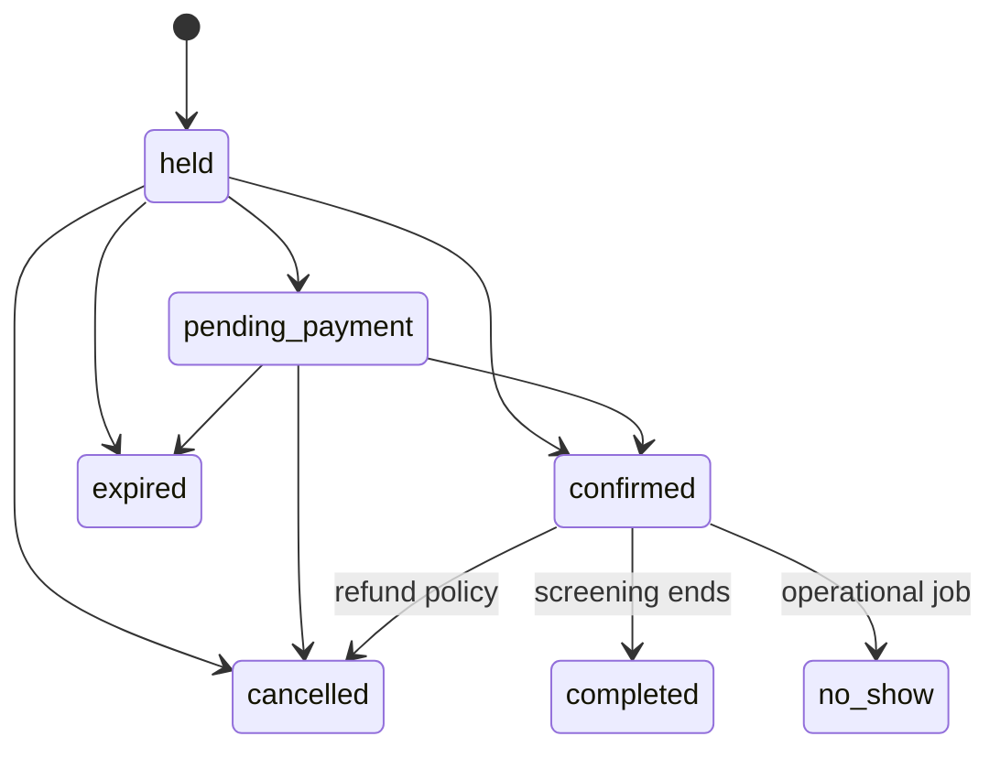

# Movie booking architecture

Tài liệu chuẩn cho developer, QA và operator của hệ thống đặt vé phim. Booking không còn là đặt một resource theo khoảng thời gian; `Booking` là order nhiều vé cho một `Screening`, còn inventory cạnh tranh nằm ở từng `ScreeningSeat`. Behavior được mô tả bên dưới là implementation hiện tại; mục `Future work` không phải tính năng đã triển khai.

## 1. Boundary và cấu trúc mã nguồn

```text
app/
├── Models/
│   ├── Infrastructure/
│   │   └── OutboxMessage.php       # generic transactional outbox
│   ├── Payments/
│   │   ├── Payment.php              # shared payable payment record
│   │   └── PaymentWebhookEvent.php
│   └── Cinema/
│       ├── Booking.php              # cinema order aggregate
│       ├── BookingTransitionAudit.php
│       ├── Movie.php
│       ├── ScreeningRoom.php
│       ├── Seat.php
│       ├── Screening.php
│       ├── ScreeningSeat.php       # inventory row, source of truth
│       ├── BookingItem.php          # ticket seat-specific
│       ├── ScreeningPrice.php
│       ├── Concession.php
│       └── BookingConcession.php
├── Actions/
│   ├── Booking/                    # hold, pay, cancel, expire, refund
│   └── Cinema/                     # schedule, combo, check-in
├── Queries/Cinema/                 # read/report queries
├── Http/Controllers/Cinema/        # public read-only storefront
├── Http/Controllers/User/          # authenticated customer actions
└── Support/{Cinema,Payment,Booking}/
```

### Vì sao Booking nằm trong Cinema?

Tên Booking nghe có vẻ dùng chung, nhưng aggregate hiện tại phụ thuộc trực tiếp vào screening, ScreeningSeat, ticket code, QR, check-in và quy tắc hold ghế. Đưa nó ra app/Models/Booking.php làm developer dễ tưởng đây là order chung cho mọi sản phẩm. Vì vậy booking phim thuộc namespace App\\Models\\Cinema\\Booking; các action workflow hiện tại vẫn ở Actions/Booking để giữ namespace use-case ổn định, nhưng chỉ được gọi bởi flow cinema.

Blog không cần booking. Ecommerce nên có App\\Models\\Commerce\\Order và OrderItem, không tái sử dụng Cinema Booking. Nếu sau này có subscription hoặc event reservation, tạo aggregate riêng thay vì thêm nullable foreign keys vào Cinema Booking.

Payment đã tách thành capability dùng chung dưới App\\Models\\Payments và dùng payable_type/payable_id, nên ecommerce có thể thanh toán Order mà không phụ thuộc bảng bookings. OutboxMessage là infrastructure model, không thuộc cinema/payment; payload phải chứa aggregate type/id và event version ổn định.

Resource cũ (`BookableResource`) và flow đặt period đã được loại khỏi runtime. Migration lịch sử vẫn giữ để database đã migrate có thể nâng cấp; migration cuối `remove_legacy_resource_booking_schema` xoá bảng resource và các cột legacy khỏi schema hiện tại.

## 2. Model và quan hệ

```mermaid
classDiagram
    User "1" --> "many" Booking
    Movie "1" --> "many" Screening
    ScreeningRoom "1" --> "many" Seat
    ScreeningRoom "1" --> "many" Screening
    Screening "1" --> "many" ScreeningSeat
    Seat "1" --> "many" ScreeningSeat
    Screening "1" --> "many" Booking
    Booking "1" --> "many" BookingItem
    ScreeningSeat "1" --> "0..1" BookingItem
    Booking "1" --> "0..1" Payment
    Booking "1" --> "many" BookingConcession
    Concession "1" --> "many" BookingConcession
    Booking "1" --> "many" BookingTransitionAudit
    Movie { int id; string title; string slug; int duration_minutes; bool is_active }
    Screening { int id; int movie_id; int screening_room_id; datetime starts_at; datetime ends_at; enum status; int base_price_minor_units }
    Seat { int id; int screening_room_id; string row_label; int seat_number; enum seat_type; int price_minor_units }
    ScreeningSeat { int id; int screening_id; int seat_id; enum status; uuid hold_token; datetime held_until; int price_minor_units }
    Booking { int id; int user_id; int screening_id; enum status; int total_minor_units; string idempotency_key }
    BookingItem { int id; int booking_id; int screening_seat_id; string ticket_code; enum status; string qr_token_hash }
```

Một `Seat` là ghế vật lý trong phòng. `ScreeningSeat` là bản materialized của ghế cho từng suất, vì vậy mỗi suất có trạng thái và giá độc lập. Không kiểm tra availability bằng `Seat` hoặc cache; luôn khóa `ScreeningSeat`.

## 3. Luồng nghiệp vụ

```mermaid
sequenceDiagram
    actor Guest
    participant Web as Public storefront
    participant Auth as Auth
    participant Hold as HoldSeats
    participant DB as Database
    participant Pay as PaymentGateway
    participant Outbox as Outbox worker

    Guest->>Web: Browse movie/showtime/seat map
    Guest->>Web: Submit selected seat IDs
    Web->>Auth: Require login at hold boundary
    Web->>Web: Store screening, seats and idempotency in session
    Auth-->>Web: Redirect to authenticated resume endpoint
    Auth->>Hold: Authenticated user + seat IDs + idempotency key
    Hold->>DB: BEGIN; lock user, screening, seats ordered by seat_id
    DB-->>Hold: available rows or conflict
    Hold->>DB: Create held Booking + BookingItems
    Hold->>DB: COMMIT
    Guest->>Pay: Pay order
    Pay->>DB: Charge with provider idempotency key
    Pay->>DB: Lock order/seats; mark confirmed/sold; issue tickets
    Pay->>Outbox: booking.paid / ticket.issued
    Outbox-->>Guest: Email notification (at-least-once)
```

### Hold và concurrency

1. Request bắt buộc `seat_ids` và `idempotency_key`, giới hạn tối đa 10 ghế.
2. Action khóa user để serialize retry cùng user, khóa screening, rồi khóa các seat theo thứ tự tăng dần để giảm deadlock.
3. Hold hết hạn được giải phóng trong transaction khi có request hoặc bởi scheduler.
4. Unique `(screening_id, seat_id)` bảo vệ inventory không nhân bản.
5. Availability conflict trả lỗi nghiệp vụ; không retry vô hạn ở HTTP layer.

SQLite chỉ phù hợp kiểm tra logic. Cần chạy multi-process integration test trên MySQL/PostgreSQL để xác nhận lock/deadlock behavior production.

### Payment, refund và ticket

- Fake gateway được dùng khi chưa có Stripe secret; Stripe gateway dùng PaymentIntent/provider idempotency.
- Chỉ payment thành công mới chuyển seat `held -> sold`, order `pending_payment/held -> confirmed` và cấp ticket code.
- Webhook kiểm tra signature và event idempotency; không tin redirect từ client.
- Refund gọi gateway trước; sau khi thành công mới transaction cập nhật payment/order/items và trả inventory/combo theo policy.
- QR chứa signed verification URL có TTL, token hash lưu trong database; check-in khóa ticket và chỉ cho `issued -> checked_in` một lần.

### Cancellation và trạng thái



Mọi transition phải đi qua domain action và `Booking::transitionTo()`. Controller không được mass-assign status. Quyền xem order/ticket không bị chặn sau giờ chiếu; cancellation deadline chỉ áp dụng cho cancel unpaid (`held`/`pending_payment`) và được kiểm tra trong `BookingPolicy`. Đã check-in thì không refund tùy tiện. Cancel độc lập chỉ áp dụng cho `held` và `pending_payment`; booking đã thanh toán phải đi qua Refund: gateway refund thành công trước, sau đó transaction mới mark payment/ticket refunded, release seat/combo và chuyển order sang cancelled.

## 4. Public và user UI

```text
GET  /                         landing
GET  /movies                   public movie catalog
GET  /movies/{movie:slug}      movie detail + showtimes
GET  /showtimes/{screening}   public seat map
POST /showtimes/{id}/hold    public boundary; guest state lưu session
GET  /user/cinema/hold/resume authenticated resume sau login
GET  /user/bookings            customer order history
GET  /user/tickets/{ticket}    QR ticket
```

Guest được xem/chọn ghế bằng UI; seat selection chỉ là client state và phải được revalidate server-side. Khi guest submit, screening, seat IDs và idempotency key được lưu trong session; sau login endpoint resume tiếp tục hold một lần. Nếu ghế đã bị lấy trong lúc login, user nhận conflict và quay lại seat map. `x-layouts.storefront` phục vụ catalog/seat map, `x-layouts.user` phục vụ lịch sử order/ticket, admin layout phục vụ vận hành rạp. Movie detail hiển thị available/total; seat map hiển thị cùng summary. `ScreeningSeat::isAvailableForSelection()` coi hold có `held_until <= now` là available trên read UI; mutation vẫn lock và release row trong `HoldSeats`.

## 5. Pricing và inventory

- Tiền dùng integer minor units, currency uppercase ISO code.
- Giá ticket snapshot tại `ScreeningSeat.price_minor_units` và `BookingItem.price_minor_units`.
- Giá VIP/couple có thể override theo `ScreeningPrice`; giá hiện tại không được làm thay đổi order cũ.
- Combo snapshot quantity/unit/total ở `BookingConcession`; stock lock trong `AddConcessions`.
- Với capacity nhiều hơn 1, mô hình hiện tại đã materialize từng ghế; không dùng counter tổng để tránh oversell.

## 6. Seed và vận hành

```bash
php artisan migrate
php artisan db:seed
php artisan booking:expire-holds
php artisan app:outbox-publish
php artisan schedule:work
```

`CinemaSeeder` tạo phim, phòng, ghế thường/VIP, suất chiếu, combo, order paid có QR và order held. Seeder dùng `updateOrCreate`, nhưng dữ liệu order demo chỉ tạo một lần cho user `user@gmail.com`.

Production cần Redis/SQS cho queue, shared cache cho scheduler, Stripe webhook secret, worker outbox, alert dead-letter, structured logs và metrics cho hold conflict, payment failure, refund, check-in, queue lag và booking latency.

## 7. Invariants và trust boundary

Các quy tắc sau phải được giữ nguyên khi mở rộng code:

- Một cặp `screening_id + seat_id` chỉ có một `screening_seats` nhờ unique index.
- Chỉ `ScreeningSeat` là nguồn sự thật về inventory. Không quyết định availability bằng `Seat`, số đếm ở UI hoặc cache.
- Client không được quyết định user, giá, currency, trạng thái screening hay quyền sở hữu booking.
- Tiền dùng integer minor units; ticket, seat và combo đều lưu giá snapshot.
- Mọi mutation booking phải qua action và transaction; không mass-assign `status` trong production flow.
- Retry phải idempotent: hold theo `user_id + idempotency_key + idempotency_hash`, webhook theo provider/event ID, refund theo payment status.
- Public chỉ đọc catalog/seat map. Ownership được kiểm tra ở Form Request và Policy; admin route được bảo vệ bởi admin middleware.

Trust boundary quan trọng là: browser -> Laravel HTTP -> domain action -> database/payment provider -> webhook/outbox. Không tin redirect payment, hidden input giá, hoặc trạng thái disabled của HTML.

## 8. Bảng dữ liệu và ownership

| Bảng | Owner và ý nghĩa | Bảo vệ dữ liệu |
|---|---|---|
| `movies` | Catalog phim, slug public | unique slug, active index, soft delete |
| `screening_rooms` | Phòng và timezone business | unique code |
| `seats` | Ghế vật lý của phòng | unique room/row/number |
| `screenings` | Suất chiếu, UTC start/end, giá cơ sở | room/time và movie/time indexes |
| `screening_seats` | Inventory ghế theo suất | unique screening/seat, status/held_until indexes |
| `bookings` | Order của user | screening, status, totals, idempotency fields |
| `booking_items` | Ticket từng ghế | ticket code và QR hash unique |
| `payments` | Payment một-một với booking | provider payment ID unique |
| `booking_concessions` | Combo snapshot theo order | unique booking/concession |
| `payment_webhook_events` | Deduplicate webhook | unique provider/event ID |
| `outbox_messages` | Side effect sau commit | attempts, available/published/failed timestamps |
| `booking_transition_audits` | Audit trạng thái | from/to, actor, reason |

Không xóa room/seat đã được dùng bởi screening nếu foreign key restrict không cho phép; dữ liệu lịch sử phải giữ để đối soát ticket và report.

## 9. HTTP contract và thư mục theo flow

```text
GET    /                         landing
GET    /movies                   public catalog
GET    /movies/{movie:slug}      movie detail + showtime summary
GET    /showtimes/{screening}   public seat map + available/total
POST   /showtimes/{id}/hold     guest/auth hold boundary
GET    /user/cinema/hold/resume authenticated resume từ session
GET    /user/bookings            order history của user
GET    /user/bookings/{booking}  order/ticket detail của owner
POST   /user/bookings/{id}/pay  payment của owner
PATCH  /user/bookings/{id}/cancel unpaid cancel của owner
POST   /admin/bookings/{id}/refund admin refund
POST   /admin/tickets/check-in  admin check-in
POST   /webhooks/stripe          signed provider callback
```

Controller chỉ làm HTTP orchestration: authorize, nhận validated input, gọi action, map exception và trả response. Business write nằm trong `app/Actions`; read nằm trong controller/query tương ứng. `resources/views/cinema` là public storefront, `resources/views/user` là dashboard/order/ticket, `resources/views/admin` là vận hành.

## 10. Nghiệp vụ chi tiết và edge cases

### Guest resume

Guest có thể xem và chọn ghế mà chưa login. Selection chỉ nằm trên browser cho đến khi submit. Server validate lại seat IDs, lưu `screening_id`, seat IDs và idempotency key vào session rồi redirect login. Endpoint resume dùng `session()->pull`, do đó dữ liệu chỉ được dùng một lần. Nếu login kéo dài, suất hết hạn hoặc ghế đã bị user khác giữ, hold trả conflict và user phải chọn lại; không giữ ghế trong lúc login.

### Hold hết hạn

Hold mặc định 10 phút (`BOOKING_HOLD_MINUTES`). Scheduler `booking:expire-holds` chuyển booking sang expired và trả ghế. Đồng thời `HoldSeats` chủ động release row held đã quá hạn trong transaction mới. Vì vậy scheduler trễ không làm ghế bị khóa vĩnh viễn. UI dùng `ScreeningSeat::isAvailableForSelection()` để coi `held_until <= now` là available, nhưng write path vẫn lock và revalidate.

### Cancel/refund

- `held` và `pending_payment`: user có thể cancel nếu qua cancellation deadline; action trả seat và đánh dấu item cancelled.
- `confirmed`: user/admin không được cancel trực tiếp như unpaid; phải gọi Refund.
- Refund gọi gateway trước. Chỉ response `refunded` mới mở transaction cập nhật payment, item, seat, combo và booking.
- Đã check-in thì không refund.
- Refund lặp lại sau khi payment đã refunded trả kết quả hiện tại, không trả inventory lần hai.
- `BOOKING_CANCELLATION_DEADLINE_MINUTES=0` nghĩa là không áp deadline; giá trị dương áp cho unpaid cancel trước `starts_at - deadline`.

Thiết kế hiện tại không auto-refund khi cancel vì refund là tác vụ tài chính có thể timeout/fail và cần audit/reconcile. `confirmed -> cancelled` chỉ hợp lệ trong Refund action sau khi gateway thành công.

### Payment/webhook failure

Payment gateway có fake adapter để local/test và Stripe adapter khi có secret. Charge không chạy trong database transaction. Nếu timeout hoặc pending, booking/seat không được tự động coi là confirmed. Webhook phải kiểm tra signature, timestamp tối đa 5 phút và event ID; event lặp không được phát ticket/email lặp. Provider callback mới là nguồn xác nhận cuối cùng.

### Pricing/combo

Khi tạo screening, ghế active được materialize và nhận giá theo seat type hoặc base price. Giá ticket được snapshot vào `booking_items`; combo snapshot quantity/unit/total vào `booking_concessions`. Stock được lock trước khi trừ. Không sửa order cũ khi admin đổi giá/concession. Một order hiện chỉ dùng currency của screening; multi-currency chưa hỗ trợ.

### Timezone/DST

`CreateScreening` parse input theo `screening_rooms.timezone`, sau đó lưu UTC. UI format theo timezone của room. Không dùng timezone của browser để quyết định nghiệp vụ. Cần test giờ mùa hè (DST), midnight và các boundary `starts_at/ends_at` trên timezone thật của từng rạp; operating-hours config hiện chưa có holiday/exception entity.

## 11. Vận hành outbox, queue và email

Booking tạo event `booking.created`; payment success tạo `booking.payment_succeeded`. `app:outbox-publish` dispatch `PublishOutboxMessage`. Job retry 3 lần, gửi `BookingCreatedMail` hoặc `PaymentSucceededMail`, ghi `published_at`; lỗi ghi `failed_at`, `last_error`, `attempts`.

Đây là at-least-once delivery. Email phải chấp nhận duplicate delivery; không gửi email trực tiếp trong transaction nghiệp vụ. Khi có nhiều publisher, cần claim/lease row hoặc queue-native dedup để giảm dispatch trùng. Operator phải theo dõi failed outbox/failed jobs và có quy trình retry/reconcile.

```bash
php artisan booking:expire-holds
php artisan app:outbox-publish --limit=100
php artisan queue:work --tries=3
php artisan schedule:work
```

Production nên dùng Redis/SQS cho queue, supervisor/Horizon để restart worker, shared cache/session và alert khi queue lag, outbox failed hoặc expiry command không chạy.

## 12. Triển khai và cấu hình

Local mặc định SQLite, fake payment, database session/cache/queue và mail log. Production nên chạy MySQL/PostgreSQL; SQLite không chứng minh được row-lock concurrency. Các biến quan trọng:

```dotenv
DB_CONNECTION=mysql                 # hoặc pgsql
BOOKING_HOLD_MINUTES=10
BOOKING_MINIMUM_LEAD_MINUTES=15
BOOKING_MAXIMUM_HORIZON_DAYS=90
BOOKING_CANCELLATION_DEADLINE_MINUTES=0
BOOKING_CHECK_IN_OPEN_MINUTES=120
BOOKING_PAYMENT_PROVIDER=stripe
BOOKING_CURRENCY=VND
STRIPE_SECRET=...
STRIPE_WEBHOOK_SECRET=...
QUEUE_CONNECTION=redis
CACHE_STORE=redis
SESSION_DRIVER=redis
```

Release checklist:

1. Migrate trên staging bằng cùng database engine với production.
2. Xác nhận server UTC và timezone từng room hợp lệ.
3. Cấu hình Stripe webhook secret/endpoint và sandbox payment.
4. Chạy worker, scheduler, outbox publisher và kiểm tra failed jobs.
5. Kiểm tra mail, refund, QR/check-in và session resume trên HTTPS.
6. Load test nhiều process cùng screening/seat set; kiểm tra deadlock retry.
7. Có backup, restore drill, retention cho audit và alert nghiệp vụ.

## 13. Testing và quality gates

Feature tests hiện có trong `tests/Feature/CinemaBookingFeatureTest.php`: guest browse, auth resume, hold conflict, idempotency, expired hold, payment, combo stock, paid-cancel guard, ownership, QR và check-in. Admin flow nằm trong `AdminCinemaManagementTest.php`.

Trước production cần bổ sung:

- MySQL/PostgreSQL multi-process test cùng một ghế, deadlock và rollback.
- Stripe invalid signature, stale timestamp, duplicate/out-of-order events.
- Provider timeout, pending rồi webhook success, refund retry/failure.
- Cancellation deadline, DST/timezone và screening boundary.
- Rate-limit, CSRF, IDOR cho booking/ticket/admin endpoint.
- Outbox duplicate dispatch, failed job và reconciliation.
- Load test seat map/report và `EXPLAIN` các query lớn.

```bash
vendor/bin/pint --dirty --format agent
php artisan test --compact
vendor/bin/phpstan analyse --memory-limit=1G --debug --no-progress
php artisan view:cache
npm run lint
npm run build
```

## 14. Future work và giới hạn đã biết

- Database exclusion constraint cho overlap screening tùy engine; hiện dùng room row lock + overlap query.
- Capacity hiện được biểu diễn bằng từng ghế; capacity tổng/ghế không đánh số cần inventory aggregate riêng.
- Operating hours mới ở config, chưa có lịch nghỉ/lễ/exception persistent.
- `completed`/`no_show` đã có enum nhưng chưa có operational job tự động.
- Refund hiện là full payment refund; chưa có partial refund, phí, voucher hoặc policy theo thời điểm.
- Outbox đã transactional nhưng cần claim/lease và dead-letter dashboard khi scale publisher.
- Metrics/tracing nên có cho hold conflict, payment/refund latency, conversion, check-in, queue lag.
- Khi traffic lớn, có thể tách read model/report hoặc cache seat map có version/invalidation; tuyệt đối không cache quyết định availability.

Mọi mở rộng phải giữ nguyên bốn điểm: lock inventory, snapshot tiền, idempotency và audit transition.
