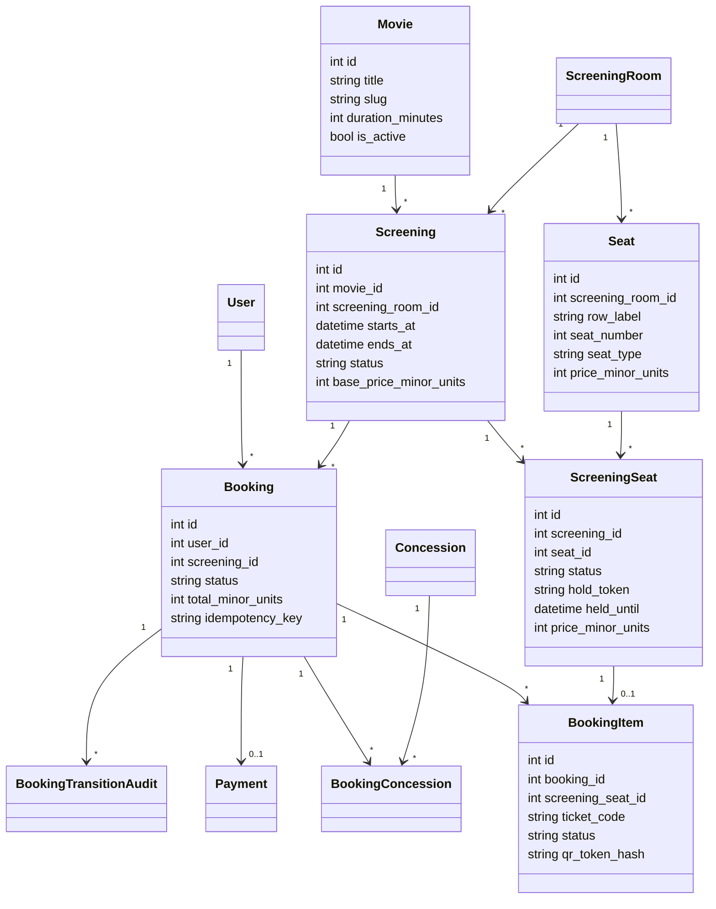
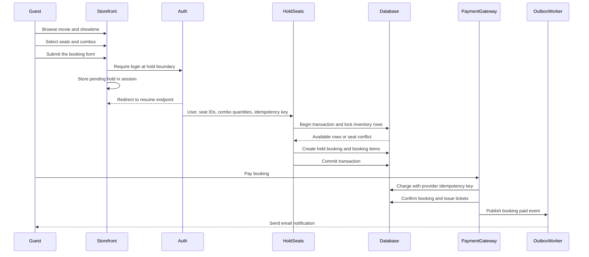
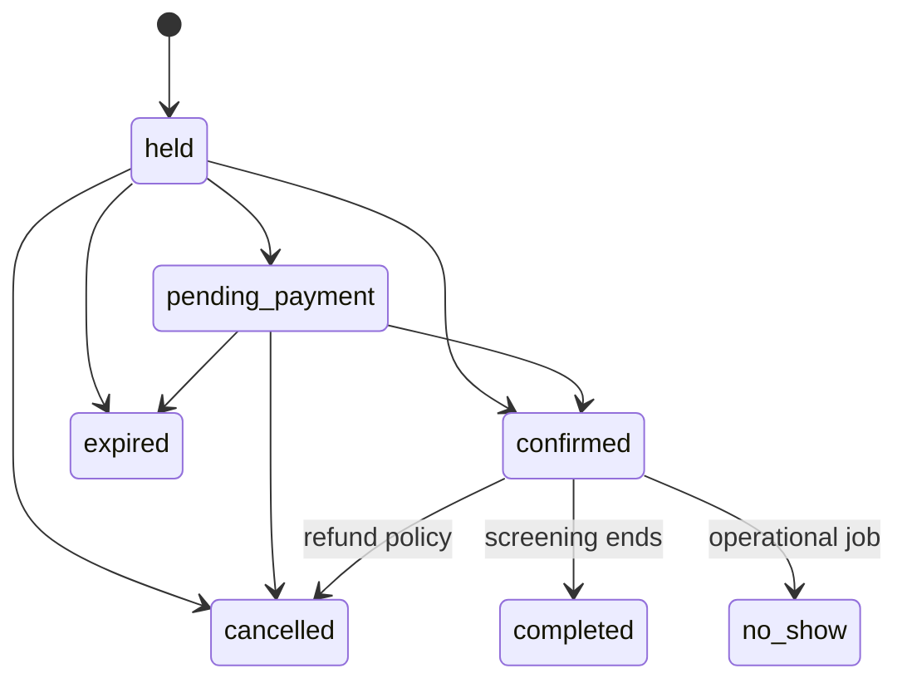

# Movie booking architecture

Tài liệu chuẩn cho developer, QA và operator của hệ thống đặt vé phim. Đây là modular monolith, trong đó code được group theo domain `Movie`, `Inventory`, `Payments` và `Infrastructure`. `Booking` là order nhiều vé cho một `Screening`, còn inventory cạnh tranh của ghế nằm ở từng `ScreeningSeat`. Behavior bên dưới mô tả implementation hiện tại; mục `Future work` không phải tính năng đã triển khai.

### Cách đọc tài liệu

- Nghiệp vụ thuần: [movie-booking-business-logic.md](movie-booking-business-logic.md).
- Schema, quan hệ và migration: [movie-booking-database.md](movie-booking-database.md).
- Kiến trúc, code boundary, reliability, UI và test: tài liệu này.
- Các section đầu mô tả baseline hiện tại; các section implementation/remediation phía sau là trace chi tiết của các thay đổi đã triển khai, không phải domain mới.

## 1. Boundary và cấu trúc mã nguồn

```text
app/
├── Actions/Movie/                # use case đặt vé, catalog, combo, ticketing
│   ├── Booking/
│   ├── Catalog/
│   ├── Concessions/
│   └── Ticketing/
├── Enums/
│   ├── Movie/                     # trạng thái/loại dữ liệu movie booking
│   ├── Inventory/                 # loại biến động tồn kho
│   ├── Payment/                   # payment/refund/provider status
│   └── Infrastructure/            # outbox/delivery event status
├── Models/
│   ├── Movie/                     # movie, screening, booking, ticket, coupon, combo catalog
│   ├── Inventory/                 # stock ledger và stock adjustment audit
│   ├── Payments/                  # payment, attempts, refund và webhook
│   └── Infrastructure/            # outbox và delivery
├── Policies/Movie/                # authorization booking movie
└── Queries/Movie/                 # read/report queries của movie flow
```

### Quy tắc phân tầng

| Tầng | Trách nhiệm | Không làm |
|---|---|---|
| Controller | Nhận request, authorize, gọi Form Request/Query/Action và trả response/view. | Không dựng lại điều kiện bookable/active/ownership; không tự mở transaction. |
| Form Request | Xác thực input HTTP, normalize dữ liệu đơn giản và authorize request-level. | Không quyết định stock, hold, payment hoặc transition dựa trên dữ liệu cạnh tranh. |
| Query object | Đóng gói read model dùng lại, eager loading, selected columns, pagination và filter. | Không mutate dữ liệu hoặc chứa side effect. |
| Action | Một use case có mutation, transaction, lock, idempotency và invariant. | Không trả HTML/HTTP response. |
| Model scope | Điều kiện query thuần, dùng lại được như `bookable`, `activeHold`, `availableForSelection`, `availableForBooking`. | Không gọi provider, queue hoặc thay đổi dữ liệu. |
| Service | Chỉ dùng cho behavior phối hợp được nhiều use case/domain và có boundary rõ. | Không tạo service chỉ bọc một lệnh Eloquent. |

Các query dùng chung hiện tại gồm `AvailableConcessionsQuery`, `ScreeningBookingContextQuery` và `UserBookingsQuery`. `AvailableConcessionsQuery` là nơi duy nhất dựng catalog combo khả dụng và giới hạn live availability; `UserBookingsQuery` sở hữu read model dashboard/history; `ScreeningBookingContextQuery` sở hữu lookup active hold và ownership ghế. Các thao tác combo có transaction/stock ledger nằm ở `AddConcessions`, `CreateConcession` và `UpdateConcession`; controller admin chỉ còn nhận input và điều phối Action.

Các scope canonical phải được ưu tiên thay vì copy điều kiện trong controller: `Movie::hasBookableScreenings()`, `Screening::bookable()`, `Screening::startsAfter()`, `Booking::activeHold()`, `Booking::expiredHold()`, `Booking::upcoming()`, `Booking::ownedBy()`, `ScreeningSeat::availableForSelection()` và `Concession::availableForBooking()`.

### Domain ownership

| Domain | Sở hữu | Không sở hữu |
|---|---|---|
| Movie | Movie, showtime, room, seat, screening seat, booking, ticket, coupon và combo catalog | Payment provider state, outbox delivery, stock ledger chi tiết |
| Inventory | `InventoryMovement`, `StockAdjustmentAudit`, stock delta/idempotency/audit | Giá combo và lifecycle booking |
| Payments | Payment aggregate, payment attempt, refund attempt, webhook/provider reconciliation | Ghế, combo stock và UI booking |
| Infrastructure | Transactional outbox, delivery, notification và queue integration | Quyết định booking/payment nghiệp vụ |

Movie là domain điều phối trải nghiệm đặt vé; các domain còn lại cung cấp invariant riêng. Tên bảng inventory được giữ nguyên để tránh data migration không cần thiết.

Payment dùng `payable_type/payable_id` để có thể tái sử dụng cho aggregate khác. Outbox là adapter hạ tầng; payload phải chứa aggregate type/id và event version ổn định.

Resource cũ (`BookableResource`) và flow đặt period không còn thuộc runtime. Mọi booking mới phải gắn với Movie `Screening` và có một hoặc nhiều `BookingItem`.

## 2. Model và quan hệ



Một `Seat` là ghế vật lý trong phòng. `ScreeningSeat` là bản materialized của ghế cho từng suất, vì vậy mỗi suất có trạng thái và giá độc lập. Không kiểm tra availability bằng `Seat` hoặc cache; luôn khóa `ScreeningSeat`.

## 3. Luồng nghiệp vụ



### Hold và concurrency

1. Request bắt buộc `seat_ids` và `idempotency_key`, giới hạn theo `config('booking.limits.max_seats')`.
2. Seat picker chặn ngay ở client khi selection đạt `config('booking.limits.max_seats')`; backend vẫn validate cùng config.
3. Tổng quantity combo không được vượt `số ticket × config('booking.limits.max_combos_per_ticket')`; UI clamp theo quota còn lại, còn `AddConcessions` kiểm tra lại sau khi lock booking.
4. Action khóa user để serialize retry cùng user, khóa screening, rồi khóa các seat theo thứ tự tăng dần để giảm deadlock.
5. Hold hết hạn được giải phóng trong transaction khi có request hoặc bởi scheduler.
6. Unique `(screening_id, seat_id)` bảo vệ inventory không nhân bản.
7. Availability conflict trả lỗi nghiệp vụ; không retry vô hạn ở HTTP layer.

SQLite chỉ phù hợp kiểm tra logic. Cần chạy multi-process integration test trên MySQL/PostgreSQL để xác nhận lock/deadlock behavior production.

### Payment, refund và ticket

- Fake gateway được dùng khi chưa có Stripe secret; Stripe gateway dùng PaymentIntent/provider idempotency.
- Chỉ payment thành công mới chuyển seat `held -> sold`, order `pending_payment/held -> confirmed` và cấp ticket code.
- Webhook kiểm tra signature và event idempotency; không tin redirect từ client.
- Refund gọi gateway trước; sau khi thành công mới transaction cập nhật payment/order/items và trả inventory/combo theo policy.
- QR chứa signed verification URL có TTL, token hash lưu trong database; check-in khóa ticket và chỉ cho `issued -> checked_in` một lần.

### Cancellation và trạng thái



Mọi transition phải đi qua domain action và `Booking::transitionTo()`. Controller không được mass-assign status. Quyền xem order/ticket không bị chặn sau giờ chiếu; cancellation deadline chỉ áp dụng cho cancel unpaid (`held`/`pending_payment`) và được kiểm tra trong `BookingPolicy`. Đã check-in thì không refund tùy tiện. Cancel độc lập chỉ áp dụng cho `held` và `pending_payment`; booking đã thanh toán phải đi qua Refund: gateway refund thành công trước, sau đó transaction mới mark payment/ticket refunded, release seat/combo và chuyển order sang cancelled.

## 4. Public và user UI

```text
GET  /                         landing
GET  /movies                   public movie catalog
GET  /movies/{movie:slug}      movie detail + showtimes
GET  /movies/{movie:slug}/showtimes/{screening} public seat map
GET  /movies/{movie:slug}/showtimes/{screening}/availability availability
POST /movies/{movie:slug}/showtimes/{screening}/hold public boundary; guest state lưu session
GET  /user/cinema/hold/resume authenticated resume sau login
GET  /user/bookings            customer order history
GET  /user/tickets/{ticket}    QR ticket
```

Guest được xem/chọn ghế bằng UI; seat selection chỉ là client state và phải được revalidate server-side. Khi guest submit, screening, seat IDs và idempotency key được lưu trong session; sau login endpoint resume tiếp tục hold một lần. Nếu ghế đã bị lấy trong lúc login, user nhận conflict và quay lại seat map. `x-layouts.movie` phục vụ catalog, seat map, checkout và trang đặt vé thành công; `x-layouts.user` phục vụ lịch sử order/ticket, admin layout phục vụ vận hành rạp. Movie layout dùng `x-ui.movie-brand-mark`; tên hiển thị lấy từ `config('app.movie_name')`, cấu hình qua `APP_MOVIE_NAME` và fallback về `APP_NAME` (mặc định `CinePass`), không phụ thuộc tên mặc định Laravel. Movie detail hiển thị available/total; seat map hiển thị cùng summary. `ScreeningSeat::isAvailableForSelection()` coi hold có `held_until <= now` là available trên read UI; mutation vẫn lock và release row trong `HoldSeats`.

## 5. Pricing và inventory

- Tiền dùng integer minor units, currency uppercase ISO code.
- Giá ticket snapshot tại `ScreeningSeat.price_minor_units` và `BookingItem.price_minor_units`.
- Giá VIP/couple có thể override theo `ScreeningPrice`; giá hiện tại không được làm thay đổi order cũ.
- Combo snapshot quantity/unit/total ở `BookingConcession`; stock lock trong `AddConcessions`.
- Với capacity nhiều hơn 1, mô hình hiện tại đã materialize từng ghế; không dùng counter tổng để tránh oversell.

## 6. Seed và vận hành

```bash
php artisan migrate
php artisan db:seed
php artisan booking:expire-holds
php artisan app:outbox-publish
php artisan schedule:work
```

`MovieSeeder` tạo phim, phòng, ghế thường/VIP, suất chiếu, combo, order paid có QR và order held. Seeder dùng `updateOrCreate`, nhưng dữ liệu order demo chỉ tạo một lần cho user `user@gmail.com`.

Production cần Redis/SQS cho queue, shared cache cho scheduler, Stripe webhook secret, worker outbox, alert dead-letter, structured logs và metrics cho hold conflict, payment failure, refund, check-in, queue lag và booking latency.

## 7. Invariants và trust boundary

Các quy tắc sau phải được giữ nguyên khi mở rộng code:

- Một cặp `screening_id + seat_id` chỉ có một `screening_seats` nhờ unique index.
- Chỉ `ScreeningSeat` là nguồn sự thật về inventory. Không quyết định availability bằng `Seat`, số đếm ở UI hoặc cache.
- Client không được quyết định user, giá, currency, trạng thái screening hay quyền sở hữu booking.
- Tiền dùng integer minor units; ticket, seat và combo đều lưu giá snapshot.
- Mọi mutation booking phải qua action và transaction; không mass-assign `status` trong production flow.
- Retry phải idempotent: hold theo `user_id + idempotency_key + idempotency_hash`, webhook theo provider/event ID, refund theo payment status.
- Public chỉ đọc catalog/seat map. Ownership được kiểm tra ở Form Request và Policy; admin route được bảo vệ bởi admin middleware.

Trust boundary quan trọng là: browser -> Laravel HTTP -> domain action -> database/payment provider -> webhook/outbox. Không tin redirect payment, hidden input giá, hoặc trạng thái disabled của HTML.

## 8. Bảng dữ liệu và ownership

| Bảng | Owner và ý nghĩa | Bảo vệ dữ liệu |
|---|---|---|
| `movies` | Catalog phim, slug public | unique slug, active index, soft delete |
| `screening_rooms` | Phòng và timezone business | unique code |
| `seats` | Ghế vật lý của phòng | unique room/row/number |
| `screenings` | Suất chiếu, start/end theo `config('app.timezone')`, giá cơ sở | room/time và movie/time indexes |
| `screening_seats` | Inventory ghế theo suất | unique screening/seat, status/held_until indexes |
| `bookings` | Order của user | screening, status, totals, idempotency fields |
| `booking_items` | Ticket từng ghế | ticket code và QR hash unique |
| `payments` | Payment một-một với booking | provider payment ID unique |
| `booking_concessions` | Combo snapshot theo order | unique booking/concession |
| `payment_webhook_events` | Deduplicate webhook | unique provider/event ID |
| `outbox_messages` | Side effect sau commit | attempts, available/published/failed timestamps |
| `booking_transition_audits` | Audit trạng thái | from/to, actor, reason |

Không xóa room/seat đã được dùng bởi screening nếu foreign key restrict không cho phép; dữ liệu lịch sử phải giữ để đối soát ticket và report.

## 9. HTTP contract và thư mục theo flow

```text
GET    /                         landing
GET    /movies                   public catalog
GET    /movies/{movie:slug}      movie detail + showtime summary
GET    /movies/{movie:slug}/showtimes/{screening} public seat map + available/total
GET    /movies/{movie:slug}/showtimes/{screening}/availability availability polling
POST   /movies/{movie:slug}/showtimes/{screening}/hold guest/auth hold boundary
GET    /user/cinema/hold/resume authenticated resume từ session
GET    /user/bookings            order history của user
GET    /user/bookings/{booking}  order/ticket detail của owner
POST   /user/bookings/{id}/pay  payment của owner
PATCH  /user/bookings/{id}/cancel unpaid cancel của owner
POST   /admin/bookings/{id}/refund admin refund
POST   /admin/tickets/check-in  admin check-in
POST   /webhooks/stripe          signed provider callback
```

Controller chỉ làm HTTP orchestration: authorize, nhận validated input, gọi action, map exception và trả response. Business write nằm trong `app/Actions`; read nằm trong controller/query tương ứng. `resources/views/cinema` là public storefront, `resources/views/user` là dashboard/order/ticket, `resources/views/admin` là vận hành.

## 10. Nghiệp vụ chi tiết và edge cases

### Guest resume

Guest có thể xem và chọn ghế mà chưa login. Selection chỉ nằm trên browser cho đến khi submit. Server validate lại seat IDs, lưu `screening_id`, seat IDs và idempotency key vào session rồi redirect login. Endpoint resume dùng `session()->pull`, do đó dữ liệu chỉ được dùng một lần. Nếu login kéo dài, suất hết hạn hoặc ghế đã bị user khác giữ, hold trả conflict và user phải chọn lại; không giữ ghế trong lúc login.

Luồng đã fix phải giữ cả ghế và combo, không chỉ combo. Payload tạm trong session có dạng:

```php
session()->put('cinema.pending_hold', [
    'screening_id' => $screening->id,
    'seat_ids' => $seatIds,
    'idempotency_key' => $idempotencyKey,
    'quantities' => $request->validated('quantities', []),
]);
```

Sau khi login thành công, `LoginResponse` ưu tiên resume nếu có payload này. Vì vậy redirect không bị role/dashboard redirect ghi đè:

```php
if (! $request->user()->is_admin
    && $request->session()->has('cinema.pending_hold')) {
    return redirect()->route('user.cinema.hold.resume');
}
```

`resumeHold` lấy payload một lần, load `screening.movie`, chạy lại `HoldSeats`, sau đó chạy `AddConcessions` với quantities đã lưu và đưa user về đúng URL public:

```php
$pendingHold = session()->pull('cinema.pending_hold');
$screening->load('movie');

$booking = $holdSeats->execute(
    user: $request->user(),
    screening: $screening,
    seatIds: $pendingHold['seat_ids'],
    idempotencyKey: $pendingHold['idempotency_key'],
);

$addConcessions->execute($booking, $pendingHold['quantities'] ?? []);

return to_route('cinema.screenings.show', [
    $screening->movie,
    $screening,
]);
```

Nếu resume thất bại vì ghế hết hoặc combo hết hàng, payload phải được ghi lại trước khi redirect về seat map để user không mất lựa chọn:

```php
session()->put('cinema.pending_hold', $pendingHold);

return to_route('cinema.screenings.show', [
    $screening->movie,
    $screening,
])->withErrors(['seat_ids' => $exception->getMessage()]);
```

### Review và chỉnh sửa ghế/combo trên showtime

Seat map là nơi chọn ghế và combo. Checkout chỉ là bước review read-only, apply coupon khi coupon engine được bật và xác nhận thanh toán. Không có nút tăng/giảm combo ở checkout để tránh tạo một state thứ hai khác với state đã hold.

Public URL phải chứa movie slug và screening để route model binding kiểm tra đúng quan hệ:

```php
Route::scopeBindings()->group(function (): void {
    Route::get(
        '/movies/{movie:slug}/showtimes/{screening}',
        [PublicMovieController::class, 'show']
    )->name('cinema.screenings.show');

    Route::post(
        '/movies/{movie:slug}/showtimes/{screening}/hold',
        [PublicMovieController::class, 'hold']
    )->name('cinema.screenings.hold');
});
```

Khi render seat map, server phải render active hold trước khi JavaScript chạy. Đây là fallback quan trọng cho login/resume và cũng giúp tổng tiền không bị về 0 trong khoảng thời gian JS chưa hydrate:

```blade
@php($activeHoldSeatIds = $activeHold?->items
    ?->pluck('screening_seat_id')
    ->map(static fn ($id): int => (int) $id)
    ->all() ?? [])
@php($initialSeatCount = count($activeHoldSeatIds))
@php($initialSeatTotal = (int) ($activeHold?->items
    ?->sum('price_minor_units') ?? 0))
@php($initialComboTotal = (int) ($activeHold?->concessions
    ?->sum('total_minor_units') ?? 0))

<button
    data-seat-id="{{ $screeningSeat->id }}"
    data-seat-selected="{{ in_array($screeningSeat->id, $activeHoldSeatIds, true) ? 'true' : 'false' }}"
    data-seat-own-hold="{{ $isOwnHold ? 'true' : 'false' }}"
>
```

Nút submit dùng binding của Blade component, không dùng directive `@disabled` trực tiếp trong component attribute:

```blade
<x-admin.button
    type="submit"
    :disabled="$initialSeatCount === 0"
>
    {{ __('booking.continue_to_booking') }}
</x-admin.button>
```

JavaScript chỉ hydrate state từ DOM, không được reset state server-rendered về mảng rỗng. Ghế của chính booking hiện tại là available-for-edit, giữ `data-seat-selected="true"`, có màu active và không bị disable:

```js
buttons.forEach((button) => {
    if (button.dataset.seatOwnHold === 'true') {
        button.dataset.selected = 'true';
        button.setAttribute('aria-pressed', 'true');
    }
});

const isSelectable = (button) => (
    button.dataset.seatOwnHold === 'true'
    || button.dataset.seatAvailable === 'true'
);
```

Summary được tính từ snapshot server và state hiện tại:

```js
const seatTotal = selectedSeats.reduce(
    (total, seat) => total + Number(seat.dataset.priceMinorUnits ?? 0),
    0,
);
const comboTotal = [...comboInputs].reduce(
    (total, input) => total
        + Number(input.dataset.priceMinorUnits ?? 0)
        * Number(input.value ?? 0),
    0,
);
const grandTotal = seatTotal + comboTotal;
```

Modal xác nhận hiển thị theo thứ tự: thông tin phim/suất chiếu/phòng, ghế đã chọn, combo, rồi ba dòng tiền `Tiền ghế`, `Tiền combo`, `Tổng tiền`. Ghế cùng giá được nhóm thành một dòng để modal ngắn hơn, còn tổng tiền dùng font đậm và màu semantic `primary` để dễ quét.

### Quy tắc edit active hold

Khi user bấm “Chỉnh sửa ghế & combo”, checkout chỉ cho phép quay lại public nested showtime route nếu booking còn `held`:

```php
route('cinema.screenings.show', [$booking->screening->movie, $booking->screening])
```

Tại endpoint hold, normalize và so sánh tập seat IDs với booking hold hiện tại:

```text
same seat set     -> reuse idempotency_key, giữ booking/hold, sync combo
changed seat set  -> cancel old held booking, release resources,
                     tạo idempotency_key mới và hold ghế mới
```

Combo cũ được hoàn tồn kho khi booking cũ bị hủy thông qua `ReleaseBookingResources`; combo mới chỉ được trừ sau đó bởi `AddConcessions` trong transaction. Vì vậy không thanh toán nhầm ghế cũ hoặc cộng dồn combo cũ và mới. Booking ở `pending_payment`/`confirmed` không được edit như `held`; phải đi qua nghiệp vụ cancel/refund tương ứng.

Các tình huống cần giữ trong regression test:

| Case | Kết quả đúng |
| --- | --- |
| Guest chọn ghế + combo rồi login | Resume đúng public URL, ghế active, combo giữ quantity, continue active, seat/combo total đúng |
| Resume lỗi ghế/combo | Payload pending được put lại session, user không mất lựa chọn |
| Edit không đổi ghế | Reuse booking/idempotency key, cập nhật combo hiện tại |
| Edit đổi ghế | Hủy hold cũ, tạo hold mới, không giữ/thanh toán ghế cũ |
| Edit đổi combo | Hoàn stock combo cũ rồi reserve combo mới |
| Hold hết hạn | Không coi ghế hết hạn là booking hợp lệ; server revalidate và cho chọn lại |

### Hold hết hạn

Hold mặc định 10 phút (`BOOKING_HOLD_MINUTES`). Scheduler `booking:expire-holds` chuyển booking sang expired và trả ghế. Đồng thời `HoldSeats` chủ động release row held đã quá hạn trong transaction mới. Vì vậy scheduler trễ không làm ghế bị khóa vĩnh viễn. UI dùng `ScreeningSeat::isAvailableForSelection()` để coi `held_until <= now` là available, nhưng write path vẫn lock và revalidate.

Các màn hình movie catalog, movie detail, user showtime list, public seat map, availability và action `HoldSeats` dùng chung `Screening::isBookable()`. Rule gồm: status là `scheduled`, giờ bắt đầu còn sau `BOOKING_MINIMUM_LEAD_MINUTES` và nằm trong `BOOKING_MAXIMUM_HORIZON_DAYS`. Điều này ngăn UI quảng bá suất đã bắt đầu hoặc suất không còn đủ thời gian để đặt. Nếu nghiệp vụ cho phép đặt sát giờ chiếu, cấu hình `BOOKING_MINIMUM_LEAD_MINUTES=0`; không bỏ kiểm tra riêng lẻ ở controller.

Nếu user mở trực tiếp link checkout sau khi `expires_at` đã qua, controller phải expire/release booking trước rồi trả về view riêng `user.bookings.expired`. Không render checkout hợp lệ với countdown hoặc nút thanh toán, vì trạng thái đó gây hiểu nhầm rằng ghế vẫn đang được giữ.

```php
if ($expiresAt !== null
    && CarbonImmutable::parse((string) $expiresAt, 'UTC')->isPast()) {
    $booking->load(['screening.movie', 'screening.room']);
    $expireBooking->execute($booking);

    $canRebook = $booking->screening?->isBookable() === true;

    return view('user.bookings.expired', compact('booking', 'canRebook'));
}
```

Màn hình expired chỉ hiển thị thông tin text cần thiết: trạng thái đã hết hạn, tên phim, phòng, ngày/giờ chiếu và giải thích ghế/combo đã được giải phóng. `canRebook` quyết định action:

- `true`: hold hết hạn nhưng suất vẫn bookable, quay lại đúng nested public seat map.
- `false`: suất đã bắt đầu, đã kết thúc, bị hủy hoặc không còn trong booking window, quay về danh sách phim vì suất đó không còn được quảng bá.

Action dùng named route, không hard-code URL:

```blade
<x-admin.button
    :href="$canRebook
        ? route('cinema.screenings.show', [$booking->screening->movie, $booking->screening])
        : route('cinema.movies.index')"
    icon="arrow-right"
>
    {{ __($canRebook
        ? 'booking.checkout.expired_action'
        : 'booking.checkout.screening_expired_action') }}
</x-admin.button>
```

Không redirect vào checkout lần nữa và không cho submit payment từ màn hình này. Regression test phải xác nhận cả hai nhánh: response `200`, view `user.bookings.expired`, hold được expire/release; suất còn hợp lệ có link nested showtime, suất đã bắt đầu có link movie list và không có link seat map cũ.

### Cancel/refund

- `held` và `pending_payment`: user có thể cancel nếu qua cancellation deadline; action trả seat và đánh dấu item cancelled.
- `confirmed`: user/admin không được cancel trực tiếp như unpaid; phải gọi Refund.
- Refund gọi gateway trước. Chỉ response `refunded` mới mở transaction cập nhật payment, item, seat, combo và booking.
- Đã check-in thì không refund.
- Refund lặp lại sau khi payment đã refunded trả kết quả hiện tại, không trả inventory lần hai.
- `BOOKING_CANCELLATION_DEADLINE_MINUTES=0` nghĩa là không áp deadline; giá trị dương áp cho unpaid cancel trước `starts_at - deadline`.

Thiết kế hiện tại không auto-refund khi cancel vì refund là tác vụ tài chính có thể timeout/fail và cần audit/reconcile. `confirmed -> cancelled` chỉ hợp lệ trong Refund action sau khi gateway thành công.

### Payment/webhook failure

Payment gateway có fake adapter để local/test và Stripe adapter khi có secret. Charge không chạy trong database transaction. Nếu timeout hoặc pending, booking/seat không được tự động coi là confirmed. Webhook phải kiểm tra signature, timestamp tối đa 5 phút và event ID; event lặp không được phát ticket/email lặp. Provider callback mới là nguồn xác nhận cuối cùng.

### Pricing/combo

Khi tạo screening, ghế active được materialize và nhận giá theo seat type hoặc base price. Giá ticket được snapshot vào `booking_items`; combo snapshot quantity/unit/total vào `booking_concessions`. Stock được lock trước khi trừ. Không sửa order cũ khi admin đổi giá/concession. Một order hiện chỉ dùng currency của screening; multi-currency chưa hỗ trợ.

### Timezone/DST

`CreateScreening` parse input và lưu theo `config('app.timezone')`. UI cũng format theo timezone ứng dụng; `screening_rooms.timezone` không còn được dùng cho nghiệp vụ booking. Không dùng timezone của browser để quyết định nghiệp vụ.

## 11. Vận hành outbox, queue và email

Booking tạo event `booking.created`; payment success tạo `booking.payment_succeeded`. `app:outbox-publish` dispatch `PublishOutboxMessage`. Job retry 3 lần; chỉ payment success gửi một `BookingConfirmationMail` duy nhất với subject theo ngôn ngữ hiện tại: `Vé xem phim của bạn đã sẵn sàng · :movie` (VI) hoặc `Your cinema tickets are ready · :movie` (EN). Email có hero header, phim/ngày giờ/phòng, danh sách ghế, danh sách vé dạng grid tối đa 4 cột (hỗ trợ tối đa 10 vé), QR được embed bằng CID (không in raw SVG), số ghế và link xác thực từng vé, combo, tổng tiền và link quản lý booking. Mã vé không hiển thị trong email; chỉ dùng nội bộ để tạo link/QR. Event `booking.created` chỉ dùng audit/outbox, không gửi email riêng. Locale của request được snapshot vào outbox payload; queue worker khôi phục locale đó trước khi render subject/body, không phụ thuộc session web. Các key email phải tồn tại đồng bộ trong `lang/vi/booking.php` và `lang/en/booking.php`.

Đây là at-least-once delivery. Email phải chấp nhận duplicate delivery; không gửi email trực tiếp trong transaction nghiệp vụ. Khi có nhiều publisher, cần claim/lease row hoặc queue-native dedup để giảm dispatch trùng. Operator phải theo dõi failed outbox/failed jobs và có quy trình retry/reconcile.

```bash
php artisan booking:expire-holds
php artisan app:outbox-publish --limit=100
php artisan queue:work --tries=3
php artisan schedule:work
```

Production nên dùng Redis/SQS cho queue, supervisor/Horizon để restart worker, shared cache/session và alert khi queue lag, outbox failed hoặc expiry command không chạy.

## 12. Triển khai và cấu hình

Local mặc định SQLite, fake payment, database session/cache/queue và mail log. Production nên chạy MySQL/PostgreSQL; SQLite không chứng minh được row-lock concurrency. Các biến quan trọng:

```dotenv
DB_CONNECTION=mysql                 # hoặc pgsql
BOOKING_HOLD_MINUTES=10
BOOKING_MAX_SEATS=10
BOOKING_MAX_COMBOS_PER_TICKET=3
BOOKING_MAX_COMBO_QUANTITY=20
BOOKING_MINIMUM_LEAD_MINUTES=15
BOOKING_MAXIMUM_HORIZON_DAYS=90
BOOKING_CANCELLATION_DEADLINE_MINUTES=0
BOOKING_CHECK_IN_OPEN_MINUTES=120
BOOKING_PAYMENT_PROVIDER=stripe
BOOKING_CURRENCY=VND
STRIPE_SECRET=...
STRIPE_WEBHOOK_SECRET=...
QUEUE_CONNECTION=redis
CACHE_STORE=redis
SESSION_DRIVER=redis
```

Business limits chỉ khai báo một lần trong `config/booking.php` và có thể override bằng `.env`:

```php
'limits' => [
    'hold_minutes' => (int) env('BOOKING_HOLD_MINUTES', 10),
    'max_seats' => (int) env('BOOKING_MAX_SEATS', 10),
    'max_combos_per_ticket' => (int) env('BOOKING_MAX_COMBOS_PER_TICKET', 3),
    'max_combo_quantity' => (int) env('BOOKING_MAX_COMBO_QUANTITY', 20),
],
```

Mapping bắt buộc:

| Limit | Backend | Frontend |
|---|---|---|
| `max_seats` | `HoldSeatsRequest` | `data-seat-max` và seat picker |
| `max_combos_per_ticket` | `AddConcessions` | `data-combos-per-seat` và quota tổng |
| `max_combo_quantity` | `HoldSeatsRequest`/availability | input `max`, combo controls |
| `hold_minutes` | `HoldSeats`/expiry actions | countdown và hold hint |

Không hard-code limit trong controller, Blade hoặc JS. Khi đổi limit, chạy `php artisan config:clear`/`php artisan config:cache` tùy môi trường rồi chạy lại regression test.

Release checklist:

1. Migrate trên staging bằng cùng database engine với production.
2. Xác nhận `APP_TIMEZONE` hợp lệ và đồng nhất giữa web, queue, scheduler, worker và database.
3. Cấu hình Stripe webhook secret/endpoint và sandbox payment.
4. Chạy worker, scheduler, outbox publisher và kiểm tra failed jobs.
5. Kiểm tra mail xác nhận duy nhất, refund, QR/check-in và session resume trên HTTPS.
6. Load test nhiều process cùng screening/seat set; kiểm tra deadlock retry.
7. Có backup, restore drill, retention cho audit và alert nghiệp vụ.

## 13. Testing và quality gates

Feature tests hiện có trong `tests/Feature/MovieBookingFeatureTest.php`: guest browse, auth resume, hold conflict, idempotency, expired hold, payment, combo stock, paid-cancel guard, ownership, QR và check-in. Admin flow nằm trong `AdminMovieManagementTest.php`.

Regression quan trọng cho luồng lần này phải kiểm tra cả response HTML sau login, không chỉ kiểm tra database:

```php
$loginResponse = $this->post(route('login'), [
    'email' => $user->email,
    'password' => 'password',
]);

$loginResponse->assertRedirect(route('user.cinema.hold.resume'));

$resumeResponse = $this->actingAs($user)
    ->get(route('user.cinema.hold.resume'));

$resumeResponse->assertRedirect(
    route('cinema.screenings.show', [$movie, $screening])
);

$this->get(route('cinema.screenings.show', [$movie, $screening]))
    ->assertSee('data-seat-selected="true"', false)
    ->assertSee($concession->name)
    ->assertSee('value="2"', false);
```

Ngoài UI contract, test phải assert inventory: giữ nguyên ghế không tạo booking thứ hai, đổi ghế làm booking cũ `cancelled`, ghế cũ available trở lại, combo cũ được hoàn stock và combo mới được reserve đúng quantity.

Regression cho giới hạn combo cần chứng minh cả client và domain:

```php
expect(fn () => app(AddConcessions::class)->execute(
    $booking,
    [$concession->id => ($ticketCount * 3) + 1],
))->toThrow(RuntimeException::class);

expect($concession->refresh()->stock)->toBe($stockBefore)
    ->and($booking->refresh()->concessions)->toHaveCount(0);
```

Khi thay đổi giới hạn kinh doanh, phải cập nhật đồng thời `data-seat-max`, thông báo EN/VI, guard trong `seat-picker.js`, validation/domain action và regression test; không chỉ sửa `max` trên input HTML.

Trước production cần bổ sung:

- MySQL/PostgreSQL multi-process test cùng một ghế, deadlock và rollback.
- Stripe invalid signature, stale timestamp, duplicate/out-of-order events.
- Provider timeout, pending rồi webhook success, refund retry/failure.
- Cancellation deadline, DST/timezone và screening boundary.
- Rate-limit, CSRF, IDOR cho booking/ticket/admin endpoint.
- Outbox duplicate dispatch, failed job và reconciliation.
- Load test seat map/report và `EXPLAIN` các query lớn.

```bash
vendor/bin/pint --dirty --format agent
php artisan test --compact
vendor/bin/phpstan analyse --memory-limit=1G --debug --no-progress
php artisan view:cache
npm run lint
npm run test:frontend
npm run build
```

## 14. Future work và giới hạn đã biết

- Database exclusion constraint cho overlap screening tùy engine; hiện dùng room row lock + overlap query.
- Capacity hiện được biểu diễn bằng từng ghế; capacity tổng/ghế không đánh số cần inventory aggregate riêng.
- Operating hours mới ở config, chưa có lịch nghỉ/lễ/exception persistent.
- `completed`/`no_show` đã có enum nhưng chưa có operational job tự động.
- Refund hiện là full payment refund; chưa có partial refund, phí, voucher hoặc policy theo thời điểm.
- Outbox đã transactional nhưng cần claim/lease và dead-letter dashboard khi scale publisher.
- Metrics/tracing nên có cho hold conflict, payment/refund latency, conversion, check-in, queue lag.
- Khi traffic lớn, có thể tách read model/report hoặc cache seat map có version/invalidation; tuyệt đối không cache quyết định availability.

Mọi mở rộng phải giữ nguyên bốn điểm: lock inventory, snapshot tiền, idempotency và audit transition.

# 15. Chi tiết implementation nâng cấp Movie Booking

Tài liệu này mô tả logic đã triển khai cho backend, payment, tiền tệ, webhook, giao diện và kiểm thử. Các ví dụ bám theo code thật trong repository.

## 1. Kiến trúc luồng booking

Luồng chính:

    Chọn phim
      -> chọn suất chiếu
      -> chọn ghế
      -> giữ ghế có thời hạn
      -> thêm combo
      -> tạo payment
      -> xác thực Stripe nếu cần
      -> webhook xác nhận
      -> finalize booking
      -> phát hành ticket và QR

Server là nguồn sự thật duy nhất cho booking, payment, amount và seat. Frontend chỉ phản hồi nhanh và cải thiện trải nghiệm; không được tự xác nhận thanh toán hoặc tự coi ghế là đã giữ.

Các mutation quan trọng cần có:

- Policy authorization.
- Form Request validation.
- Transaction cho nhiều ghi nhận liên quan.
- Lock/idempotency cho dữ liệu cạnh tranh.
- Translation cho lỗi hiển thị người dùng.

## 2. State machine

Booking:

    held -> pending_payment -> confirmed -> completed
      |           |
      v           v
    expired    expired/cancelled

Payment:

    pending -> processing -> succeeded
                         -> requires_action -> pending/succeeded
                         -> failed
                         -> requires_refund -> refunded

Booking::transitionTo() là nơi kiểm tra transition và tạo audit/outbox. Không gán trực tiếp status trong controller nếu transition có business rule.

PaymentStatus hiện gồm:

    Pending, Processing, RequiresAction, Succeeded,
    Failed, Refunded, RequiresRefund

Ý nghĩa:

| Status | Ý nghĩa |
| --- | --- |
| pending | Chưa có kết quả cuối hoặc đang chờ provider |
| processing | Một request đang giữ quyền gọi gateway |
| requires_action | Cần user hoàn tất 3DS/SCA |
| succeeded | Payment thành công |
| failed | Provider từ chối rõ ràng |
| requires_refund | Đã nhận tiền nhưng booking không thể finalize |
| refunded | Đã refund thành công |

## 3. Chống charge đồng thời

### 3.1 Database

Migration add_payment_processing_fields_to_payments_table thêm:

    $table->unsignedInteger('attempts')->default(0);
    $table->timestamp('processing_started_at')->nullable();
    $table->timestamp('last_attempt_at')->nullable();
    $table->index(['status', 'processing_started_at']);

PayBooking lock booking trước khi đọc hoặc tạo payment, rồi claim trong transaction.

    $booking = Booking::query()
        ->whereKey($booking->id)
        ->lockForUpdate()
        ->firstOrFail();

    $payment = Payment::query()->firstOrCreate(
        [
            'payable_type' => Booking::class,
            'payable_id' => $booking->id,
        ],
        [
            'provider' => config('booking.payment.provider', 'fake'),
            'status' => PaymentStatus::Pending,
            'amount_minor_units' => $booking->amount_minor_units,
            'currency' => $booking->currency,
        ],
    );

Nếu payment đã succeeded, requires_action, hoặc pending nhưng đã có provider id thì không charge lại:

    if ($paymentStatus === PaymentStatus::Succeeded
        || $paymentStatus === PaymentStatus::RequiresAction
        || ($paymentStatus === PaymentStatus::Pending
            && filled($payment->provider_payment_id))) {
        return ['payment' => $payment, 'should_charge' => false];
    }

Payment mới được claim:

    $payment->forceFill([
        'status' => PaymentStatus::Processing,
        'attempts' => ((int) $payment->attempts) + 1,
        'processing_started_at' => now()->utc(),
        'last_attempt_at' => now()->utc(),
    ])->save();

Chỉ request nhận should_charge = true mới gọi gateway. Nếu HTTP timeout, không reset mù processing về pending; cần reconciliation với provider trước khi retry.

## 4. Stripe requires_action

StripePaymentGateway map PaymentIntent status:

    $status = match ($response->json('status')) {
        'succeeded' => 'succeeded',
        'requires_action', 'requires_confirmation' => 'requires_action',
        'processing' => 'processing',
        default => 'failed',
    };

Controller chuyển requires_action và processing tới payment-action page:

    if ($status === PaymentStatus::RequiresAction->value
        || in_array($status, [
            PaymentStatus::Pending->value,
            PaymentStatus::Processing->value,
        ], true)) {
        return to_route('user.bookings.payment-action', $booking);
    }

Payment action page:

- Gọi Stripe.js nếu có publishable key và client secret.
- Poll payment-status mỗi 3 giây.
- Retry sau 5 giây nếu mạng lỗi.
- Chỉ redirect success khi server trả redirect cho trạng thái succeeded.

Route:

    GET /user/bookings/{booking}/payment-action
    GET /user/bookings/{booking}/payment-status

Cấu hình:

    STRIPE_SECRET=sk_...
    STRIPE_KEY=pk_...
    STRIPE_WEBHOOK_SECRET=whsec_...

Không đưa secret key vào Blade, JavaScript hoặc URL.

## 5. Webhook validation

### 5.1 Tìm payment

    $payment = Payment::query()
        ->where('provider', 'stripe')
        ->where('provider_payment_id', $object['id'] ?? null)
        ->lockForUpdate()
        ->first();

Webhook cần verify chữ ký, event id, provider, payable type và event type.

### 5.2 Amount, currency và metadata

Event succeeded dùng amount_received; event failed dùng amount vì amount_received có thể bằng 0:

    $amount = $successful
        ? ($object['amount_received'] ?? null)
        : ($object['amount'] ?? null);

    $currency = strtoupper((string) ($object['currency'] ?? ''));
    $metadata = is_array($object['metadata'] ?? null)
        ? $object['metadata']
        : [];

    $matches = is_numeric($amount)
        && (int) $amount === (int) $payment->amount_minor_units
        && $currency === strtoupper((string) $payment->currency)
        && (string) ($metadata['payable_id'] ?? $payment->payable_id)
            === (string) $payment->payable_id
        && (string) ($metadata['payable_type'] ?? Booking::class)
            === Booking::class;

Mismatch không được finalize. Event ghi failed_at và failure_message trong payment_webhook_events để audit.

### 5.3 Idempotency

    $event = PaymentWebhookEvent::query()->firstOrCreate(
        ['provider' => 'stripe', 'event_id' => $eventId],
        ['payload' => $data],
    );

    if ($event->processed_at !== null) {
        return;
    }

FinalizeSuccessfulPayment tiếp tục lock payment, booking, item và screening seat, vì vậy event gửi lặp không phát hành ticket lặp.

## 6. Xử lý tiền tệ

Quy tắc:

- Integer minor units.
- VND: 100000 nghĩa là 100.000 VND.
- USD: 1099 nghĩa là 10.99 USD.
- Không dùng float.
- Currency normalize uppercase.
- Không cộng Money khác currency.
- Combo phải cùng currency booking.

Ví dụ:

    $price = Money::fromMinorUnits(100000, 'VND');
    $total = $price->add(
        Money::fromMinorUnits(50000, 'VND')
    );

Money khác currency bị từ chối:

    private function assertSameCurrency(self $other): void
    {
        if ($this->currency !== $other->currency) {
            throw new InvalidArgumentException(
                'Money values must use the same currency.'
            );
        }
    }

USD/EUR format dùng intdiv và remainder, không chia float:

    $wholeUnits = intdiv($this->minorUnits, 100);
    $fractionalUnits = str_pad(
        (string) ($this->minorUnits % 100),
        2,
        '0',
        STR_PAD_LEFT,
    );

Combo kiểm tra currency:

    if (strtoupper((string) $booking->currency)
        !== strtoupper((string) $concession->currency)) {
        throw new BookingOperationFailed(
            __('booking.messages.currency_mismatch')
        );
    }

Unit price và total của booking concession là snapshot. Nếu cần conversion, phải lưu exchange rate, source, timestamp, rounding policy và snapshot.

## 7. Chuẩn hóa lỗi

Action dùng BookingOperationFailed cho lỗi người dùng có thể sửa:

    try {
        $checkInTicket->execute($ticketCode, $staffId);
    } catch (BookingOperationFailed $exception) {
        throw ValidationException::withMessages([
            'ticket_code' => $exception->getMessage(),
        ]);
    }

Các case:

- Ticket không tồn tại hoặc không hợp lệ.
- Booking chưa confirmed.
- Ngoài thời gian check-in.
- Refund không ở trạng thái succeeded.
- Ticket đã check-in không được refund.
- Combo khác currency hoặc không đủ stock.

Message phải tồn tại trong cả EN và VI:

    lang/en/booking.php
    lang/vi/booking.php
    lang/en/cinema.php
    lang/vi/cinema.php

Không hiển thị raw provider exception nếu có thể chứa dữ liệu nội bộ.

## 8. Seat availability và gợi ý ghế

Endpoint:

    Route::get(
        '/movies/{movie:slug}/showtimes/{screening}/availability',
        [PublicMovieController::class, 'availability']
    )->name('cinema.screenings.availability');

Response gồm seat id, trạng thái khả dụng, updated_at và Cache-Control no-store.

Frontend seat-picker.js poll mỗi 10 giây khi tab hoạt động. Nếu ghế đã chọn vừa bị mất:

1. Bỏ ghế khỏi selection.
2. Tạo lại hidden seat_ids.
3. Tính lại count và total.
4. Hiển thị cảnh báo localized.
5. Giữ ghế còn hợp lệ.

Polling là near-realtime; HoldSeats vẫn là authority cuối cùng và lock server-side.

Nút Suggest seats ưu tiên ghế available cùng hàng và giữ số lượng người dùng đang chọn. Đây là heuristic client-side; server vẫn validate toàn bộ khi hold.

## 9. Checkout và UI/UX

### 9.1 Price breakdown

Checkout hiển thị seat total, combo total, discount, grand total và currency từ snapshot:

    $comboTotal = (int) $booking->concessions
        ->sum('total_minor_units');

    $seatTotal = max(
        0,
        (int) $booking->subtotal_minor_units - $comboTotal
    );

Render qua Money::format, không đọc catalog price hiện tại.

### 9.2 Countdown

Ngưỡng:

    > 180 giây: primary
    61-180 giây: warning
    1-60 giây: destructive
    0 giây: disable payment + alert

Countdown chỉ là UX; backend vẫn kiểm tra expires_at trước payment.

### 9.3 Booking list

UserBookingsQuery whitelist status trước khi thêm where:

    $allowedStatuses = [
        'held', 'pending_payment', 'confirmed',
        'completed', 'cancelled', 'expired', 'no_show',
    ];

Desktop dùng table; mobile dùng card với movie, showtime, status và detail action.

### 9.4 Cancel modal

Modal có reason tối đa 500 ký tự, confirm rõ ràng, CSRF và PATCH. common.js chuyển reason thành hidden input trước submit:

    modal.querySelectorAll('[data-modal-input]')
        .forEach((field) => {
            if (field.name && field.value.trim() !== '') {
                appendHiddenInput(field.name, field.value.trim());
            }
        });

Policy và CancelBooking vẫn kiểm tra quyền hủy server-side.

## 10. Dashboard và ticket

Dashboard lấy booking kế tiếp trong tương lai, trạng thái confirmed/pending_payment, eager-load movie/room/seats và 5 booking gần nhất.

Khi join các bảng có cùng tên cột phải qualify:

    ->whereIn('bookings.status', [
        BookingStatus::Confirmed->value,
        BookingStatus::PendingPayment->value,
    ])
    ->join(
        'screenings',
        'bookings.screening_id',
        '=',
        'screenings.id',
    )
    ->orderBy('screenings.starts_at')
    ->select('bookings.*');

Nếu viết whereIn('status', ...) SQLite sẽ báo ambiguous column name: status.

Ticket hỗ trợ:

- Download QR SVG.
- Web Share API, fallback copy URL.
- Download file ICS.
- Service worker cache trang ticket đã mở.

Cache offline không kéo dài signed QR URL; server vẫn kiểm tra signature và expiry.

## 11. Outbox và production

Outbox là at-least-once delivery. claimed_at giảm duplicate worker nhưng chưa bảo đảm email không trùng trong mọi crash scenario.

Khuyến nghị tiếp theo:

- Delivery log unique theo outbox_message_id.
- Status processing/published/failed/dead_letter.
- Retry backoff.
- Reconciliation job cho provider timeout.
- Alert cho requires_refund và webhook mismatch.
- WebSocket broadcasting nếu cần realtime tức thời thay polling.

## 12. Migration và deploy

    php artisan migrate --force
    php artisan optimize:clear
    npm run build

Kiểm tra Stripe:

    STRIPE_SECRET=
    STRIPE_KEY=
    STRIPE_WEBHOOK_SECRET=

Kiểm tra queue/outbox worker và webhook endpoint sau deploy.

## 13. Test matrix

Test reliability:

    php artisan test --compact \
        tests/Feature/BookingPaymentReliabilityTest.php

Case được bao phủ:

- Payment pending không charge lần hai.
- Webhook sai amount/currency không finalize.
- Webhook đúng gửi lặp chỉ finalize một lần.
- Dashboard join không ambiguous.
- Seat conflict không cho giữ trùng.
- Booking hết hạn không phát hành ticket.
- Refund ticket đã check-in bị từ chối.
- Combo khác currency bị từ chối.

Verification:

    vendor/bin/pint --dirty --format agent
    git diff --check
    npm run lint
    npm run build
    php artisan test --compact

Kết quả hiện tại:

- Pest: 61 passed, 1 skipped, 237 assertions.
- Pint: passed.
- ESLint: passed.
- Vite production build: passed.
- git diff --check: passed.

## 16. Checkout layout và inline combo controls

Checkout hiện dùng layout responsive hai vùng:

```text
Desktop:
┌────────────────────────────────┬──────────────────────┐
│ Booking + seats + combo cards  │ Sticky order summary │
│                                │ Coupon UI            │
│                                │ Countdown            │
│                                │ Payment action       │
└────────────────────────────────┴──────────────────────┘

Mobile:
Booking details -> combo controls -> sticky/visible summary
```

View `resources/views/user/bookings/checkout.blade.php` dùng `max-w-6xl` và CSS grid:

```blade
<div class="grid items-start gap-6 lg:grid-cols-[minmax(0,1fr)_22rem]">
    <main class="space-y-6">
        {{-- booking, seats and combo editor --}}
    </main>
    <aside class="sticky bottom-4 z-20 h-fit space-y-4 lg:top-24 lg:bottom-auto">
        {{-- price summary, coupon, countdown and payment --}}
    </aside>
</div>
```

Sidebar chứa các thông tin quan trọng nhất để user không phải scroll dài:

- Currency.
- Giá ghế.
- Giá combo.
- Discount hiện tại.
- Grand total.
- Coupon input.
- Countdown giữ ghế.
- Nút thanh toán.

Trên mobile sidebar nằm sau nội dung chính và dùng `sticky bottom-4` để vùng thao tác vẫn dễ tiếp cận. Không nên dùng fixed height cho summary vì translation dài hoặc zoom có thể làm mất nội dung.

### 16.1 Combo inline trong checkout

Khi booking còn ở `held`, checkout render combo inline bên trong cùng payment form:

```blade
<form method="POST"
    action="{{ route('user.bookings.pay', $booking) }}"
    data-payment-form
    data-combo-form
    data-original-combo-total="{{ $comboTotal }}">
    @csrf
    {{-- quantity controls --}}
    {{-- sticky summary and payment button --}}
</form>
```

Không còn nút lưu combo hoặc redirect trung gian; quantity gửi thẳng cùng request pay. Route `bookings.combos.store` vẫn được giữ cho màn hình combo cũ/backward compatibility, nhưng checkout là flow chuẩn.

Trước đây controller chỉ cho phép hai destination cố định:

```php
$destination = $request->string('return_to')->toString() === 'checkout'
    ? 'user.bookings.checkout'
    : 'user.bookings.show';

return to_route($destination, $booking);
```

Không nhận URL redirect tùy ý từ client để tránh open redirect.

Mỗi combo hiển thị ảnh `image_url`, fallback icon, giá, tồn kho và quantity input. Quantity bị giới hạn bởi:

```php
$maxQuantity = $concession->stock === null
    ? (int) config('booking.limits.max_combo_quantity')
    : min(
        (int) config('booking.limits.max_combo_quantity'),
        $selectedQuantity + $concession->stock,
    );
```

`selectedQuantity + stock` là giới hạn hợp lý khi booking đã giữ một phần stock trước đó. Giá và stock vẫn phải validate lại ở `AddConcessions` trong transaction; giới hạn HTML chỉ là UX.

Migration hình ảnh:

```php
$table->string('image_url', 2048)
    ->nullable()
    ->after('name');
```

Admin request validate URL và model whitelist field `image_url`. Nếu không có ảnh, UI dùng fallback icon để tránh layout shift.

### 16.2 Tăng/giảm quantity và live total

Các button tăng/giảm dùng data hook, không dùng selector phụ thuộc vào class styling:

```html
<div data-combo-control>
    <button type="button" data-combo-decrease aria-label="Decrease combo">−</button>
    <input type="number" min="0" max="5" data-combo-price="75000">
    <button type="button" data-combo-increase aria-label="Increase combo">+</button>
</div>
```

Module `resources/js/modules/booking.js` clamp quantity trước khi tính:

```js
const current = Number(input.value ?? 0);
const step = button.hasAttribute('data-combo-increase') ? 1 : -1;
const minimum = Number(input.min ?? 0);
const maximum = Number(input.max ?? 0);

input.value = String(Math.min(
    maximum,
    Math.max(minimum, current + step),
));
input.dispatchEvent(new Event('input', { bubbles: true }));
```

Live preview tính delta so với snapshot hiện tại:

```js
const previewTotal = originalGrandTotal
    + editedComboTotal
    - originalComboTotal;
```

Checkout dùng một payment form duy nhất: quantity được gửi cùng request thanh toán, không còn bước `Lưu combo` riêng. Preview chỉ là dữ liệu tạm trên browser; tại thời điểm pay, `PayBooking` giữ lock booking, gọi `AddConcessions::executeForLockedBooking`, lock từng concession, kiểm tra currency/stock, cập nhật total và payment amount trong cùng transaction. Nếu request fail, transaction rollback và feedback Laravel hiển thị lỗi.

### 16.3 Coupon

Checkout có thể apply coupon qua endpoint server-side. Coupon được validate và snapshot vào booking/payment:

```text
coupon code
-> lookup active rule
-> validate date, currency, minimum subtotal, usage limit
-> lock usage counter
-> calculate integer discount
-> save coupon_id/code/rule snapshot
-> recalculate total
```

Không bao giờ tin discount do browser gửi lên.

## 17. Quy ước cập nhật tài liệu

`docs/movie-booking-architecture.md` là tài liệu canonical duy nhất của tính năng movie booking. Mọi thay đổi liên quan business hoặc architecture bắt buộc cập nhật trong cùng file, tối thiểu gồm:

1. Business rule/state transition mới.
2. Database field/index/migration.
3. Route, authorization và trust boundary.
4. Logic action/query/controller tương ứng.
5. Frontend contract và trạng thái loading/error/empty.
6. Translation nếu có text hiển thị.
7. Test case và command verification.
8. Migration/deploy/rollback impact.

Mỗi phần tài liệu phải phân biệt rõ:

- Implementation hiện tại.
- Limitation đã biết.
- Future work chưa triển khai.

Không tạo thêm review hoặc architecture document riêng cho movie booking nếu nội dung có thể đặt trong file canonical này. Các tài liệu khác chỉ được link tới file canonical hoặc mô tả domain độc lập.

## 18. Combo checkout một bước và realtime inventory

### 18.1 Contract nghiệp vụ

Ở trạng thái `held`, người dùng được chọn combo trực tiếp trong checkout và bấm thanh toán. Form gửi:

```http
POST /user/bookings/{booking}/pay
quantities[concession_id]=quantity
```

Không tin tổng tiền hoặc stock từ browser. `quantities` chỉ là ý định cuối cùng của user; server luôn tính lại bằng integer minor units và kiểm tra tồn kho lần cuối.

### 18.2 Transaction chống oversell

`PayBooking` lock booking trước. Khi payment chưa bắt đầu và booking còn `held`, action đồng bộ combo trong transaction đó:

```php
$booking = Booking::query()
    ->whereKey($booking->id)
    ->lockForUpdate()
    ->firstOrFail();

$booking = $this->addConcessions->executeForLockedBooking(
    $booking,
    $quantitiesByConcession,
);

$payment->forceFill([
    'amount_minor_units' => $booking->amount_minor_units,
    'currency' => $booking->currency,
])->save();
```

`AddConcessions` lock từng concession, so sánh `desired - current` với stock và chỉ decrement phần delta. Thiếu stock hoặc sai currency ném `BookingOperationFailed`; transaction rollback cả line combo, booking total, payment claim và stock. Sau khi booking chuyển `pending_payment`, combo bị khóa để không thay đổi amount trong lúc gateway đang charge.

### 18.3 Realtime/near-realtime availability

Endpoint owner-authorized `GET /user/bookings/{booking}/combo-availability` trả `stock`, `selected` và `max` theo từng concession. Checkout polling mỗi 10 giây, bỏ qua khi tab background và dùng `Cache-Control: no-store`. Đây là tín hiệu UX, không phải cơ chế bảo mật cuối cùng.

Khi `stock = 0` và user chưa chọn item, card chuyển xám, input bị disable và hiện nhãn nhỏ `Bán hết`/`Sold out`. Quantity đã được booking giữ trước đó vẫn được giữ lại trong `max`, để user có thể giảm quantity và hoàn stock. Nếu stock thay đổi giữa hai lần polling và lúc pay, server lock/check sẽ quyết định kết quả.

### 18.4 Translation và test matrix

Các key `booking.combos.items_selected`, `booking.combos.sold_out` và `booking.checkout.combos_pay_hint` phải tồn tại đồng thời trong `lang/en/booking.php` và `lang/vi/booking.php`; không hard-code text trong Blade/JavaScript.

Test tối thiểu:

- checkout render combo và gửi quantity trong request pay;
- pay thành công tạo line combo, trừ stock và cập nhật amount;
- stock bằng 0 trả validation error, booking vẫn `held`, payment chưa được charge;
- availability chỉ truy cập được bởi owner, trả `no-store`, đúng `stock/max`;
- retry payment không sync/charge lại khi payment đã có provider id hoặc `requires_action`;
- currency mismatch rollback toàn bộ thay đổi.

## 19. Booking success và lịch sử đặt vé

Sau khi payment thành công, `BookingController::success` eager-load `concessions.concession` cùng screening và ticket items. Vì vậy trang success và trang chi tiết booking dùng cùng dữ liệu snapshot từ `booking_concessions`, không đọc lại giá catalog hiện tại.

Hai màn hình phải hiển thị nhất quán:

- Lịch chiếu: ngày, giờ bắt đầu/kết thúc, phòng chiếu và mã booking.
- Ghế: tổng tiền ghế và danh sách ticket/seat.
- Combo: tên combo, quantity, line total và tổng combo.
- Discount nếu có.
- Tổng đã thanh toán từ `bookings.total_minor_units` và currency snapshot.

Giá hiển thị dùng `Money::fromMinorUnits(...)->format()`; không tính lại tổng từ browser và không lấy `concessions.price_minor_units` để thay thế `booking_concessions.unit_price_minor_units`. Các label mới nằm trong `booking.bookings.*` và `booking.success.*` ở cả English/Vietnamese, tránh render literal translation key.

Regression test cần kiểm tra success và details đều render tên combo cùng tổng tiền sau payment. Khi thay đổi cấu trúc snapshot giá hoặc thêm phí, phải cập nhật cả breakdown ở checkout, success, details và test tương ứng.

## 20. Production hardening Sprint 1–3 (implementation hiện tại)

### 20.1 Payment lifecycle và chống charge trùng

`PayBooking` khóa bản ghi `payments` trước khi claim. Các trạng thái `processing`, `requires_action` và payment đã có provider id không được charge lại. Mỗi lần gọi gateway tạo một `payment_attempts` với `attempt_key` unique, amount/currency snapshot, provider id và trạng thái cuối. Gateway timeout được giữ ở trạng thái `processing`/`unknown` để reconciliation truy vấn provider thay vì thử charge mù lần hai.

Stripe lifecycle đã hỗ trợ `succeeded`, `processing`, `requires_action`, `payment_failed` và `canceled`; `requires_action` lưu `client_secret` để frontend tiếp tục xác thực. `ReconcilePayment` và command `payments:reconcile` đối soát các payment đang chờ theo provider status. `payments:alert-stuck` ghi cảnh báo các payment processing quá `BOOKING_PAYMENT_PROCESSING_TIMEOUT_MINUTES`.

Giới hạn: payment timeout không có `provider_payment_id` không thể tự đối soát với provider; cần dashboard vận hành hoặc quy trình tra soát thủ công. Việc gửi email vẫn là at-least-once nếu process chết ngay sau khi provider nhận email; unique queue job chỉ giảm duplicate dispatch, không thay thế idempotency key của email provider.

### 20.2 Refund, check-in và claim lock

`RefundBooking` dùng lock theo thứ tự payment → booking → booking items, tạo `refund_attempts` unique trước khi gọi provider và re-check `checked_in` sau khi provider trả kết quả. `CheckInTicket` khóa booking/item và từ chối khi refund đang `processing` hoặc `unknown`. Nhờ vậy check-in và refund không thể cùng xác nhận một quyền sử dụng.

Nếu provider đã refund thành công nhưng transaction cập nhật nội bộ gặp lỗi hạ tầng, `RefundAttempt::Succeeded` cùng provider refund id là bằng chứng để retry bỏ qua provider call và chạy lại local finalize. Seat, ticket, payment và từng dòng stock đều idempotent; retry chỉ bù phần chưa hoàn tất, không restore stock hai lần.

### 20.3 Currency và tiền tệ

`Currency` là registry tập trung (`EUR`, `GBP`, `JPY`, `SGD`, `THB`, `USD`, `VND`) và request admin chỉ nhận currency trong registry. `Money` làm việc bằng integer minor units, chuẩn hóa currency và định dạng theo số chữ số thập phân của currency; JPY/VND không có phần thập phân, locale Việt dùng dấu chấm hàng nghìn và dấu phẩy thập phân. Mọi total từ browser đều bị bỏ qua; server tính lại từ snapshot booking.

Future work: bổ sung FX/rate snapshot nếu bán đa tiền tệ thực sự, cùng policy làm tròn riêng cho từng loại phí. Không dùng phép float cho amount.

### 20.4 Combo inventory ledger và audit

Mỗi thay đổi stock combo tạo `concession_inventory_movements` với loại `initial_stock`, `sale_reserve`, `release` hoặc `adjustment`, quantity delta, stock trước/sau, booking/reference và actor. Điều chỉnh stock từ admin bắt buộc reason và tạo `concession_stock_adjustment_audits`. Khi thanh toán, action khóa concession và kiểm tra lại quantity; polling availability chỉ phục vụ UX, lock transaction mới là hàng rào chống oversell.

Giới hạn: ledger hiện chưa có màn hình lịch sử audit riêng và release cần được giữ idempotent ở cấp reservation nếu có retry job phức tạp. Giai đoạn tiếp theo nên thêm reconciliation stock (`catalog stock` so với tổng movement) và báo cáo discrepancy.

### 20.5 Query, index và vận hành

Booking list eager-load screening/movie/room và dùng `withCount` cho seats/combos; dashboard eager-load breakdown. Payment/refund attempts và inventory movements có foreign key/index theo payment, concession, status và reference để scale tốt hơn truy vấn polling/audit. Webhook lưu lifecycle event, failure message và retry metadata; lỗi transient được để provider retry, mismatch amount/currency bị từ chối và cần replay có kiểm soát.

### 20.6 UI/UX và accessibility

Dashboard và booking list hiển thị ngày giờ, số ghế, số combo và tổng tiền; checkout giữ summary/sidebar sticky, combo quantity inline và trạng thái sold-out. Payment action có CTA tiếp tục xác thực, polling retry khi status endpoint lỗi, `aria-busy` và thông báo lỗi đã dịch. QR ticket hết hạn theo thời điểm kết thúc suất chiếu cộng grace period 24 giờ; ticket hỗ trợ cache offline qua service worker.

Giới hạn: realtime hiện là polling/near-realtime, chưa phải websocket; gợi ý ghế liền nhau, browser E2E đa trình duyệt và dashboard analytics nâng cao vẫn là future work. Khi phát triển tiếp cần kiểm tra keyboard navigation, focus modal, contrast, reduced motion và screen reader trên các luồng chọn ghế, checkout, payment, ticket.

### 20.7 Test và release gate

Đã bổ sung test gateway timeout/concurrent retry để chứng minh chỉ một charge được tạo. Release gate nên chạy thêm matrix lifecycle webhook, refund-vs-check-in race, inventory oversell, currency mismatch rollback, reconciliation provider status, mobile viewport và accessibility smoke test. Browser/E2E cần chạy trong CI với Stripe test mode hoặc fake gateway có hành vi `requires_action`, timeout và delayed webhook; không đưa secret thật vào test.

## 21. Implementation cookbook: lý do, logic và code mẫu

Phần này là hướng dẫn triển khai chi tiết cho các thay đổi ở Sprint 1–3. Code mẫu rút gọn để mô tả invariant; implementation đầy đủ nằm trong các class được nêu ở mỗi mục.

### 21.1 Chống charge trùng và xử lý gateway timeout

Hai request có thể cùng đọc payment là `pending` trước khi một request cập nhật trạng thái. Nếu không claim bằng database lock, cả hai đều gọi Stripe và tạo double charge. `PayBooking` khóa booking/payment, chuyển payment sang `processing`, rồi chỉ request claim thành công mới được gọi gateway.

```php
$claim = DB::transaction(function () use ($booking): array {
    $booking = Booking::query()
        ->whereKey($booking->id)
        ->lockForUpdate()
        ->firstOrFail();

    $payment = Payment::query()
        ->where('payable_type', Booking::class)
        ->where('payable_id', $booking->id)
        ->lockForUpdate()
        ->firstOrFail();

    $status = PaymentStatus::from($payment->getRawOriginal('status'));
    if (in_array($status, [
        PaymentStatus::Processing,
        PaymentStatus::RequiresAction,
        PaymentStatus::Succeeded,
    ], true) || filled($payment->provider_payment_id)) {
        return ['payment' => $payment, 'should_charge' => false];
    }

    $payment->update([
        'status' => PaymentStatus::Processing,
        'processing_started_at' => now()->utc(),
    ]);

    return ['payment' => $payment->refresh(), 'should_charge' => true];
}, 3);

if (! $claim['should_charge']) {
    return $claim['payment'];
}
```

Không giữ database lock trong lúc gọi HTTP tới Stripe. Nếu provider timeout, response có thể đã được Stripe nhận; vì vậy không chuyển ngay sang `failed` và không retry charge mù.

```php
try {
    $result = $this->gateway->charge($payment);
} catch (Throwable $exception) {
    $attempt->update([
        'status' => 'unknown',
        'failure_message' => 'Payment provider response was unknown.',
    ]);
    report($exception);

    return $payment->refresh();
}
```

### 21.2 Refund claim và check-in đồng thời

Refund và check-in cùng tác động tới quyền sử dụng ticket. Refund khóa theo thứ tự payment → booking → items, tạo `refund_attempts` trước khi gọi provider. Check-in khóa booking/item và từ chối nếu refund đang `processing` hoặc `unknown`.

```php
$payment = Payment::query()
    ->where('payable_type', Booking::class)
    ->where('payable_id', $booking->id)
    ->lockForUpdate()
    ->firstOrFail();

$booking = Booking::query()
    ->whereKey($booking->id)
    ->lockForUpdate()
    ->firstOrFail();

if ($payment->refundAttempts()
    ->whereIn('status', ['processing', 'unknown'])
    ->exists()) {
    throw new BookingOperationFailed(__('booking.messages.refund_in_progress'));
}
```

Sau khi provider refund thành công, action mở transaction mới, khóa lại payment/booking và kiểm tra `checked_in` lần cuối trước khi đánh dấu ticket `refunded`. Nếu transaction local lỗi, retry dựa trên `RefundAttempt::Succeeded` và idempotency key theo payment/concession; chỉ khi attempt provider là `unknown` mới cần reconciliation thủ công trước khi retry provider.

### 21.3 Reconciliation và webhook lifecycle

Webhook có thể trễ/thất lạc; charge request cũng có thể timeout. Job `ReconcilePayment` truy vấn provider, cập nhật payment có lock và gọi finalize khi provider xác nhận `succeeded`.

```php
$provider = $retriever->retrieve($payment->provider_payment_id);

$payment = DB::transaction(function () use ($payment, $provider): Payment {
    $payment = Payment::query()
        ->whereKey($payment->id)
        ->lockForUpdate()
        ->firstOrFail();

    $payment->update([
        'status' => match ($provider->status) {
            'succeeded' => PaymentStatus::Succeeded,
            'requires_action' => PaymentStatus::RequiresAction,
            'processing' => PaymentStatus::Pending,
            'failed', 'canceled' => PaymentStatus::Failed,
            default => $payment->status,
        },
        'metadata' => $provider->metadata,
        'failure_message' => $provider->failureMessage,
    ]);

    return $payment->refresh();
}, 3);

if ($payment->status === PaymentStatus::Succeeded) {
    $finalizeSuccessfulPayment->execute($payment);
}
```

Webhook bắt buộc xác minh signature, provider payment id, amount, currency và payable metadata. Event id unique trong `payment_webhook_events`; event đã xử lý được trả idempotently.

```php
$amount = $successful
    ? ($object['amount_received'] ?? null)
    : ($object['amount'] ?? null);

$valid = is_numeric($amount)
    && (int) $amount === (int) $payment->amount_minor_units
    && strtoupper((string) ($object['currency'] ?? ''))
        === strtoupper((string) $payment->currency);
```

Mismatch phải đánh dấu failed và không finalize booking. Payment chưa tồn tại nên ném exception để provider retry, vì webhook có thể đến trước transaction tạo payment hoàn tất.

### 21.4 Currency registry và Money formatter

Currency registry tránh việc mỗi request/model/frontend hiểu một danh sách khác nhau. Money phải lưu integer minor units; không dùng float.

```php
final class Currency
{
    /** @return list<string> */
    public static function codes(): array
    {
        return ['EUR', 'GBP', 'JPY', 'SGD', 'THB', 'USD', 'VND'];
    }

    public static function normalize(string $currency): string
    {
        $currency = strtoupper(trim($currency));
        if (! in_array($currency, self::codes(), true)) {
            throw new InvalidArgumentException('Unsupported currency.');
        }

        return $currency;
    }
}
```

```php
$total = Money::fromMinorUnits(250000, 'VND');
$display = $total->format(); // 250,000 VND hoặc 250.000 VND theo locale
```

Request chỉ nhận currency từ registry; amount/currency trong browser chỉ là dữ liệu hiển thị. Server luôn tính lại từ seat price và booking concession snapshot.

### 21.5 Combo inventory ledger và admin audit

Frontend gửi quantity mong muốn; backend tính `delta = requested - current`, khóa concession và chỉ trừ phần delta. Đây là cách tránh trừ stock lặp khi user chỉnh quantity nhiều lần.

```php
$concession = Concession::query()
    ->whereKey($concessionId)
    ->lockForUpdate()
    ->firstOrFail();

$delta = $requestedQuantity - $currentQuantity;
if ($concession->stock !== null && $delta > (int) $concession->stock) {
    throw new BookingOperationFailed(__('booking.messages.concession_out_of_stock'));
}

$concession->decrement('stock', max(0, $delta));
InventoryMovement::create([
    'type' => 'sale_reserve',
    'quantity_delta' => -$delta,
    'stock_before' => $stockBefore,
    'stock_after' => $stockAfter,
    'booking_id' => $booking->id,
]);
```

Mọi stock change phải có movement `initial_stock`, `sale_reserve`, `release`, `refund` hoặc `adjustment`. Admin adjustment bắt buộc reason và lưu actor/before/after:

```php
if ($stockDelta !== 0 && blank($data['stock_reason'] ?? null)) {
    throw ValidationException::withMessages([
        'stock_reason' => __('validation.required'),
    ]);
}

StockAdjustmentAudit::create([
    'concession_id' => $concession->id,
    'actor_id' => auth()->id(),
    'quantity_delta' => $stockDelta,
    'stock_before' => $stockBefore,
    'stock_after' => $stockAfter,
    'reason' => $data['stock_reason'],
]);
```

Polling availability chỉ là UX. Lock transaction tại thời điểm pay mới là bảo vệ chống oversell. Future work là màn hình audit và job đối chiếu stock với tổng ledger movement.

### 21.6 Outbox idempotency và retry webhook

Outbox commit cùng domain transaction; worker chỉ set `published_at` sau khi xử lý thành công. `ShouldBeUnique` ngăn hai job cùng outbox id chạy đồng thời:

```php
final class PublishOutboxMessage implements ShouldQueue, ShouldBeUnique
{
    public int $uniqueFor = 3600;

    public function uniqueId(): string
    {
        return (string) $this->outboxMessageId;
    }
}
```

Đây là at-least-once, không phải exactly-once. Nếu process chết ngay sau khi email provider nhận mail, cần provider idempotency key dựa trên outbox id để tránh duplicate tuyệt đối.

### 21.7 Query, UI/UX và accessibility

Booking list dùng `withCount(['items', 'concessions'])` và eager-load screening/movie/room để tránh N+1. Dashboard hiển thị lịch chiếu, số ghế, số combo và Money total. Checkout giữ sidebar summary sticky, quantity combo inline, sold-out disabled và coupon UI đã dịch.

Payment action phải disable CTA, đặt `aria-busy`, hiển thị lỗi translation và tiếp tục polling kể cả khi status endpoint tạm trả 5xx:

```js
try {
    const result = await stripe.confirmCardPayment(clientSecret);
    if (result.error) showError(result.error.message ?? fallbackMessage);
} catch {
    showError(fallbackMessage);
} finally {
    button.disabled = false;
    button.setAttribute('aria-busy', 'false');
}
```

QR ticket hết hạn theo `screening.ends_at` cộng grace period. Mobile cần compact sticky CTA; các trạng thái không được chỉ biểu diễn bằng màu, phải có text/ARIA label. Browser E2E, keyboard navigation, focus trap cho modal, contrast và reduced-motion là release gate tiếp theo.

### 21.8 Test matrix bắt buộc

```php
it('does not charge again after gateway timeout', function (): void {
    $payment = payWithGatewayThatThrowsTimeout();

    expect($payment->status)->toBe(PaymentStatus::Processing)
        ->and($gateway->charges)->toBe(1)
        ->and($payment->attempts()->where('status', 'unknown')->count())->toBe(1);
});
```

Tối thiểu phải kiểm tra: payment concurrent/timeout, refund-vs-check-in, webhook lifecycle và mismatch, reconciliation provider state, combo oversell, stock audit reason, JPY/VND formatting, success/detail/list breakdown, `requires_action`, mobile layout và accessibility smoke test. Không dùng Stripe secret thật trong test; fake gateway phải mô phỏng succeeded, pending, requires-action, timeout và delayed webhook.

## 22. Performance hardening Batch 1–3

### 22.1 Service worker và dữ liệu riêng tư

Service worker chỉ cache public navigation. Các route `/user`, `/admin`, `/checkout`, `/payment`, `/tickets` và `/ticket-verify` luôn đi qua network, tránh lưu HTML chứa booking/payment/QR riêng tư vào cache trình duyệt.

```js
const isPrivateRoute = /^\/(user|admin|login|register|forgot-password|reset-password|ticket-verify)/.test(url.pathname)
    || /\/checkout|\/payment|\/tickets\//.test(url.pathname);

if (event.request.mode === 'navigate' && !isPrivateRoute) {
    // cache public pages only
}
```

Khi đổi cache version, `activate` xóa cache cũ. Offline ticket trong tương lai phải cache payload QR có chủ đích, không bật fallback cho toàn bộ trang authenticated.

### 22.2 Money formatter frontend/backend

Backend và frontend cùng quy ước amount là integer minor units. VND/JPY có zero decimal; USD/EUR/GBP/SGD/THB có hai chữ số. Frontend không được format raw minor units như amount nguyên.

```js
const fractionDigits = new Set(['JPY', 'VND']).has(currency) ? 0 : 2;
const amount = minorUnits / (10 ** fractionDigits);
return new Intl.NumberFormat(locale, {
    minimumFractionDigits: fractionDigits,
    maximumFractionDigits: fractionDigits,
}).format(amount) + ` ${currency}`;
```

Test backend kiểm tra `1250 USD = 12.50 USD`, `250000 VND = 250,000 VND` và reject currency không hỗ trợ. Test Node frontend kiểm tra cùng contract; browser test thật chưa được thêm vì project không cài browser runner.

### 22.3 Index-friendly currency query

Currency được normalize uppercase ở boundary. Do đó query phải dùng trực tiếp column để database sử dụng index:

```php
Concession::query()
    ->where('is_active', true)
    ->where('currency', $currency)
    ->orderBy('name')
    ->get(['id', 'name', 'price_minor_units', 'currency', 'stock']);
```

Không dùng `whereRaw('UPPER(currency) = ?')` trên hot path. Migration `concessions_active_currency_name_index` hỗ trợ các query lọc active/currency/sort name. Nếu dữ liệu cũ có lowercase, phải migrate data một lần trước khi bật constraint/đường query mới.

### 22.4 Availability rate limit và polling lifecycle

Seat/combo availability là endpoint đọc nhưng có tần suất cao. Limiter `availability` giới hạn theo user hoặc IP ở mức 120 request/phút. Đây không thay thế lock ở mutation; nó chỉ bảo vệ tài nguyên.

Frontend sử dụng `AbortController`, dừng khi tab background/pagehide và dùng recursive timeout thay vì `setInterval`, nhờ đó không tạo request overlap. Khi polling thất bại, UI hiện trạng thái nhẹ bằng `role="status"`; payment/hold vẫn kiểm tra authoritative ở server.

```js
availabilityController?.abort();
availabilityController = new AbortController();
const response = await fetch(url, { signal: availabilityController.signal });

window.addEventListener('pagehide', () => {
    availabilityController?.abort();
});
```

Future work: ETag/delta payload và websocket khi traffic lớn hơn polling threshold.

### 22.5 Dashboard và movie detail query

Dashboard chỉ cần screening/movie/room, tổng tiền và số lượng. Vì vậy dùng `withCount(['items', 'concessions'])`, select columns cần thiết và không load từng seat/concession line.

```php
$recentBookings = $user->bookings()
    ->select(['id', 'user_id', 'screening_id', 'status', 'total_minor_units', 'pricing_currency'])
    ->with([
        'screening:id,movie_id,screening_room_id,starts_at,ends_at',
        'screening.movie:id,title',
        'screening.room:id,name,timezone',
    ])
    ->withCount(['items', 'concessions'])
    ->latest()
    ->limit(5)
    ->get();
```

Movie detail không load toàn bộ `screeningSeats`; dùng `withCount` và conditional count cho seat available/expired hold. Full seat map chỉ load ở trang chọn ghế, nơi UI thực sự cần từng seat.

### 22.6 Admin pagination và giới hạn dữ liệu

Admin cinema không còn `Movie::latest()->get()` hoặc `ScreeningRoom::latest()->get()` không giới hạn. Các danh sách dùng paginator riêng (`movies_page`, `rooms_page`, screenings page) và select chỉ lấy các column cần thiết.

```php
'movies' => Movie::query()
    ->select(['id', 'title'])
    ->latest()
    ->paginate(20, pageName: 'movies_page'),
```

Khi catalog lớn, bước tiếp theo là endpoint search-as-you-type cho movie/room thay vì đưa cả catalog vào HTML select.

### 22.7 Shared screening context query

Public screening và authenticated screening dùng chung `ScreeningBookingContextQuery` để tìm active hold và seat ids. Điều này loại bỏ duplicate query logic, giữ authorization ở controller/policy và đảm bảo hai flow có cùng behavior.

```php
$activeHold = $bookingContext->activeHold($user, $screening);
$activeHoldSeatIds = $bookingContext->seatIds($activeHold);
```

### 22.8 Dynamic JavaScript và image performance

Global app chỉ load theme/navigation. Seat picker, checkout, payment và ticket module được dynamic import khi DOM có marker tương ứng:

```js
if (document.querySelector('[data-seat-picker]')) {
    import('./modules/seat-picker.js').then(({ initSeatPickers }) => initSeatPickers());
}
```

Poster/combo image có `width`, `height`, `loading`, `decoding`; ảnh đầu trang dùng `fetchpriority="high"`, ảnh dưới fold dùng lazy loading. Điều này giảm layout shift và JavaScript parse cost ở public movie pages.

### 22.9 Mobile checkout và accessibility

Checkout có desktop right summary và mobile bottom CTA cố định. Mobile CTA dùng cùng form id, hiển thị total đã format và bị disable khi hold hết hạn. Dialog xác nhận seat có `role="dialog"`, `aria-modal`, Escape close, focus return và focus trap khi Tab/Shift+Tab.

Availability error dùng `role="status" aria-live="polite"`; trạng thái seat vẫn có text/ARIA, không phụ thuộc chỉ vào màu. Các test thủ công phải bao phủ keyboard-only, zoom 200%, viewport 320px, long translation và reduced motion.

### 22.10 Slow query observability

Ngưỡng `BOOKING_SLOW_QUERY_MS` mặc định 200ms được cấu hình ở `booking.observability.slow_query_ms`. `AppServiceProvider` ghi connection, duration và raw SQL cho query vượt ngưỡng.

```php
DB::listen(function (QueryExecuted $query) use ($threshold): void {
    if ($query->time >= $threshold) {
        Log::warning('database.slow_query', [
            'connection' => $query->connectionName,
            'duration_ms' => $query->time,
            'sql' => $query->toRawSql(),
        ]);
    }
});
```

Production nên chuyển event này sang APM/metrics, sampling theo route và redact dữ liệu nhạy cảm nếu query có user input. Không bật verbose SQL logging vô hạn trên hệ thống traffic cao.

## 23. Current implementation audit và traceability

Phần này là inventory đối chiếu trực tiếp với code hiện tại. Khi thêm hoặc đổi nghiệp vụ, cập nhật section này cùng test tương ứng để dev/QA có thể lần từ UI vào database và job vận hành.

### 23.1 Route map theo user journey

| Journey | Route | Controller/Action | Kết quả |
|---|---|---|---|
| Browse catalog | `GET /movies` | `PublicMovieController@index` | Chỉ movie active có screening bookable |
| Movie detail | `GET /movies/{movie:slug}` | `PublicMovieController@movie` | Showtimes tương lai, available/total seat counts |
| Public seat map | `GET /movies/{movie:slug}/showtimes/{screening}` | `PublicMovieController@screening` | Seat map, active hold, combo và summary |
| Availability | `GET .../availability` | `PublicMovieController@availability` | JSON no-store, polling gần realtime |
| Guest/auth hold | `POST .../hold` | `PublicMovieController@hold` / `ScreeningController@hold` | Tạo/reuse/rewrite hold; guest lưu session |
| Login resume | `GET /user/cinema/hold/resume` | `PublicMovieController@resumeHold` | Tạo lại hold rồi redirect public nested URL |
| User showtimes | `GET /user/screenings` | `ScreeningController@index` | Danh sách screening bookable |
| Checkout | `GET /user/bookings/{booking}/checkout` | `BookingController@checkout` | Review/payment hoặc expired screen |
| Combo review | `GET .../combos` | `BookingController@combos` | Edit combo khi booking còn `held` |
| Pay | `POST .../pay` | `BookingController@pay` → `PayBooking` | Claim payment, fake/Stripe, requires action |
| Payment status | `GET .../payment-status` | `BookingController@paymentStatus` | Poll trạng thái payment |
| Payment action | `GET .../payment-action` | `BookingController@paymentAction` | Xác thực thêm với provider |
| Success/detail | `GET .../success`, `GET /user/bookings/{booking}` | `BookingController` | Snapshot ticket, combo, money |
| Cancel/refund | `PATCH .../cancel`, `POST /admin/bookings/{booking}/refund` | `CancelBooking` / `RefundBooking` | Release inventory hoặc refund trước rồi release |
| Ticket | `GET /user/tickets/{ticket}`, `GET /ticket-verify/{ticket}` | `TicketController` | Ticket detail/QR và signed verification |
| Check-in | `POST /admin/tickets/check-in` | `CheckInTicket` | Validate window, issued status, one-time check-in |
| Stripe webhook | `POST /webhooks/stripe` | `StripeWebhookController` | Signature, event dedupe, amount/currency check |

Public nested routes dùng `scopeBindings()` và phải truyền cả `$movie`, `$screening`; không dùng lại route phẳng `/showtimes/{id}`.

### 23.2 Booking domain và state transitions

```php
// app/Actions/Movie/Booking/HoldSeats.php
$booking = $holdSeats->execute(
    $user,
    $screening,
    $seatIds,
    $idempotencyKey,
);

// app/Actions/Movie/Concessions/AddConcessions.php
$booking = $addConcessions->execute(
    $booking,
    $quantitiesByConcession,
);

// app/Actions/Movie/Booking/PayBooking.php
$payment = $payBooking->execute(
    $booking,
    $paymentMethodId,
    $quantitiesByConcession,
);
```

| State | Cho phép | Không cho phép |
|---|---|---|
| `held` | Edit seats/combo, checkout, cancel, expire | Confirm trực tiếp ngoài action |
| `pending_payment` | Provider/webhook/reconcile tiếp tục | Đổi combo hoặc edit seat |
| `confirmed` | Ticket, check-in theo window, refund flow | Cancel unpaid trực tiếp |
| `completed` | History/report | Pay/edit/cancel như hold |
| `cancelled`/`expired` | History/audit | Reuse để thanh toán hoặc giữ lại inventory |
| `no_show` | Report/operations | Issue lại ticket |

Mọi transition phải đi qua `Booking::transitionTo()` và action tương ứng. `ReleaseBookingResources` là điểm chung để trả `ScreeningSeat` và combo stock, tránh mỗi controller tự release khác nhau.

### 23.3 Screening bookability rule

`Screening::isBookable()` là business rule dùng chung cho query scope, public/user listing, seat map, availability và `HoldSeats`:

```php
public function isBookable(?CarbonImmutable $now = null): bool
{
    $now ??= CarbonImmutable::now(config('app.timezone'));
    $startsAt = $this->starts_at?->utc();

    return $this->status === ScreeningStatus::Scheduled
        && $startsAt?->isAfter($now->addMinutes(
            (int) config('booking.minimum_lead_minutes')
        ))
        && $startsAt?->isBeforeOrEqualTo($now->addDays(
            (int) config('booking.maximum_horizon_days')
        ));
}
```

Suất vẫn có thể tồn tại trong database nhưng không xuất hiện catalog nếu đã bắt đầu, nằm trong lead-time buffer, quá horizon hoặc không còn `scheduled`. Khi user mở checkout expired, `canRebook` quyết định: đúng suất nếu còn bookable, movie list nếu không còn bookable.

### 23.4 Auth và guest resume

Guest form lưu đủ dữ liệu, không chỉ seat IDs:

```php
session()->put('cinema.pending_hold', [
    'screening_id' => $screening->id,
    'seat_ids' => $seatIds,
    'idempotency_key' => $idempotencyKey,
    'quantities' => $quantities,
]);
```

`LoginResponse` ưu tiên `user.cinema.hold.resume` khi có pending hold. Resume dùng `session()->pull()` để tránh replay; nếu conflict/stock failure thì put payload lại session trước khi redirect. Response public sau resume phải render active seat, combo quantity, totals và continue enabled từ server fallback.

### 23.5 Price, combo và inventory

- `ScreeningSeat.price_minor_units` snapshot giá vé theo suất.
- `BookingItem.price_minor_units` snapshot giá tại thời điểm hold.
- `BookingConcession.unit_price_minor_units` và `total_minor_units` snapshot combo.
- `Money` dùng integer minor units và currency uppercase.
- `AddConcessions` lock booking/concession, tính delta quantity, kiểm tra currency/stock, ghi `InventoryMovement` và cập nhật booking totals trong transaction. Catalog combo thuộc Movie; ledger stock thuộc Inventory.
- Tổng combo tối đa là `ticket_count × config('booking.limits.max_combos_per_ticket')`; mỗi line còn chịu `max_combo_quantity`.
- Admin thay đổi stock bắt buộc reason và ghi `StockAdjustmentAudit` thuộc Inventory.
- Cancel/expire/refund trả stock đúng một lần; retry không được double release.

### 23.6 Payment reliability và operations

```bash
php artisan booking:expire-holds --chunk=100
php artisan payments:alert-stuck
php artisan payments:reconcile --limit=100
php artisan app:outbox-publish --limit=100
php artisan audit:prune-user-management --days=365
```

| Component | Trách nhiệm |
|---|---|
| `PayBooking` | Lock booking, tránh charge lặp, tạo payment attempt/provider intent |
| `StripeWebhookController` | Verify signature/timestamp, dedupe event, reject mismatch |
| `ReconcilePayments` + `ReconcilePayment` | Đối chiếu pending/processing/requires_action với provider |
| `AlertStuckPayments` | Log payment processing quá timeout |
| `ExpireBookings` | Expire unpaid holds và release seat/combo |
| `OutboxPublish` + `PublishOutboxMessage` | Dispatch side effects at-least-once sau commit |
| `PruneUserManagementAudits` | Dọn audit theo retention |

Payment timeout không được tự động kết luận success/failure nếu provider chưa xác nhận. Webhook/reconciliation mới là nguồn đồng bộ cuối cùng; các attempt và webhook event dùng khóa/idempotency để audit.

### 23.7 Admin và authentication boundary

- Admin cinema quản lý movie, room/seat materialization, screening và concession catalog.
- Admin booking xem danh sách, cancel unpaid và refund paid booking.
- Admin ticket check-in qua `CheckInTicketRequest` và action window/status validation.
- Admin user management được mô tả chi tiết trong `docs/user-management.md`, gồm soft delete, restore, force delete, self-protection, last-admin protection, bulk transaction và audit.
- Fortify xử lý login, register, password reset, profile/password update, email verification, 2FA/passkey; `LoginResponse` là điểm redirect đặc biệt cho booking resume.
- Authorization nhiều lớp: middleware/role, Policy, Form Request và Action; không tin hidden input, disabled button hoặc redirect từ client.

### 23.8 UI runtime và test coverage

`resources/js/app.js` dynamic import theo hook:

```js
if (document.querySelector('[data-seat-picker]')) {
    import('./modules/seat-picker.js').then(({ initSeatPickers }) => {
        initSeatPickers();
    });
}
```

| UI | Contract |
|---|---|
| Seat picker | Active own hold, max seats, availability polling, suggest seats, combo quota, combined total |
| Confirm modal | Movie/showtime/room, grouped seats, combos, seat/combo/total money, SVG icons, focus handling |
| Checkout | Read-only review, countdown, coupon placeholder, payment/requires-action state |
| Expired screen | No payment form; rebook showtime hoặc browse movies theo `canRebook` |
| Ticket | Signed QR/verification, ticket status and check-in feedback |
| Admin user table | Bulk selection, self-protection, modal accessibility and server authorization |

Regression commands:

```bash
php artisan test --compact
npm run test:frontend
npm run lint
npm run build
vendor/bin/pint --dirty --format agent
git diff --check
```

Các case booking bắt buộc trong `MovieBookingFeatureTest`: guest/auth resume, hold conflict, idempotency, edit seat, expired hold với hai nhánh rebook/movie-list, combo stock/limit, payment success/expiry, ownership, cancel/refund, QR và check-in. `BookingPaymentReliabilityTest` bao phủ pending/timeout/webhook mismatch/idempotency; admin và auth suites bao phủ authorization, Fortify và user lifecycle.

### 23.9 Những phần hiện chưa phải tính năng hoàn chỉnh

- Coupon apply, usage limit, reservation/release và snapshot discount đã có; cần tiếp tục theo dõi vận hành và bổ sung campaign rule nếu nghiệp vụ mở rộng.
- Browser/E2E runner chưa được cài; accessibility và mobile cần smoke test thủ công/CI browser.
- Operating hours mới là config mặc định, chưa có holiday/exception entity.
- Partial refund, voucher, multi-currency conversion và seat capacity aggregate chưa triển khai.
- Outbox có retry nhưng production scale lớn nên bổ sung lease/dead-letter dashboard.

Không được ghi các mục trên là “đã hỗ trợ” trong UI hoặc release note cho đến khi có backend contract, migration/action, test và docs tương ứng.
# Review remediation log (2026-09-09)

Phần này ghi lại các lỗi đã phát hiện trong review nghiệp vụ booking và cách hệ thống xử lý sau khi sửa. Đây là changelog kỹ thuật để trace giữa yêu cầu, mã nguồn và test hồi quy.

## 1. Availability và thời gian hold

Availability phải xét cả `status` và `held_until`. Chỉ lấy `status` sẽ khiến ghế đã hết hạn nhưng scheduler chưa chạy vẫn bị xem là unavailable.

```php
$screening->screeningSeats()
    ->get(['seat_id', 'status', 'held_until'])
    ->mapWithKeys(fn (ScreeningSeat $seat): array => [
        (string) $seat->seat_id => $seat->isAvailableForSelection(),
    ]);
```

Blade public và authenticated dùng cùng một rule:

```php
$available = $screeningSeat->isAvailableForSelection() || $isOwnHold;
```

`ScreeningSeat::isAvailableForSelection()` trả về `true` khi ghế available hoặc hold đã hết hạn. Hold của chính user vẫn được phép hiển thị active và edit.

## 2. Single source cho các giới hạn booking

Các giới hạn được định nghĩa tại `config/booking.php`:

```php
'limits' => [
    'hold_minutes' => (int) env('BOOKING_HOLD_MINUTES', 10),
    'max_seats' => (int) env('BOOKING_MAX_SEATS', 10),
    'max_combos_per_ticket' => (int) env('BOOKING_MAX_COMBOS_PER_TICKET', 3),
    'max_combo_quantity' => (int) env('BOOKING_MAX_COMBO_QUANTITY', 20),
],
```

Request validation, action, Blade data attributes và JavaScript đều phải đọc cùng các key này. Không dùng literal như `max:20` trong FormRequest.

Tổng combo được tính theo công thức:

```php
$maxComboCount = $booking->items()->count()
    * (int) config('booking.limits.max_combos_per_ticket');
```

Mỗi combo line vẫn chịu `max_combo_quantity` và giới hạn tồn kho. Frontend chỉ giúp phản hồi sớm; backend lock booking và concession rồi kiểm tra lại.

## 3. Payment timeout không có provider ID

Nếu gateway timeout trước khi trả về provider payment ID, hệ thống không được charge lại mù vì provider có thể đã nhận giao dịch.

Flow hiện tại:

```php
$attempt->forceFill([
    'status' => 'unknown',
    'failure_message' => 'Payment provider response was unknown.',
])->save();

$payment->forceFill([
    'status' => PaymentStatus::Unknown,
    'processing_started_at' => null,
])->save();
```

Payment `unknown` không được coi là terminal. Booking/seat vẫn được giữ đến thời điểm expiry; trạng thái cần được đối soát, retry an toàn hoặc xử lý thủ công. Payment status page tiếp tục polling khi nhận `unknown` và hiển thị hướng dẫn đối soát.

Các trạng thái payment quan trọng:

```text
pending → processing → succeeded
                     ↘ failed
                     ↘ requires_action
                     ↘ unknown
```

`unknown` khác `failed`: failed có kết quả chắc chắn không thu tiền, còn unknown chưa thể kết luận.

## 4. Quy tắc edit booking

- `held`: được edit ghế và combo.
- Giữ nguyên ghế: giữ booking/idempotency key, đồng bộ combo trong transaction.
- Đổi ghế: cancel hold cũ, release seat/combo, tạo hold mới.
- `pending_payment`: không được edit. User được đưa về checkout/payment-action để tránh thay đổi dữ liệu trong lúc payment provider đang xử lý.
- `confirmed`: không edit; chỉ đi qua cancel/refund theo policy.

Route GET cũ `/user/screenings/{screening}` được giữ để backward compatibility nhưng chuyển về public canonical URL:

```text
/movies/{movie-slug}/showtimes/{screening}
```

Mục tiêu là chỉ còn một UI seat picker, một availability contract và một đường analytics chính.

## 5. Guest resume và dữ liệu cũ

Guest selection được lưu trong session gồm:

```php
[
    'screening_id' => $screening->id,
    'seat_ids' => [...],
    'idempotency_key' => '...',
    'quantities' => [...],
]
```

Sau login, `LoginResponse` chuyển tới `user.cinema.hold.resume`. Nếu screening không còn tồn tại, session được xử lý an toàn và user về danh sách phim với thông báo, không phát sinh 500.

## 6. Dashboard và booking hết hạn

`pending_payment` chỉ được hiển thị là upcoming khi `expires_at > now()`. Booking confirmed không phụ thuộc hold expiry vì đã hoàn tất thanh toán.

```php
->where(function ($query): void {
    $query->where('status', 'confirmed')
        ->orWhere(fn ($pending) => $pending
            ->where('status', 'pending_payment')
            ->where('expires_at', '>', now()->utc()));
})
```

## 7. Test hồi quy và concurrency

Các test cần duy trì:

- expired held seat trả về available từ availability endpoint;
- user thứ hai không thể acquire seat đã được user thứ nhất hold;
- guest hold resume sau login giữ URL, seat và combo;
- giữ nguyên ghế khi edit không tạo booking mới;
- đổi ghế release hold cũ và không thanh toán nhầm ghế cũ;
- combo không vượt `ticket_count × max_combos_per_ticket`;
- payment timeout chỉ tạo một attempt và không charge lại;
- payment success sau expiry chuyển sang `requires_refund`;
- duplicate webhook không finalize hai lần;
- pending payment không cho edit seat/combo;
- expired pending booking không xuất hiện trên dashboard upcoming.

Test feature có thể chứng minh transaction/HTTP contract. Real browser test cần chạy thêm trên browser automation với các bước click/redirect thực tế; không thay thế được concurrency test ở database layer.

## 8. Query plan và slow query

Kiểm tra query production-like bằng `EXPLAIN`/`EXPLAIN ANALYZE` cho các hot path:

```sql
EXPLAIN SELECT * FROM screenings
WHERE status = 'scheduled'
  AND starts_at > CURRENT_TIMESTAMP
  AND starts_at <= CURRENT_TIMESTAMP + INTERVAL '90 days'
ORDER BY starts_at;

EXPLAIN SELECT * FROM screening_seats
WHERE screening_id = ?
  AND status = 'held'
  AND held_until <= CURRENT_TIMESTAMP;

EXPLAIN SELECT * FROM bookings
WHERE user_id = ?
  AND screening_id = ?
  AND status IN ('held', 'pending_payment')
  AND expires_at > CURRENT_TIMESTAMP
ORDER BY id DESC;
```

Các index liên quan hiện có:

- `screenings(movie_id, starts_at)`;
- `screenings(screening_room_id, starts_at, ends_at)`;
- `screening_seats(screening_id, status, held_until)`;
- `bookings(user_id, screening_id, status, expires_at)`;
- `bookings(status, expires_at)`;
- `payments(status, processing_started_at)`.

Trong local/test, query vượt `config('booking.observability.slow_query_ms')` được log với `connection`, duration và SQL đã bind. Khi production có dữ liệu lớn, phải đối chiếu log này với `EXPLAIN ANALYZE` trước khi thêm index mới.

Đo trên database local MySQL 8.0.33 hiện tại với 100 lần lặp/query:

```text
screenings       0.827 ms/query
screening_seats  0.414 ms/query
bookings         0.437 ms/query
```

`EXPLAIN` cho thấy `screenings` đang dùng `screenings_status_index` và `Using filesort`; `bookings` đang dùng unique index theo `user_id` nhưng vẫn `Using filesort`. Dataset hiện chỉ có 18 screening rows nên chưa đủ để kết luận production cần index mới. Khi dữ liệu lớn, cần benchmark lại và cân nhắc index phủ cho pattern lọc/sắp xếp thực tế.

Availability seat hiện dùng composite index `screening_id, status, held_until` theo đúng access pattern. Kết quả local chưa đại diện cho tải production.

## 9. Quality gate

Sau mỗi thay đổi booking cần chạy:

```bash
php artisan test --compact
vendor/bin/phpstan analyse --no-progress --debug
vendor/bin/pint --dirty --format agent
npm run lint
npm run test:frontend
npm run build
git diff --check
```

Không đánh dấu hoàn tất nếu PHPStan, test backend, frontend lint hoặc build còn fail.

Browser automation không chạy được trong môi trường review này vì không có browser session khả dụng. Vì vậy guest resume/edit/payment đã được kiểm tra bằng HTTP feature tests và JavaScript unit-level tests; cần chạy manual/browser E2E trên môi trường có browser trước khi release.

## 10. Enum, magic values và translation contract

Các giá trị có ý nghĩa nghiệp vụ không được so sánh bằng literal rải rác trong application code:

- Booking dùng `App\Enums\Movie\Booking\BookingStatus`.
- Screening seat dùng `App\Enums\Movie\Seating\ScreeningSeatStatus`.
- Screening dùng `App\Enums\Movie\Catalog\ScreeningStatus`.
- Ticket dùng `App\Enums\Movie\Ticketing\TicketStatus`.
- Payment và payment attempt dùng `App\Enums\Payment\PaymentStatus` và `PaymentAttemptStatus`.
- Refund attempt dùng `App\Enums\Payment\RefundAttemptStatus`.
- Concession inventory movement dùng `App\Enums\Inventory\InventoryMovementType`.
- Outbox event dùng `App\Enums\Infrastructure\OutboxEventType`.

Các model tương ứng có Eloquent cast về enum. Khi truy vấn raw database, dùng `Enum::value`; khi làm việc với model đã cast, so sánh trực tiếp enum. Chuỗi trạng thái từ Stripe/fake gateway là protocol boundary, phải được normalize trước khi lưu vào enum nội bộ và không được lan sang UI.

Giới hạn booking (`hold_minutes`, số ghế tối đa, số combo tối đa) và policy danh sách cinema nằm trong `config/booking.php`, có biến môi trường và comment giải thích. Pagination/preview cho các màn hình booking cũng dùng `config('booking.listing.*')`; không thêm một literal giới hạn mới trong controller.

Text hiển thị, aria-label và thông báo người dùng phải đi qua `lang/en` và `lang/vi`. Status label được truy cập theo `booking.status.<enum value>`, vì vậy khi thêm enum case phải bổ sung key dịch tương ứng ở cả hai locale. `unknown` đã được thêm cho payment status để không rơi vào key thiếu.

## 11. Model scopes cho điều kiện nghiệp vụ dùng lại

Các điều kiện nghiệp vụ dùng ở nhiều nơi được đặt trong model scope để tránh controller/query tự định nghĩa biến thể khác nhau:

```php
Booking::query()->activeHold();
Booking::query()->expiredHold();
Booking::query()->upcoming();
Screening::query()->bookable();
Screening::query()->scheduled()->overlapping($startsAt, $endsAt);
ScreeningSeat::query()->availableForSelection();
Concession::query()->active()->forCurrency($currency);
Movie::query()->active();
Seat::query()->active();
```

`Booking::activeHold()` luôn kiểm tra đồng thời trạng thái giữ chỗ và `expires_at`. `Booking::expiredHold()` dùng cho worker expire. `Booking::upcoming()` chỉ nhận booking confirmed hoặc pending payment còn hạn. `Screening::bookable()` dùng chung booking lead time và maximum horizon; `bookableStartsAfter()` và `bookableStartsUntil()` là boundary chung cho scope và `isBookable()`. `ScreeningSeat::availableForSelection()` xét cả `status` và `held_until`, nên ghế hold đã hết hạn được mở lại ngay cả khi scheduler chưa chạy. Các scope currency/active thống nhất filter concession/movie/seat trên các màn hình public, user và admin.

Khi thêm điều kiện vào các scope trên, phải kiểm tra cả caller dùng relation và caller có `join`. Scope booking đã qualify tên bảng (`bookings.status`, `bookings.expires_at`) để không gây ambiguous column khi dashboard join `screenings`.

## 12. Payment, inventory và delivery reliability remediation

Các invariant production-critical được bảo vệ ở database/action layer:

- `screening_seats.held_by_booking_id` ghi rõ booking sở hữu seat hold. Hold, finalize và release đều kiểm tra ownership; khi seat chuyển sang `sold`, ownership hold được xóa.
- `concession_inventory_movements.idempotency_key` là unique. Release/refund stock dùng key ổn định theo booking/payment + concession, vì vậy retry không cộng stock hai lần.
- `RefundBooking` nhận diện `RefundAttemptStatus::Succeeded`. Nếu provider đã refund nhưng transaction local bị rollback, lần retry bỏ qua provider call và finalize từng resource bằng idempotency key; trạng thái `requires_refund` không được dùng để bỏ qua việc hoàn stock.
- `payments:recover-stuck` chạy mỗi phút. Payment ở `processing`, quá `processing_timeout_minutes` và chưa có provider ID được chuyển sang `unknown`; payment attempt processing tương ứng cũng chuyển sang `unknown`. Trạng thái này không tự charge lại.
- Webhook, reconcile và synchronous charge đều đồng bộ payment attempt với payment transition. Mapping provider string chỉ tồn tại ở adapter boundary.
- Outbox có `outbox_deliveries` unique theo message/channel. Delivery được claim bằng lease; delivery `sent` không gửi lại, còn delivery `sending` quá lease có thể được reclaim sau worker crash.

Migration rollback phải chạy theo thứ tự migration ngược: xóa outbox deliveries trước các message liên quan, xóa inventory idempotency key, sau đó xóa seat ownership. Khi deploy production, migration add-column/index cần chạy trước code đọc/ghi column mới; chỉ xóa column sau khi toàn bộ worker cũ đã được drain.

Các policy booking được tách rõ: `pay`, `editSelection`, `changeCombos` và `cancel`. Controller vẫn authorize server-side; việc ẩn/nút disable ở frontend chỉ là UX, không phải security boundary.

## 13. Atomic edit và verification coverage

`EditBookingSelection` là application boundary duy nhất cho việc user submit lại seat/combo từ public screening. Action khóa active hold trong transaction; giữ nguyên seat thì cập nhật combo trên booking hiện tại, đổi seat thì cancel/release hold cũ rồi tạo hold mới trong cùng transaction. Nếu seat mới conflict, transaction rollback và booking/seat/combo cũ vẫn còn nguyên.

Các test reliability hiện bao phủ:

- payment claim không charge lại khi pending/unknown;
- recover payment processing không có provider ID;
- payment attempt được đồng bộ khi provider trả pending;
- refund retry không restore combo stock hai lần;
- held seat ghi đúng owner booking và xóa owner khi sold;
- edit seat thất bại không làm mất booking hiện tại;
- outbox publisher claim một lần và delivery email không gửi lại khi job retry;
- guest browse/hold, expired checkout, webhook idempotency, stock/seat concurrency và check-in.

Browser E2E thực tế vẫn cần chạy trong môi trường có browser session. HTTP/feature test không thay thế hoàn toàn việc kiểm tra focus modal, multi-tab, redirect sau login, mobile viewport và race giữa các request trình duyệt.

## 16. Notifications, booking reminder và coupon

### 16.1 Thông báo sau đặt vé thành công

Khi `FinalizeSuccessfulPayment` xác nhận booking, hệ thống tạo outbox event `booking.payment_succeeded`. `PublishOutboxMessage` tạo database notification `booking_confirmed` trước rồi gửi email xác nhận cho user. Khi booking chuyển sang `expired` từ scheduler, checkout hoặc payment race, model `Booking` tạo outbox event `booking.expired`; publisher tạo notification `booking_expired` trên chuông, không gửi email. Notification được kiểm tra key idempotent khi retry, nên lỗi SMTP không làm mất notification và retry không tạo thông báo trùng. Outbox delivery có unique channel.

Database notification dùng bảng chuẩn `notifications`. User có thể:

- xem 10 thông báo mới nhất;
- xem số lượng chưa đọc;
- đánh dấu từng thông báo đã đọc;
- đánh dấu toàn bộ đã đọc;
- xóa từng thông báo khỏi danh sách.
- xóa toàn bộ thông báo sau khi xác nhận;

Chuông dùng layout compact: tiêu đề không rớt dòng, nội dung giới hạn hai dòng và có chấm trạng thái unread. Khi có thông báo chưa đọc, chuông có hiệu ứng thu hút chú ý; CSS tắt animation khi người dùng bật `prefers-reduced-motion`. Danh sách email ticket tối đa 10 vé được xếp dạng grid tối đa 4 cột; mỗi item chỉ hiển thị QR, số ghế và link xác thực, không hiển thị mã vé.

Các endpoint nằm dưới authenticated user route và luôn query qua `$request->user()->notifications()` để tránh IDOR.

### 16.2 Chuông thông báo realtime

`x-ui.notification-bell` được dùng ở user layout và storefront khi đã login. Frontend gọi notification endpoint ngay khi render và poll lại mỗi 15 giây. Payment success/reminder dispatch publisher ngay sau commit transaction nên không phải chờ chu kỳ scheduler một phút; scheduler vẫn là cơ chế retry/recovery. Badge ở góc chuông hiển thị số chưa đọc; khi count lớn hơn 0, chuông rung một lần. Animation tự tắt khi user bật reduced motion. Đây là realtime polling, không yêu cầu WebSocket/broadcast infrastructure; có thể nâng cấp sang broadcast sau mà không đổi database contract.

Mỗi notification hiển thị `created_at` dưới message theo thời gian tương đối (`now`, `2 minutes ago`, `2 phút trước`) dựa trên locale hiện tại. Phần tử `<time>` giữ ISO timestamp và tooltip thời gian đầy đủ để user biết chính xác lúc thông báo được tạo.

Notification message được render bằng `textContent`, không inject raw HTML. API URL cho mark-as-read và delete được tạo bằng named route; các mutation gửi CSRF token.

Notification link phải được lưu dưới dạng relative URL bằng `route(..., false)`. Điều này giữ nguyên session khi môi trường local được mở bằng `localhost` hoặc `127.0.0.1`. API cũng normalize các absolute URL legacy chỉ khi host thuộc app/current request; URL ngoài hệ thống bị thay bằng dashboard để không tạo open redirect.

### 16.2.1 Chạy local bằng `composer run dev`

`composer run dev` chạy `config:clear` trước, sau đó chạy web server, Vite, scheduler và queue worker. Việc clear config giúp các thay đổi Mailtrap trong `.env` được nạp lại. Scheduler chỉ tạo outbox/job theo lịch; queue worker là tiến trình xử lý job để gửi mail và tạo database notification. Nếu chỉ chạy server hoặc scheduler mà không chạy queue worker, notification có thể nằm trong bảng `jobs` nhưng chưa hiển thị trên chuông.

Database MySQL được khởi tạo session timezone theo `env('APP_TIMEZONE', 'UTC')`, cùng nguồn với `config('app.timezone')`, nhưng truyền offset hiện tại (`+00:00`, `+07:00`...) thay vì tên timezone để không phụ thuộc MySQL timezone tables. Nhờ đó các cột `TIMESTAMP` như `available_at` không bị lệch với `now()` của Laravel. `OutboxMessage` cũng luôn gán `available_at` theo timezone ứng dụng khi tạo nếu caller không truyền giá trị; đây là điều kiện cần để scheduler publish outbox đúng thời điểm.

### 16.3 Reminder trước suất chiếu 2 giờ

> Lưu ý: không cấu hình MySQL bằng named timezone. Timestamp nghiệp vụ được ghi/đọc theo timezone tại `config('app.timezone')` thông qua `BookingClock`; nếu đổi timezone, phải chuyển đổi dữ liệu datetime hiện có.

Scheduler chạy `booking:send-reminders` mỗi phút. Command claim các booking `Confirmed` có `starts_at` trong cửa sổ quanh `now + 2 hours`, khóa booking, kiểm tra lại trạng thái và `reminder_sent_at`, sau đó:

1. ghi `reminder_sent_at`;
2. tạo outbox event `booking.reminder_due`;
3. outbox publisher gửi `BookingReminderMail`;
4. tạo in-app notification `booking_reminder`.

`reminder_sent_at` và row lock bảo đảm command chạy lặp hoặc nhiều scheduler instance không tạo reminder trùng. Booking phải được confirmed; hold/pending payment không nhận reminder.

### 16.4 Coupon reservation

Coupon gồm:

- `code` unique;
- `fixed` hoặc `percentage`;
- giá trị giảm;
- giới hạn giảm tối đa;
- currency tùy chọn;
- thời gian hiệu lực;
- usage limit và used count.

Khi user apply coupon ở checkout, `ApplyCoupon` khóa booking và coupon trong cùng transaction. Hệ thống tạo `coupon_reservations` unique theo booking/coupon và tăng `used_count`. Booking snapshot `coupon_code`, `coupon_id`, `discount_minor_units`, `total_minor_units`.

Reservation được:

- release và hoàn `used_count` khi hold bị cancel/expire;
- chuyển `redeemed` khi payment finalize thành công;
- giữ nguyên giá trị đã snapshot để giá coupon thay đổi sau đó không làm thay đổi booking.

Khi combo thay đổi sau khi coupon đã apply, discount percentage được tính lại trên subtotal mới. Coupon không được thay đổi sau khi payment đã bắt đầu.

MovieSeeder cung cấp các coupon mẫu để kiểm thử đủ trạng thái trên UI và nghiệp vụ:

| Code | Loại | Giá trị | Trạng thái/mục đích |
|---|---|---:|---|
| `MOVIE10` | Percentage | 10% (tối đa 50.000 VND) | Đang hiệu lực |
| `WELCOME50K` | Fixed | 50.000 VND | Đang hiệu lực |
| `VIP15` | Percentage | 15% (tối đa 100.000 VND) | Đang hiệu lực |
| `EARLYBIRD20` | Percentage | 20% (tối đa 75.000 VND) | Chưa bắt đầu |
| `EXPIRED5` | Percentage | 5% (tối đa 25.000 VND) | Đã hết hạn |
| `PAUSED10` | Percentage | 10% (tối đa 50.000 VND) | Bị vô hiệu hóa |

Các bản ghi được seed bằng `updateOrCreate` theo code. Seeder không ghi đè `used_count`, nên có thể chạy lại nhiều lần mà không làm mất số lượt đã sử dụng. Production cần có quy trình admin/ops tạo coupon với code, thời gian, currency và usage limit rõ ràng; không nên cho client tự tạo coupon.

### 16.5 Test coverage mới

Feature tests kiểm tra:

- apply coupon percentage và cập nhật total;
- release reservation khi booking bị cancel/expire;
- tạo notification sau payment success;
- scheduler reminder chỉ claim một lần;
- outbox event reminder được tạo đúng;
- quyền truy cập notification theo user.

Frontend cần tiếp tục bổ sung browser/DOM tests cho mở chuông, badge unread, mark-read, polling failure và responsive notification panel.

## 14. Cấu trúc module Movie

Domain movie booking được group theo feature `Movie` bên trong các layer chính của `app/`. Đây là modular monolith: module sở hữu nghiệp vụ movie, còn Laravel HTTP/Queue/Mail/Infrastructure vẫn là các adapter bên ngoài.

```text
app/
├── Actions/Movie/
│   ├── Booking/                 # hold, edit, pay, expire, cancel, refund, finalize
│   ├── Catalog/                 # tạo/quản lý movie screening
│   ├── Concessions/             # combo catalog và booking integration
│   └── Ticketing/               # check-in và quyền sử dụng ticket
├── Enums/Movie/                 # trạng thái/loại dữ liệu thuần movie
│   ├── Booking/
│   ├── Catalog/
│   ├── Concessions/
│   ├── Seating/
│   └── Ticketing/
├── Enums/Inventory/              # inventory movement types
├── Models/Movie/                # movie, screening, seat, booking, combo và audit models
├── Models/Inventory/             # inventory ledger và stock adjustment audit models
├── Policies/Movie/              # authorization cho booking movie
└── Queries/Movie/               # read model/query object của movie flow
```

Các lớp delivery vẫn ở vị trí chuẩn để dễ nhận biết boundary:

```text
app/Http/Controllers/Movie/       # public movie HTTP surface
app/Http/Controllers/Admin/       # admin HTTP surface (MovieController, BookingController...)
app/Http/Controllers/User/        # authenticated user HTTP surface
app/Http/Requests/               # input validation theo HTTP surface
app/Jobs/                        # asynchronous adapter
app/Models/Payments/             # payment infrastructure dùng chung
app/Models/Infrastructure/       # outbox infrastructure dùng chung
app/Enums/                       # enum payment/infrastructure/admin dùng chung
```

Quy tắc tổ chức mới:

- Use case mới thuộc movie phải bắt đầu ở `app/Actions/Movie/<Capability>`; không tạo action movie ở root `app/Actions`.
- Enum thuần movie đặt trong `app/Enums/Movie/<Capability>`; enum payment, infrastructure và admin giữ ở `app/Enums` vì có phạm vi dùng chung.
- Model có ownership của movie booking đặt tại `app/Models/Movie`; model payment/outbox dùng chung giữ ở layer riêng.
- Inventory model đặt tại `app/Models/Inventory`; không đặt ledger/audit stock trong `app/Models/Movie` dù catalog combo vẫn thuộc Movie.
- Payment model đặt tại `app/Models/Payments`; outbox/notification model đặt tại `app/Models/Infrastructure`.
- Query đọc lại nhiều nơi đặt tại `app/Queries/Movie`; controller không tự copy điều kiện nghiệp vụ đã có trong query/scope.
- Controller chỉ authorize, validate, gọi action/query và trả response; không đưa transaction hoặc inventory invariant vào controller.
- Tên route, view và translation legacy có thể tiếp tục dùng `cinema` để giữ backward compatibility; đó là presentation contract, không phải lý do để domain code quay lại namespace `Cinema`.
- Khi tách capability mới, cập nhật namespace, factory, seed, policy registration, route imports, test imports và tài liệu trong cùng một change.
- Giới hạn hiển thị/phân trang phải đọc từ `config/booking.php`; không đưa lại magic limit vào controller, Form Request hoặc Blade.

Import canonical sau refactor:

```php
use App\Actions\Movie\Booking\HoldSeats;
use App\Actions\Movie\Catalog\CreateScreening;
use App\Actions\Movie\Concessions\AddConcessions;
use App\Actions\Movie\Ticketing\CheckInTicket;
use App\Models\Movie\Booking;
use App\Models\Movie\Screening;
use App\Queries\Movie\UserBookingsQuery;
```

Refactor này chỉ thay namespace/path và không thay route URL, route name, database table hoặc business transition. Rollback an toàn bằng cách revert commit namespace/path nếu chưa deploy; không cần migration dữ liệu.

## 15. Payment webhook, retry và resume consistency

### 15.1 Monotonic Stripe webhook

`StripeWebhookController` phải kiểm tra provider payment ID trước khi query. Payload có chữ ký hợp lệ nhưng thiếu `data.object.id` bị đánh dấu failed và trả `422`; không được dùng `whereNull(provider_payment_id)`.

Payment webhook được xử lý dưới row lock của payment. Metadata lưu `stripe_last_event_created` để bỏ qua event Stripe đến trễ. Các trạng thái terminal không bị downgrade:

```text
Refunded / RequiresRefund  -> không nhận webhook chuyển trạng thái
Succeeded                  -> bỏ qua processing/failed/canceled đến trễ
event.created cũ hơn       -> bỏ qua
```

Event vẫn được ghi `processed_at` khi bị bỏ qua vì stale/terminal để provider không retry vô hạn. Event mismatch amount/currency/metadata vẫn được ghi `failed_at` và không mutate payment.

Ngay cả khi payload không có timestamp event, `Succeeded`, `Refunded` và `RequiresRefund` không bị downgrade; payment `Failed` cũng không quay ngược về `Processing` hoặc `RequiresAction`. Một payment failed chỉ được phục hồi bởi event `succeeded` hợp lệ.

### 15.2 Stripe idempotency theo PaymentAttempt

Mỗi lần charge tạo một `PaymentAttempt` riêng với `attempt_key`. Stripe gateway lấy attempt mới nhất và dùng key đó làm HTTP `Idempotency-Key`:

```php
$attemptKey = $payment->attempts()->latest('id')->value('attempt_key')
    ?: 'booking-payment-'.$payment->id;
```

Không dùng duy nhất `booking-payment-{payment_id}` cho mọi lần retry. Như vậy retry sau provider failure có identity riêng, còn cùng một attempt vẫn an toàn khi request bị retry ở network/job layer.

### 15.3 Invalid combo và transaction boundary

Combo không tồn tại hoặc inactive phải trả lỗi nghiệp vụ `booking.messages.combo_unavailable`, không để `firstOrFail()` phát sinh HTTP 500.

Guest resume dùng chung `EditBookingSelection`. Hold seat và apply combo chạy trong transaction boundary của action; nếu combo fail sau khi seat hold thành công, toàn bộ seat hold/booking mới phải rollback. Session pending được giữ lại để user chọn lại.

### 15.4 Edit sau khi hold hết hạn

Nếu không còn active hold nhưng vẫn có booking Held/PendingPayment đã hết hạn, `EditBookingSelection` khóa booking đó, cancel/release resources trước, rồi tạo hold mới. Điều này tránh giữ ghế/combo cũ tới lúc expiry worker chạy.

### 15.5 Availability contract và DOM state

Availability trả state từ server thay vì chỉ trả boolean:

```json
{
  "seats": {
    "12": {
      "available": false,
      "owned_by_current_booking": true
    }
  }
}
```

Seat picker cập nhật lại `data-seat-own-hold` sau mỗi poll. DOM flag cũ không còn đủ quyền quyết định; seat chỉ selectable khi API hiện tại trả `available` hoặc `owned_by_current_booking`.

### 15.6 Regression tests

Các test bắt buộc cho thay đổi này:

- Stripe webhook thiếu provider ID không query nhầm payment và trả `422`.
- Event Stripe cũ không downgrade payment đã `Succeeded`.
- Stripe request dùng `PaymentAttempt.attempt_key` làm idempotency key.
- Guest resume rollback nếu combo trong session không còn tồn tại.
- Edit release booking đã hết hạn trước khi tạo booking mới.
- Availability trả ownership theo current authenticated booking.
- Frontend polling dừng ở `failed`, `refunded`, `requires_refund` và `canceled`; `unknown` tiếp tục được xem là trạng thái cần reconcile.
- Frontend không dùng `data-seat-own-hold` cũ khi availability response đã thay đổi.

Các test HTTP/feature chứng minh transaction và authorization; browser E2E vẫn cần thiết để kiểm tra multi-tab, login redirect, polling thật và DOM accessibility. Project hiện chưa cài browser test runner và môi trường hiện tại không có browser instance, vì vậy đây là khoảng trống verification cần xử lý riêng.

## 17. Chuẩn hóa timezone và payment recovery

### 17.1 Quy ước thời gian

Toàn bộ thời gian của movie booking dùng `config('app.timezone')` làm timezone duy nhất cho PHP, Eloquent, database datetime, query, Blade và countdown frontend. Không dùng timezone riêng của room hoặc browser để quyết định nghiệp vụ. `BookingClock` là boundary dùng chung:

```php
$now = BookingClock::now();
$stored = BookingClock::parseStored($model->getRawOriginal('starts_at'));
```

Checkout parse `expires_at` từ raw database theo `BookingClock::timezone()` rồi so sánh bằng `lessThanOrEqualTo(BookingClock::now())` trên cùng một instant; không dùng timezone của browser để quyết định hold còn hạn.

Countdown checkout cũng nhận `expires_at` từ `getRawOriginal()` qua `BookingClock::parseStored()` rồi xuất ISO-8601 với timezone ứng dụng. Không gọi `utc()` trong Blade countdown, vì sẽ làm UI trộn quy ước timezone với backend.

Input giờ chiếu được parse theo `config('app.timezone')` và lưu cùng timezone đó. Trường `screening_rooms.timezone` chỉ còn là dữ liệu legacy, không tham gia nghiệp vụ booking. Khi đổi `APP_TIMEZONE` trên dữ liệu production, cần chạy migration chuyển đổi dữ liệu cũ trước khi deploy code mới.

### 17.2 Payment provider ID và orphan attempt

Không được tự tạo payment `Succeeded` cho booking `Confirmed` nếu payment record không tồn tại. Provider success thiếu `provider_payment_id` được chuyển thành `Unknown` và không phát hành ticket.

Nếu `PaymentAttempt` đã lưu provider ID nhưng payment cha chưa kịp lưu do local transaction/process failure, `payments:recover-stuck` hoặc `payments:reconcile` phải backfill provider ID và dispatch `ReconcilePayment`:

```text
PaymentAttempt(provider_id) -> backfill Payment.provider_payment_id
                         -> ReconcilePayment
                         -> validate provider payload
                         -> FinalizeSuccessfulPayment
```

### 17.3 Refund retry/reconciliation

Refund `Unknown` không phải terminal business state. Retry dùng cùng logical provider idempotency key, không tạo thêm refund operation. Provider refund response phải có refund ID; nếu thiếu ID, local refund không được đánh dấu thành công và phải chờ reconciliation.

Local finalization của refund vẫn idempotent bằng `InventoryMovement.idempotency_key` và ticket/seat status. Vì vậy nếu provider đã refund nhưng DB transaction cuối lỗi, lần retry sau có thể hoàn tất local state mà không restore stock lần hai.

Scheduler/operator có thể chạy `payments:retry-refunds --limit=100`. Command chỉ lấy các `RefundAttempt` đang `Unknown` và dispatch job retry; action refund tiếp tục khóa `Booking` trước `Payment` và dùng lại logical provider idempotency key.

### 17.4 Reconcile invariant

`ReconcilePayment` chỉ được chuyển payment thành công khi provider payload đồng thời khớp:

- provider payment ID;
- amount minor units;
- currency;
- metadata `payable_type=Booking::class`;
- metadata `payable_id` đúng booking.

Payload không khớp chuyển payment/attempt sang `Unknown`, không finalize ticket và cần được quan sát/reconcile thủ công.

### 17.5 Transaction lock order

Các payment mutation dùng lock order thống nhất:

```text
Booking -> Payment -> PaymentAttempt/RefundAttempt -> BookingItems -> ScreeningSeats -> Concessions
```

Không đảo thứ tự giữa pay, finalize, refund và cancel; DB transaction retry chỉ là lớp bảo vệ bổ sung, không thay thế lock order.

### 17.6 Showtime expiry

Checkout, pay và payment finalization đều phải kiểm tra `Screening::isBookable()`. Hold còn hạn không đồng nghĩa suất chiếu còn nhận booking. Nếu provider success đến sau thời điểm bắt đầu chiếu, booking không phát hành ticket và chuyển sang `RequiresRefund` theo policy.

### 17.7 Verification matrix

Các failure mode đã có test feature:

- provider success thiếu ID không finalize;
- orphan attempt backfill ID và dispatch reconcile;
- reconcile sai amount/metadata chuyển `Unknown`;
- refund timeout retry được và finalization chỉ chạy một lần;
- test suite có thể chạy deterministic với `APP_TIMEZONE=UTC`; production phải dùng cùng `APP_TIMEZONE` giữa mọi process;
- PHPStan, Pint, frontend tests và ESLint nằm trong quality pipeline.

Chưa thể coi browser E2E, load test, EXPLAIN trên dataset production-size hoặc concurrency nhiều process là đã hoàn tất nếu chưa có browser runner, dữ liệu lớn và môi trường DB tương ứng.

## 18. Production readiness remediation log

Phần này là nhật ký đối chiếu các hạng mục hardening đã triển khai. Khi thêm nghiệp vụ mới, cập nhật cả invariant, boundary code và test tương ứng.

### 18.1 Payment fail-closed và state machine

`BOOKING_PAYMENT_PROVIDER` là cấu hình explicit. Mặc định là `stripe`; `fake` chỉ được phép trong `local` và `testing`. Nếu production thiếu `STRIPE_SECRET` hoặc dùng provider không được hỗ trợ, container ném `LogicException` ngay khi resolve gateway. Không còn suy luận fake provider chỉ vì thiếu secret và không có fake confirmed payment trong production.

Mọi payment transition quan trọng dùng `PaymentStateMachine`: webhook, pay, reconcile, recover, finalize và refund. Trạng thái terminal không bị downgrade bởi event cũ. Payment thành công bắt buộc có provider ID; nếu thiếu thì chuyển `Unknown`, không phát hành vé.

### 18.2 Orphan payment attempt

Nếu `PaymentAttempt` đã có provider ID nhưng `Payment` chưa có, recovery/reconcile khóa payment, backfill ID và dispatch `ReconcilePayment`. Reconcile tiếp tục kiểm tra amount, currency và metadata booking trước khi finalize. Trường hợp không thể xác minh vẫn giữ `Unknown` để operator xử lý, không coi là thành công.

### 18.3 Webhook malformed

Signature sai, JSON không parse được, thiếu event ID hoặc thiếu provider payment ID đều là request `400`. Payload hợp lệ nhưng amount/currency/metadata không khớp là `422` và event được đánh dấu failed để không retry vô hạn một payload độc hại/sai dữ liệu.

### 18.4 Coupon reapply

Coupon reservation có unique key theo booking và coupon. Khi user đổi A → B → A, reservation A đã released được khóa và chuyển lại `Reserved`, không insert dòng mới gây lỗi unique. Stock/usage chỉ thay đổi theo transition thực tế.

### 18.5 Email idempotency

Confirmation/reminder mail dùng Message-ID ổn định theo booking (`booking-confirmation-{id}` hoặc `booking-reminder-{id}`). Outbox vẫn là cơ chế retry; Message-ID giúp mail provider/client deduplicate tốt hơn nhưng không phải cam kết exactly-once tuyệt đối. Muốn đạt exactly-once theo provider cần thêm delivery receipt/provider idempotency API và dashboard theo dõi retry.

### 18.6 Booking observer boundary

Side effect audit/outbox/log của booking đã tách khỏi `Booking` model sang `app/Observers/Movie/BookingObserver.php`. Model giữ quan hệ, scope và invariant chuyển trạng thái; observer là integration boundary hiện tại. Khi cần tách hoàn toàn khỏi model events, chuyển observer sang explicit domain event được phát trong các action transition và giữ test regression tương ứng.

### 18.7 Verification status

- Pint và PHPStan pass.
- Booking/payment feature tests pass sau remediation, gồm orphan reconcile, malformed webhook và coupon reapply.
- Cần chạy thêm trên MySQL thật với nhiều process để chứng minh lock/concurrency; SQLite không đủ để kết luận deadlock/locking production.
- Browser E2E/accessibility, benchmark availability/notification và dashboard metrics cần môi trường runner/dataset tương ứng; không đánh dấu hoàn tất chỉ bằng feature test.
