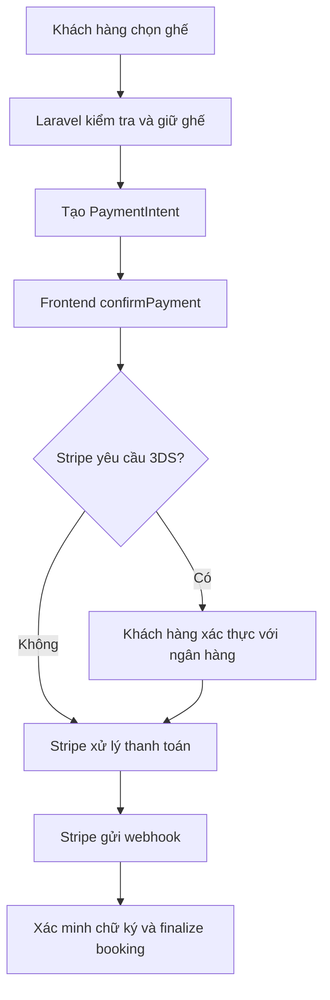

# Hướng dẫn tích hợp Stripe và Webhook cho Laravel

Tài liệu này hướng dẫn lấy và sử dụng ba giá trị thường cần cho ứng dụng Laravel dùng Stripe:

- `STRIPE_KEY`
- `STRIPE_SECRET`
- `STRIPE_WEBHOOK_SECRET`

> Ví dụ dùng Stripe Test mode. Không dùng key test cho production.

## 1. Ba key dùng để làm gì?

| Biến | Ví dụ | Nơi sử dụng | Đưa ra frontend? |
|---|---|---|---|
| `STRIPE_KEY` | `pk_test_...` | Publishable key cho Stripe.js | Có |
| `STRIPE_SECRET` | `sk_test_...` | Backend gọi Stripe API | Không |
| `STRIPE_WEBHOOK_SECRET` | `whsec_...` | Backend xác minh webhook | Không |

`STRIPE_KEY` là publishable key, có thể xuất hiện trong JavaScript frontend. `STRIPE_SECRET` là secret API key để backend tạo/truy vấn PaymentIntent, Customer, Refund... Nếu lộ, người khác có thể gọi Stripe API dưới danh nghĩa tài khoản của bạn.

`STRIPE_WEBHOOK_SECRET` là signing secret dành riêng cho một webhook endpoint. Nó không gọi Stripe API và không phải `sk_test_...`.

## 2. Bật Test mode

1. Truy cập [Stripe Dashboard](https://dashboard.stripe.com/).
2. Đăng nhập hoặc đăng ký tài khoản.
3. Bật **Test mode** trong Dashboard.

Test mode không thu tiền thật và có bộ key riêng. Khi chuyển sang live mode, phải lấy bộ key live mới.

## 3. Lấy STRIPE_KEY và STRIPE_SECRET

Mở [API keys](https://dashboard.stripe.com/test/apikeys) trong Test mode. Copy:

- **Publishable key** bắt đầu bằng `pk_test_`.
- **Secret key** bắt đầu bằng `sk_test_`.

Khai báo trong file `.env` Laravel:

```env
STRIPE_KEY=pk_test_xxxxxxxxxxxxxxxxx
STRIPE_SECRET=sk_test_xxxxxxxxxxxxxxxxx
```

Không copy dấu nháy hoặc khoảng trắng. Không commit `.env` vào Git.

## 4. Cài Stripe CLI trên macOS

Stripe CLI dùng để đăng nhập Stripe và chuyển tiếp webhook về Laravel local.

### Kiểm tra Homebrew

```bash
brew --version
```

Nếu chưa có, cài Homebrew từ [brew.sh](https://brew.sh/), mở Terminal mới rồi kiểm tra lại.

### Cài Stripe CLI

```bash
brew install stripe/stripe-cli/stripe
stripe version
which stripe
```

Nếu `stripe` không được tìm thấy, mở Terminal mới để nạp lại PATH của Homebrew.

### 4.3. Linux và VPS

Stripe CLI có thể chạy trên Ubuntu/Debian, CentOS/RHEL và các Linux phổ biến. Trên VPS, CLI chỉ cần được cài trên máy đang chạy ứng dụng Laravel hoặc trên một máy có thể truy cập được endpoint local. Với VPS đã có domain HTTPS, thường không cần `stripe listen`; hãy tạo webhook endpoint production trong Dashboard.

Trên Ubuntu/Debian, có thể tải bản phát hành phù hợp từ [Stripe CLI releases](https://github.com/stripe/stripe-cli/releases), giải nén rồi đặt binary vào `/usr/local/bin`:

```bash
uname -m
tar -xvf stripe_X.Y.Z_linux_x86_64.tar.gz
sudo install stripe /usr/local/bin/stripe
stripe version
```

Tên file phải khớp kiến trúc máy. Nếu VPS là ARM64, dùng bản `linux_arm64` thay vì `linux_x86_64`. Không chạy CLI bằng tài khoản `root` nếu không cần thiết.

Đăng nhập trên VPS:

```bash
stripe login
stripe listen --forward-to http://127.0.0.1:8000/webhooks/stripe
```

Nếu Laravel chạy trong Docker, `127.0.0.1` có thể trỏ sai container. Hãy dùng tên service/container hoặc port được expose, ví dụ:

```bash
stripe listen --forward-to http://localhost/webhooks/stripe
```

Kiểm tra bằng `curl` hoặc URL thực tế của stack Docker. Không cần mở public port chỉ để nhận webhook khi dùng `stripe listen`; Stripe CLI giữ kết nối outbound và forward event về máy.

### 4.4. Windows

Trên Windows, tải file ZIP phù hợp từ [Stripe CLI releases](https://github.com/stripe/stripe-cli/releases), giải nén, đổi tên binary thành `stripe.exe` nếu cần và thêm thư mục chứa file vào **System Properties → Environment Variables → Path**. Mở PowerShell mới:

```powershell
stripe version
stripe login
stripe listen --forward-to http://127.0.0.1:8000/webhooks/stripe
```

Nếu dùng WSL2, hãy cài Stripe CLI bên trong WSL theo hướng dẫn Linux và chạy lệnh ở terminal WSL. Nếu Laravel chạy trong Windows còn CLI chạy trong WSL, `127.0.0.1` đôi khi phụ thuộc cấu hình mạng; dùng địa chỉ/port mà WSL truy cập được hoặc chạy cả Laravel và CLI trong cùng môi trường.

### 4.5. Bảng lựa chọn theo môi trường

| Môi trường | Cài Stripe CLI | Local webhook |
|---|---|---|
| macOS | Homebrew | `stripe listen --forward-to ...` |
| Linux/VPS local | Binary release hoặc package phù hợp | `stripe listen --forward-to ...` |
| VPS production có HTTPS | Có thể không cần CLI | Dashboard tạo endpoint thật |
| Windows PowerShell | ZIP release và thêm vào PATH | `stripe listen --forward-to ...` |
| Windows + WSL2 | Cài trong WSL | Chạy cùng môi trường hoặc dùng địa chỉ truy cập đúng |

## 5. Đăng nhập Stripe CLI

```bash
stripe login
```

Trình duyệt sẽ mở. Đăng nhập đúng tài khoản Stripe, cấp quyền cho Stripe CLI rồi quay lại Terminal:

```bash
stripe config --list
```

CLI login không tự tạo key trong `.env`; nó chỉ xác thực lệnh `stripe` để nhận/gửi test event.

## 6. Cấu hình Laravel và lấy webhook secret

Trong `config/services.php`:

```php
'stripe' => [
    'key' => env('STRIPE_KEY'),
    'secret' => env('STRIPE_SECRET'),
    'webhook_secret' => env('STRIPE_WEBHOOK_SECRET'),
],
```

Terminal 1, chạy Laravel:

```bash
php artisan serve --host=127.0.0.1 --port=8000
```

Giả sử route là `POST /webhooks/stripe`. Terminal 2:

```bash
stripe listen --forward-to http://127.0.0.1:8000/webhooks/stripe
```

CLI sẽ hiển thị:

```text
Ready! Your webhook signing secret is whsec_...
```

Copy đúng secret đó vào:

```env
STRIPE_WEBHOOK_SECRET=whsec_xxxxxxxxxxxxxxxxx
```

Sau đó:

```bash
php artisan config:clear
```

Giữ cửa sổ `stripe listen` mở khi test. Secret do `stripe listen` cấp thường dành cho local; không dùng nó ở production.

## 7. Mục đích của STRIPE_WEBHOOK_SECRET

Stripe gửi request webhook kèm header `Stripe-Signature`. Laravel dùng `STRIPE_WEBHOOK_SECRET` để:

1. Xác nhận request thật sự do Stripe gửi.
2. Phát hiện payload bị thay đổi.
3. Chống request giả mạo gọi vào endpoint.
4. Chỉ xử lý payment sau khi event hợp lệ.

Ví dụ xác minh bằng Stripe PHP SDK (chỉ tham khảo; ứng dụng hiện tại dùng Laravel HTTP client và verifier riêng):

```php
use Stripe\Exception\SignatureVerificationException;
use Stripe\Webhook;

$payload = $request->getContent(); // raw body
$signature = $request->header('Stripe-Signature');
$secret = config('services.stripe.webhook_secret');

try {
    $event = Webhook::constructEvent($payload, $signature, $secret);
} catch (\UnexpectedValueException|SignatureVerificationException $exception) {
    return response()->json(['message' => 'Invalid webhook'], 400);
}
```

Phải dùng raw body từ `getContent()`; không parse JSON rồi encode lại trước khi xác minh. Không dùng secret giả và không bỏ kiểm tra signature.

### Cách backend của ứng dụng tạo PaymentIntent

Số tiền phải được tính lại ở backend, không tin tổng tiền do frontend gửi lên.

Ứng dụng hiện tại không cài Stripe PHP SDK; `StripePaymentGateway` gọi Stripe REST API bằng Laravel HTTP client. PaymentIntent được tạo trong `POST /user/bookings/{booking}/pay`, sau khi backend khóa booking, tính lại tổng tiền từ booking và tạo một `PaymentAttempt` bất biến.

Backend gửi `amount` từ `booking.amount_minor_units`, `currency` từ booking, metadata của booking và `metadata[attempt_key]`. Cùng `attempt_key` được gửi trong header `Idempotency-Key`, nhờ đó retry cùng một attempt không tạo PaymentIntent thứ hai.

Nếu request có `payment_method_id`, backend tạo và confirm PaymentIntent trong cùng request. Với Payment Element, backend tạo PaymentIntent trước, lưu `client_secret` đã mã hóa ở local rồi frontend dùng secret đó để `confirmPayment`.

### Code webhook dispatch job

```php
public function __invoke(Request $request)
{
    try {
        $event = Webhook::constructEvent(
            $request->getContent(),
            $request->header('Stripe-Signature'),
            config('services.stripe.webhook_secret'),
        );
    } catch (\UnexpectedValueException|SignatureVerificationException $exception) {
        return response()->json(['message' => 'Invalid webhook'], 400);
    }

    if ($event->type === 'payment_intent.succeeded') {
        ProcessSuccessfulPayment::dispatch(
            $event->id,
            $event->data->object->id,
        );
    }

    return response()->json(['received' => true]);
}
```

Route webhook chỉ cần nhận `POST`; xác thực bằng Stripe signature, không dùng CSRF token của trình duyệt:

```php
Route::post('/webhooks/stripe', StripeWebhookController::class);
```

## 8. Flow 3DS và PaymentIntent

### Flowchart tổng quát



### UML sequence diagram

```mermaid
sequenceDiagram
    participant U as User
    participant FE as Frontend
    participant API as Laravel API
    participant S as Stripe
    participant W as Webhook
    U->>FE: Bấm thanh toán
    FE->>API: POST /user/bookings/{id}/pay
    API->>DB: Lock booking, tạo PaymentAttempt
    API->>S: Create PaymentIntent + Idempotency-Key
    S-->>API: PaymentIntent + client_secret
    API-->>FE: Redirect payment-action

## 9. Các invariant sau khi triển khai reliability

### Hết hạn hold

`expires_at` là giới hạn cứng của tài nguyên ghế. Các trạng thái `requires_action`, `requires_payment_method`, `processing` và `unknown` không được giữ ghế vô hạn. Khi hold hết hạn, Laravel chuyển booking sang `expired` và release ghế/combo/coupon reservation. Nếu Stripe báo thanh toán thành công sau đó, backend không phát vé; payment chuyển sang `requires_refund` để xử lý hoàn tiền.

### Refund

HTTP 2xx từ API tạo refund chưa có nghĩa là tiền đã hoàn tất. Chỉ Refund có `status=succeeded` mới được finalize booking, vé và kho. `pending` hoặc `requires_action` giữ payment ở `refunding` và được reconcile định kỳ. `refund.created`, `refund.updated` và `refund.failed` phải được bật trên Stripe webhook endpoint.

### Retry PaymentIntent

Mỗi `PaymentAttempt` có một idempotency key bất biến. Các provider payment ID của những attempt trước được lưu lại và webhook có thể tìm payment qua cả payment hiện tại lẫn các attempt cũ. Reconciliation phải xử lý mọi attempt còn khả năng thành công; không được bỏ qua PaymentIntent cũ chỉ vì một retry mới đã được tạo.

### Inventory và coupon

Idempotency của request booking khác với idempotency của inventory ledger. Lịch sử hợp lệ `0→1→0→1` phải tạo được ba movement riêng. Coupon capacity được kiểm tra trong transaction có lock trên coupon; release/redeem phải cập nhật reservation và counter cùng transaction.

### Queue và scheduler

Local có thể dùng `composer run dev` để chạy app, Vite, queue, scheduler và Stripe CLI. Production cần process quản lý riêng cho queue worker và `schedule:run` mỗi phút. Các job refund retry/reconcile phải được schedule; không phụ thuộc thao tác thủ công.

### Kiểm thử tối thiểu

- Hai request đồng thời lấy ghế cuối hoặc combo cuối.
- Apply/release/redeem coupon đồng thời.
- 3DS bị bỏ dở và hold hết hạn.
- Provider success đến sau khi hold đã release.
- Refund trả về `pending`, sau đó `succeeded` hoặc `failed`.
- Retry payment sau timeout và webhook của PaymentIntent cũ.
- Add/remove/add lại cùng một combo.

Browser E2E cần chạy trong môi trường có Playwright hoặc Laravel Dusk, có database test, app server, Vite build và Stripe test configuration. Repository hiện chưa cài browser runner; các test backend/HTTP contract không thay thế hoàn toàn kiểm thử trình duyệt thật cho 3DS redirect.
    FE->>S: confirmPayment
    S-->>U: 3DS nếu cần
    S->>W: payment_intent.succeeded
    W->>W: Verify signature và deduplicate
    W-->>API: Dispatch finalize job
```

### Code frontend xác nhận PaymentIntent

```js
const stripe = Stripe(import.meta.env.VITE_STRIPE_KEY);
const response = await fetch('/checkout/payment-intent', { method: 'POST' });
const { client_secret: clientSecret } = await response.json();

const result = await stripe.confirmPayment({
    clientSecret,
    confirmParams: { return_url: `${location.origin}/checkout/result` },
    redirect: 'if_required',
});

if (result.error) console.error(result.error.message);
```

Frontend chỉ hiển thị kết quả tạm thời; không tự đánh dấu booking đã thanh toán.

### 3DS là gì?

3DS là viết tắt của **3-D Secure**, một lớp xác thực bổ sung cho thanh toán thẻ trực tuyến. Khi ngân hàng phát hành thẻ đánh giá giao dịch cần xác thực, khách hàng có thể phải nhập OTP, xác nhận trong ứng dụng ngân hàng, dùng sinh trắc học hoặc hoàn tất màn hình xác thực của ngân hàng.

3DS không phải là một loại key và không cần cài phần mềm riêng trên máy chủ. Stripe.js và Stripe PaymentIntent phối hợp với Stripe để thực hiện bước xác thực.

Trong flow kỹ thuật, PaymentIntent có thể chuyển sang trạng thái `requires_action`. Frontend phải gọi `confirmPayment` hoặc flow xác nhận tương ứng để hiển thị bước 3DS. Sau khi người dùng hoàn tất, PaymentIntent có thể thành công hoặc thất bại. Backend vẫn phải xác nhận kết quả cuối cùng bằng webhook hoặc truy vấn lại Stripe.

Không phải giao dịch nào cũng hiển thị màn hình 3DS. Stripe và ngân hàng có thể áp dụng **frictionless flow**, tức xác thực nền và người dùng không cần nhập thêm thông tin.

Flow khuyến nghị cho booking:

```text
Laravel tạo PaymentIntent
  -> Frontend confirmPayment bằng Stripe.js
  -> Stripe yêu cầu 3DS nếu cần
  -> Người dùng hoàn tất xác thực
  -> Stripe gửi payment_intent.succeeded
  -> Laravel xác minh webhook
  -> Finalize booking trong transaction
```

Event thường cần xử lý:

```text
payment_intent.succeeded
payment_intent.payment_failed
payment_intent.canceled
payment_intent.requires_action
```

`requires_payment_method` là trạng thái PaymentIntent, không phải event webhook mà ứng dụng cần đăng ký. Ứng dụng nhận trạng thái này từ response tạo/retrieve PaymentIntent và lưu thành `requires_payment_method`. Event webhook không thuộc danh sách trên được lưu là ignored và không tạo orphan retry.

Không nên finalize booking chỉ vì frontend báo thành công. Người dùng có thể đóng trình duyệt hoặc callback bị gián đoạn. Backend nên dựa vào webhook, hoặc truy vấn lại PaymentIntent từ Stripe trước khi xác nhận.

## 9. Queue và kiểm thử

Nếu webhook dispatch job, mở Terminal 3:

```bash
php artisan queue:work database --tries=3
```

Gửi event mẫu:

```bash
stripe trigger payment_intent.succeeded
tail -f storage/logs/laravel.log
```

Webhook nên trả HTTP `2xx` nhanh; xử lý nặng trong queue. Ứng dụng lưu `provider + event.id`, payload và `provider_payment_id`; job xử lý với transaction/row lock để một event không finalize booking hai lần.

Các invariant backend cần giữ:

```text
- Chỉ payment_intent.succeeded có amount_received, currency và metadata khớp mới có thể finalize.
- Payment succeeded bắt buộc có provider_payment_id.
- Booking chỉ chuyển confirmed sau khi payment succeeded và seat hold còn hợp lệ.
- Payment thành công sau khi hold hết hạn chuyển requires_refund, không phát hành vé.
- Timeout provider chuyển sang reconciliation; không charge lại cùng attempt.
- Refund Unknown được retry với idempotency key ổn định và finalize local một cách idempotent.
```

Chạy test trong repository:

```bash
php artisan test --compact tests/Feature/BookingPaymentReliabilityTest.php
php artisan test --compact
```

Bộ test hiện bao phủ provider timeout, attempt recovery, Stripe idempotency key, Payment Element client secret, reconciliation mismatch/deadline, webhook signature/JSON/orphan/duplicate ordering và finalize sau expiry. Cần thực hiện thêm một vòng staging với Stripe Test mode cho success, decline và 3DS trước khi bật live mode.

## 10. Production webhook

Local dùng `stripe listen`. Production cần endpoint HTTPS thật:

1. Mở [Workbench Webhooks](https://dashboard.stripe.com/webhooks).
2. Chọn đúng Test mode hoặc Live mode.
3. Chọn **Add endpoint**.
4. Nhập, ví dụ: `https://example.com/webhooks/stripe`.
5. Chọn event cần nhận và tạo endpoint.
6. Chọn endpoint, bấm **Reveal signing secret**.
7. Đặt secret production vào secret manager hoặc `.env`.

Ví dụ live:

```env
STRIPE_KEY=pk_live_xxxxxxxxxxxxxxxxx
STRIPE_SECRET=sk_live_xxxxxxxxxxxxxxxxx
STRIPE_WEBHOOK_SECRET=whsec_xxxxxxxxxxxxxxxxx
```

Mỗi endpoint có signing secret riêng. Không dùng secret local cho production.

## 11. Checklist

```text
[ ] Test mode đang bật khi phát triển
[ ] STRIPE_KEY bắt đầu bằng pk_test_
[ ] STRIPE_SECRET bắt đầu bằng sk_test_
[ ] stripe version chạy được
[ ] Đã chạy stripe login
[ ] stripe listen forward đúng URL
[ ] STRIPE_WEBHOOK_SECRET bắt đầu bằng whsec_
[ ] Đã chạy php artisan config:clear
[ ] Webhook xác minh chữ ký bằng raw body
[ ] Queue worker đang chạy
[ ] Đã test succeeded, failed và 3DS
[ ] Đã kiểm tra payment thành công sau khi hold hết hạn phải vào requires_refund
[ ] Đã kiểm tra provider timeout không tạo charge/PaymentIntent lặp
[ ] Đã có quy trình manual reconciliation cho orphan PaymentIntent/refund
[ ] Đã tách key test/live
```

## 12. Chạy toàn bộ môi trường development

Laravel `artisan dev` đã chạy web server, Vite, queue worker và scheduler. Repository này đã thêm Stripe CLI vào cùng process group, vì vậy chỉ cần:

```bash
composer run dev
```

Lệnh trên tương đương với việc chạy đồng thời:

```text
php artisan dev
npm run dev:stripe
```

Trong đó `npm run dev:stripe` chạy `stripe listen --forward-to http://127.0.0.1:8000/webhooks/stripe`. Khi process dừng, cả app stack và Stripe listener dừng cùng nhau. Nếu báo `stripe: command not found`, hãy cài Stripe CLI; nếu báo cần đăng nhập, chạy `stripe login`. Secret được Stripe CLI in ra phải được đặt vào `STRIPE_WEBHOOK_SECRET` trong `.env`, rồi khởi động lại `composer run dev`.

Nếu chỉ cần frontend/backend mà không test thanh toán webhook, chạy riêng:

```bash
php artisan dev
```

### Tóm tắt lệnh Stripe

```bash
brew install stripe/stripe-cli/stripe
stripe version
stripe login
stripe listen --forward-to http://127.0.0.1:8000/webhooks/stripe
php artisan config:clear
php artisan queue:work database --tries=3
stripe trigger payment_intent.succeeded
```

## 13. Kết quả rà soát backend hiện tại

Tại thời điểm cập nhật tài liệu, payment flow đã có các lớp bảo vệ nền tảng: số tiền được tính ở server bằng minor units, PaymentIntent có idempotency key theo attempt, webhook dùng raw body và signature, event được deduplicate, xử lý bất đồng bộ, reconciliation kiểm tra lại amount/currency/booking metadata, và finalization có transaction cùng lock booking/seat.

Đây chưa phải cam kết “đã sẵn sàng production” tuyệt đối. Rủi ro còn lại cần xử lý trước khi coi là hoàn tất vận hành: khi người dùng retry sau một PaymentIntent cũ, provider có thể vẫn giữ intent cũ. Webhook của intent cũ được lưu orphan nếu provider ID đã bị thay thế; hệ thống hiện yêu cầu manual reconciliation/refund, chưa tự động hủy hoặc hoàn tiền orphan. Không được bỏ qua queue worker, reconciliation scheduler, cảnh báo stuck payment và quy trình xử lý thủ công này.

## Tài liệu chính thức

- [Stripe API keys](https://docs.stripe.com/keys)
- [Stripe CLI](https://docs.stripe.com/cli)
- [Webhook quickstart](https://docs.stripe.com/webhooks/quickstart)
- [Webhook signature verification](https://docs.stripe.com/webhooks/signature)
- [3D Secure authentication](https://docs.stripe.com/payments/3d-secure/authentication-flow)
- [Stripe testing](https://docs.stripe.com/testing)
