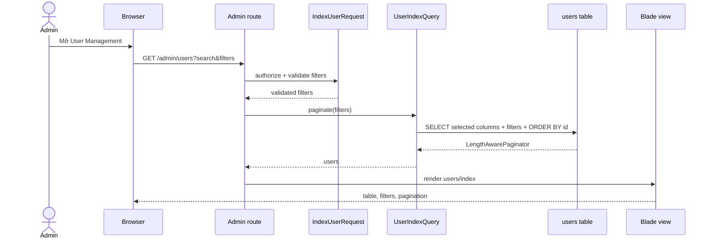
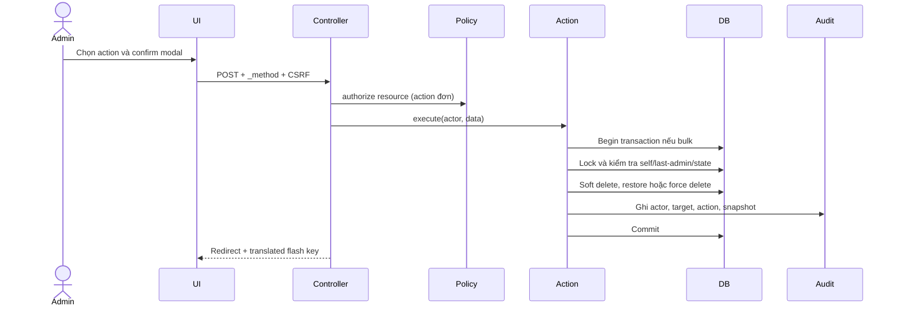
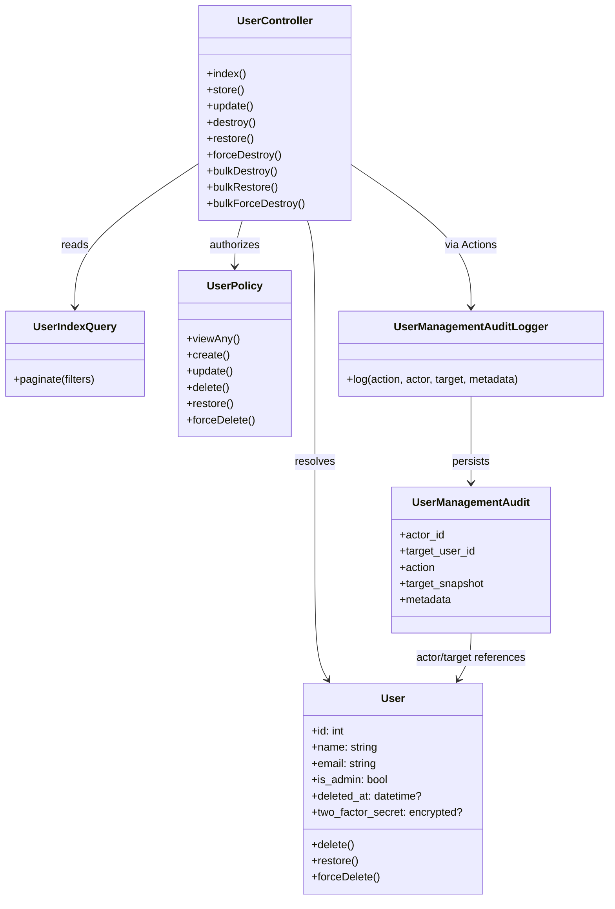
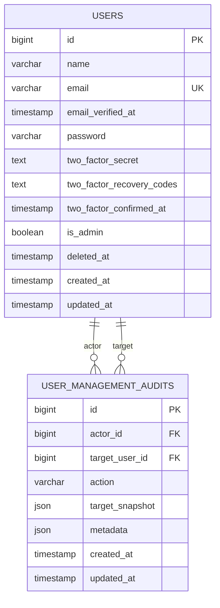

# Admin User Management

## 1. Mục tiêu và phạm vi

Tính năng này cung cấp một module quản lý user dành cho administrator:

- danh sách có phân trang, tìm kiếm và filter;
- tạo, chỉnh sửa và thay đổi quyền admin;
- soft delete, restore và force delete;
- bulk action tối đa 100 user mỗi lần;
- audit log cho các thao tác quản trị;
- 2FA secret/recovery code không xuất hiện khi serialize model;
- giao diện Blade responsive, hỗ trợ tiếng Anh và tiếng Việt.

Module hiện là một modular monolith trong Laravel. Mỗi boundary được tách theo trách nhiệm nhưng vẫn dùng chung transaction, model và database của ứng dụng.

## 2. Nguyên tắc kiến trúc

### Single responsibility

- Controller nhận request, authorize ở boundary và điều phối response.
- Form Request validate input và trạng thái dữ liệu đầu vào.
- Query object xây dựng read model cho danh sách.
- Action class thực hiện một use case ghi dữ liệu.
- Policy kiểm tra quyền trên resource.
- Audit logger ghi lại hành động quản trị.
- Blade component chỉ chịu trách nhiệm trình bày.
- JavaScript module chỉ điều khiển tương tác UI tương ứng.

### Defense in depth

Quyền được kiểm tra ở nhiều lớp:

1. route group yêu cầu `auth` và `can:manage-users`;
2. Form Request kiểm tra actor và dữ liệu;
3. Controller gọi Policy cho action đơn;
4. Action kiểm tra invariant quan trọng như không tự xóa và luôn giữ admin cuối;
5. database transaction khóa bản ghi liên quan bằng `lockForUpdate()`.

Không coi UI là lớp bảo mật. Checkbox và dropdown chỉ là tiện ích; request giả lập vẫn phải bị validate và authorize ở backend.

## 3. Cấu trúc thư mục

```text
app/
├── Actions/
│   └── Admin/
│       ├── CreateUser.php
│       ├── UpdateUser.php
│       ├── DeleteUser.php
│       ├── DeleteUsers.php
│       ├── RestoreUser.php
│       ├── RestoreUsers.php
│       ├── ForceDeleteUser.php
│       └── ForceDeleteUsers.php
├── Http/
│   ├── Controllers/Admin/UserController.php
│   └── Requests/Admin/
│       ├── IndexUserRequest.php
│       ├── StoreUserRequest.php
│       ├── UpdateUserRequest.php
│       ├── BulkDeleteUsersRequest.php
│       ├── BulkRestoreUsersRequest.php
│       └── BulkForceDeleteUsersRequest.php
├── Models/
│   ├── User.php
│   └── UserManagementAudit.php
├── Policies/UserPolicy.php
├── Queries/Admin/UserIndexQuery.php
└── Support/Audit/UserManagementAuditLogger.php

database/
├── migrations/
│   ├── *_add_is_admin_to_users_table.php
│   ├── *_add_deleted_at_to_users_table.php
│   ├── *_add_user_management_indexes.php
│   └── *_create_user_management_audits_table.php
└── seeders/DatabaseSeeder.php

resources/
├── js/
│   └── modules/
│       ├── common.js
│       ├── admin-shell.js
│       ├── language-menus.js
│       └── user-selection.js
├── css/app.css
└── views/
    ├── admin/users/
    └── components/admin/

tests/Feature/Admin/UserManagementTest.php
```

## 4. Route và middleware flow

`bootstrap/app.php` load `routes/admin.php` với các middleware:

```text
HTTP request
    │
    ├── web: session, CSRF, locale
    ├── auth: user phải đăng nhập
    └── can:manage-users: user phải là administrator
             │
             ├── GET /admin/users       -> index + UserIndexQuery
             ├── POST /admin/users      -> StoreUserRequest + CreateUser
             ├── PUT /admin/users/{id} -> UpdateUserRequest + UpdateUser
             ├── DELETE /admin/users/{id} -> Policy + DeleteUser
             ├── PATCH /admin/users/{id}/restore -> Policy + RestoreUser
             └── DELETE /admin/users/{id}/force-delete -> Policy + ForceDeleteUser
```

Login cũng dùng role-aware redirect: administrator đi tới `admin.dashboard`, user thường đi tới `user.dashboard`. Không dùng một static home path cho cả hai role vì điều đó có thể đưa user thường vào admin route và tạo 403 sau khi login thành công.

Các bulk endpoint sử dụng request riêng theo lifecycle state, tránh việc một request hợp lệ ở action này lại được chấp nhận ở action khác.

## 5. Read flow: danh sách user



### Query rules

- Chỉ select các column cần cho table.
- `active`: dùng global SoftDeletes scope.
- `deleted`: dùng `onlyTrashed()`.
- `all`: dùng `withTrashed()`.
- page size chỉ nhận 15, 30 hoặc 50.
- thứ tự ổn định theo `id DESC`.
- search `%term%` dễ dùng nhưng không tận dụng B-tree index ở đầu chuỗi; khi dữ liệu lớn phải chuyển sang full-text/trigram tùy database.

## 6. Mutation flow



Bulk action không tin vào số lượng checkbox từ browser. Backend giới hạn tối đa 100 ID, distinct, integer và tồn tại đúng trạng thái lifecycle.

## 7. UML domain/component



## 8. Database model



Indexes hiện có hoặc được bổ sung:

- `users.email` unique;
- `users.is_admin` index;
- `users.deleted_at, users.id` composite index;
- `user_management_audits.action, created_at`;
- `user_management_audits.target_user_id, created_at`.

Không nên thêm index cho mọi filter vì `boolean` và nullable columns có độ phân biệt thấp. Luôn xác nhận bằng `EXPLAIN` trên database thật.

## 9. Lifecycle và edge cases

### Không được tự xóa

Actor không thể soft delete hoặc force delete chính mình. UI ẩn action xóa và disable checkbox bulk của active account hiện tại; backend vẫn là source of truth để chặn cả request thủ công.

### Không được xóa admin cuối cùng

Delete, force delete và demote đều phải giữ lại ít nhất một administrator. Invariant được thực thi tại một boundary duy nhất là `LastAdministratorGuard` bên trong transaction của Action; Policy/Request chỉ xử lý authorization và input contract, UI chỉ phản ánh UX.

### Bulk chứa trạng thái sai

Bulk delete chỉ nhận active user. Bulk restore và force delete chỉ nhận trashed user. Nếu request bị sửa thủ công, validation trả lỗi thay vì silently no-op.

### User bị thay đổi đồng thời

Bulk mutation dùng transaction, row lock và retry tối đa 3 lần cho deadlock transient. Test concurrency production-like nên chạy trên MySQL/InnoDB vì SQLite không mô phỏng đúng row lock.

### Force delete

Force delete không thể hoàn tác. Chỉ nên hiển thị trong deleted view, ghi audit và nên có retention/approval policy ở production.

### Email trùng khi restore

Email đang unique trên toàn bảng. Vì vậy restore user có thể thất bại nếu email đã được user khác sử dụng trong thời gian bản ghi bị xóa. UI cần hiển thị validation error rõ ràng và không nuốt exception.

### Chọn tất cả

Checkbox all chỉ chọn các dòng của trang hiện tại. Không được hiểu là toàn bộ kết quả filter. Nếu cần select-all toàn bộ result set, phải có bước xác nhận riêng và cơ chế server-side selection.

### Audit target bị force delete

Audit lưu snapshot trước khi force delete và foreign key dùng `nullOnDelete()`, vì vậy lịch sử vẫn tồn tại dù target user bị xóa vĩnh viễn.

### 2FA data

Secret và recovery codes phải được mã hóa theo Fortify, không mass assign, không serialize và không log. Secret chỉ xuất hiện trong bước setup đang chờ confirm sau password confirmation; sau khi confirm không render lại secret. Recovery codes chỉ hiển thị ở flow Fortify tương ứng và cần được coi là dữ liệu nhạy cảm.

## 10. UI/accessibility checklist

- Modal có đủ header/title, body/description và footer/actions.
- Nội dung modal thay đổi theo delete, restore hoặc force delete.
- Destructive action dùng màu đỏ; restore dùng action trung tính/success.
- Icon-only button có `title` và `aria-label`.
- Checkbox có radius nhẹ, cursor pointer và select-all có trạng thái indeterminate.
- Dropdown có khoảng cách, shadow, width cố định và không làm rớt dòng label.
- Sidebar có scrollbar mỏng, header/sidebar sticky và mobile backdrop.
- Escape đóng modal/sidebar/dropdown.
- Modal không tự động focus nút X hoặc nút xác nhận khi mở; Escape đóng modal, focus trap vẫn bảo vệ vòng Tab, và focus được trả về trigger sau khi đóng.
- Không dùng text hard-code trong Blade/JS; mọi label cần đi qua locale.

## 11. Testing strategy

### Feature tests

Đã có coverage cho:

- guest redirect;
- non-admin forbidden;
- list/search/pagination;
- create/update;
- self-delete và last-admin invariant;
- soft delete/restore/force delete;
- bulk lifecycle actions;
- audit record;
- 2FA secrets không xuất hiện khi serialize.

### Cần chạy trong CI

```bash
php artisan test --compact
vendor/bin/pint --dirty --format agent
npm run build
```

### Trạng thái coverage hiện tại

- query count regression test và EXPLAIN benchmark đã được bổ sung/chạy trên MySQL dataset lớn;
- concurrency/deadlock retry đã được kiểm thử ở mức Action; concurrency production-like cần chạy trong CI trên MySQL/InnoDB;
- browser test cho modal, bulk dropdown, select-all và mobile sidebar vẫn là lớp kiểm thử nên bổ sung khi có browser runner;
- focus trap, keyboard Escape, initial focus vào confirm và focus return đã được triển khai trong module modal; cần kiểm tra lại bằng browser/assistive technology trong CI.

## 12. Seeder và môi trường

Seeder tạo tối đa 10.000 non-admin users để benchmark pagination/search. Admin credentials không được hard-code trong production.

```env
SEED_ADMIN_EMAIL=admin@example.test
SEED_ADMIN_PASSWORD=change-me-before-running
```

Ngoài `local` và `testing`, seeder từ chối chạy nếu hai biến này không được khai báo. Trong production nên dùng account bootstrap riêng, secret manager và bắt buộc đổi password lần đầu.

## 13. Bài học rút ra

1. Tách module sớm giúp `app.js`, controller và Blade page không phình nhanh.
2. Soft delete không chỉ là thêm trait; phải định nghĩa rõ active/deleted/all, restore và force-delete semantics.
3. Bulk request phải validate theo trạng thái nghiệp vụ, không chỉ validate ID tồn tại.
4. Policy, Form Request và Action có vai trò khác nhau; không nên dồn toàn bộ authorization vào UI hoặc controller.
5. Query “đúng” chưa chắc query “nhanh”; phải kiểm tra query plan trên dữ liệu thật.
6. Dữ liệu 2FA cần được xem là secret ngay từ model serialization và logging.
7. Confirm modal phải mô tả đúng action; dùng chung một modal không có nghĩa dùng chung nội dung.
8. Audit log và retention nên được thiết kế cùng lifecycle, không đợi đến khi đã có force delete.
9. UI compact phải đi cùng accessibility; icon nhỏ, button lớn và thiếu label đều làm giảm khả năng sử dụng.

## 14. Giới hạn xác minh hiện tại

Trong môi trường phát triển hiện tại không có PHP CLI nên chưa thể chạy trực tiếp Artisan, Pint, Pest hoặc EXPLAIN database. Frontend có thể xác minh bằng `npm run build`; backend cần chạy các lệnh CI ở trên trong môi trường có PHP và database sau khi migrate.

## 15. Vì sao dùng model scope và enum?

### Model scope

Quy tắc administrator được dùng ở nhiều nơi: policy, seeder, filter, bulk action và báo cáo. Viết lặp:

```php
User::where('is_admin', true)
```

dễ tạo ra các biến thể sai, ví dụ một chỗ quên `withTrashed()` hoặc dùng giá trị boolean khác. Scope gom ý nghĩa nghiệp vụ vào model:

```php
User::query()->administrators()->count();
User::withTrashed()->administrators()->count();
```

`withTrashed()` vẫn được gọi ở nơi cần bao gồm user đã xóa; scope chỉ mô tả “là administrator”, không tự quyết định lifecycle. Đây là ranh giới quan trọng để scope không che giấu điều kiện query.

Các scope `verified`, `unverified`, `twoFactorEnabled` và `twoFactorDisabled` cũng làm filter dễ đọc hơn. Nếu sau này quy tắc thay đổi, ví dụ 2FA phải vừa có secret vừa có `confirmed_at`, chỉ cần sửa một scope.

### Backed enum

Các giá trị `active`, `deleted`, `admin`, `verified` là một finite state set, không phải chuỗi tùy ý. Enum được dùng trong validation và Query Object:

```php
Rule::enum(UserStatus::class)

$status = UserStatus::tryFrom($filters['status'] ?? '') ?? UserStatus::Active;
```

Lợi ích:

- tránh typo giữa request, query và Blade;
- có fallback rõ ràng;
- IDE/static analysis hiểu được các branch;
- thêm state mới có một nơi để cập nhật.

Không nên dùng enum cho dữ liệu tự do như tên, email hoặc search term.

## 16. `refresh()` là gì và khi nào cần?

`$user->refresh()` tải lại chính model từ database và thay thế trạng thái trong memory bằng dữ liệu hiện tại. Nó không tạo bản ghi mới và không lưu dữ liệu; nó là thao tác đọc lại.

Trong `UpdateUser`, thao tác này hữu ích vì:

1. update có thể cập nhật `updated_at`;
2. model event/observer có thể thay đổi attribute;
3. cast như password/date có thể có giá trị khác với input;
4. caller nhận được snapshot giống database sau khi ghi.

Ví dụ:

```php
$user->update($data);
$user->refresh();
return $user;
```

Không cần gọi `refresh()` nếu action không trả model cho caller hoặc model chắc chắn không được dùng tiếp. Với update hiện tại, refresh giúp contract của Action rõ ràng hơn.

## 17. `lockForUpdate()` và transaction

`lockForUpdate()` chỉ có ý nghĩa bên trong transaction. Nó yêu cầu database khóa các row đã đọc cho đến khi transaction commit/rollback.

### Khi cần lock

Lock được dùng khi một quyết định phụ thuộc vào dữ liệu vừa đọc và dữ liệu đó không được thay đổi bởi request khác trong khoảng thời gian kiểm tra:

```php
DB::transaction(function () use ($userIds): void {
    $users = User::query()
        ->whereKey($userIds)
        ->lockForUpdate()
        ->get();

    // kiểm tra self/last-admin rồi mới delete
});
```

Nếu không lock, hai admin có thể cùng đọc thấy “còn 2 admin”, sau đó mỗi người xóa một admin và kết quả còn 0 admin. Đây là race condition kiểu check-then-act.

### Khi không cần lock

Không dùng lock cho:

- trang list read-only;
- search/pagination;
- query thống kê không bảo vệ invariant;
- dữ liệu không bị thay đổi trong transaction hiện tại.

Lock quá rộng làm giảm concurrency và tăng nguy cơ deadlock. Vì vậy code chỉ lock target rows và administrator rows trong các bulk lifecycle mutation.

### Lưu ý production

- cần dùng database engine hỗ trợ row-level lock;
- transaction phải ngắn;
- các transaction tương tự nên lock theo cùng thứ tự;
- nên retry khi database báo deadlock;
- cần kiểm thử concurrency trên database thật.

## 18. Vì sao 2FA fields phải hidden?

```php
#[Hidden([
    'two_factor_secret',
    'two_factor_recovery_codes',
])]
```

`two_factor_secret` là khóa tạo mã TOTP. `two_factor_recovery_codes` là các mã dự phòng để vượt qua bước TOTP. Người có một trong hai dữ liệu này có thể vượt qua hoặc làm suy yếu bảo vệ 2FA.

Hidden không xóa dữ liệu và không ngăn Fortify sử dụng model trong authentication. Nó chỉ ngăn các đường serialize thông thường như:

```php
return response()->json($user);
Log::info('user', $user->toArray());
```

Những dữ liệu này vẫn cần được:

- encrypt khi lưu;
- loại khỏi API resource/audit snapshot;
- loại khỏi debug dump và log;
- không mass assign từ request;
- chỉ hiển thị manual key trong bước setup cần thiết;
- bảo vệ bằng password confirmation nếu hiển thị lại.

Đây là lý do audit snapshot chỉ chứa `id`, `name`, `email`, `is_admin`, `deleted_at`, không dùng `$user->toArray()` toàn bộ.

## 19. Business invariant và code tương ứng

| Invariant | Nơi bảo vệ | Lý do |
|---|---|---|
| Guest không truy cập admin | `auth` middleware | Chặn request chưa đăng nhập |
| User thường không truy cập admin | `can:manage-users` | Chặn ở route boundary |
| Không tự xóa | Policy + bulk Action | UI có thể bị bypass |
| Luôn còn admin | Policy, Request, transaction Action | Chống mất quyền quản trị |
| Delete có thể restore | `SoftDeletes` + `onlyTrashed` | Phân biệt lifecycle |
| Force delete không khôi phục | Policy + audit snapshot | Giảm rủi ro thao tác không thể đảo ngược |
| Bulk tối đa 100 records | Form Request | Giới hạn lock time và payload |
| Bulk đúng state | request riêng | Tránh silently no-op |
| Secret không serialize | model `Hidden` | Giảm accidental disclosure |

Khi thêm action mới, cần xác định action đó làm thay đổi invariant nào và đặt kiểm tra ở cả boundary phù hợp lẫn use-case Action.

## 20. Review/test đề xuất tiếp theo

Các test hiện tại đã bao phủ các regression chính. Nên bổ sung thêm:

```php
it('keeps filters when moving through pagination', ...);
it('does not expose two factor fields in an API response', ...);
it('does not delete the last administrator under concurrent requests', ...);
it('retries a deadlock during bulk mutation', ...);
```

Với query performance, test không nên chỉ assert kết quả. Nên có benchmark/EXPLAIN riêng theo database:

```sql
EXPLAIN SELECT id, name, email
FROM users
WHERE deleted_at IS NULL
ORDER BY id DESC
LIMIT 15;
```

Search `%term%` vẫn là điểm cần nâng cấp khi dữ liệu tăng mạnh. Chọn FULLTEXT, trigram hoặc prefix search theo driver thực tế, không đưa một giải pháp database-specific vào model chung nếu ứng dụng còn hỗ trợ nhiều driver.

## 21. Quy ước khi mở rộng module

Khi thêm một filter mới:

1. tạo backed enum nếu giá trị thuộc tập hữu hạn;
2. thêm key ở cả `lang/en` và `lang/vi`;
3. thêm rule trong Form Request;
4. thêm scope nếu đó là quy tắc query có tên nghiệp vụ;
5. dùng enum trong Query Object thay vì so sánh string rải rác;
6. thêm feature test cho giá trị hợp lệ, giá trị sai và kết hợp filter;
7. cập nhật bảng invariant/edge case trong tài liệu.

Khi thêm mutation có lock:

1. viết rõ invariant mà lock đang bảo vệ;
2. xác định row nào cần lock và lock theo thứ tự ổn định;
3. giữ transaction ngắn;
4. ghi audit sau khi state change thành công;
5. thêm test cạnh tranh hoặc ít nhất test rollback;
6. không dùng `lockForUpdate()` cho read-only query.

## 22. Trạng thái implementation hiện tại

Các nguyên tắc dưới đây là source of truth cho code hiện tại:

- Input create/update đi qua `AdminUserData`; không truyền array trực tiếp vào Admin Action.
- Last-admin invariant được thực thi tại `LastAdministratorGuard` trong transaction Action. Policy chỉ chịu trách nhiệm authorization/self-target; Request không được dùng query count để quyết định invariant.
- `DeleteUserRequest`, `RestoreUserRequest` và `ForceDeleteUserRequest` tách riêng contract của mutation đơn.
- Restore đơn re-query target bằng `onlyTrashed()->lockForUpdate()` để không dùng model stale.
- Mọi admin mutation transaction có retry 3 lần cho deadlock transient.
- Bulk Action lock target, kiểm tra lại số lượng record sau validation và reject stale lifecycle state thay vì silently no-op.
- Bulk audit select đầy đủ snapshot fields trước khi gọi một lần `insert()`.

Ví dụ boundary đúng:

```php
public function update(
    UpdateUserRequest $request,
    User $user,
    UpdateUser $updateUser,
): RedirectResponse {
    $updateUser->execute(
        $user,
        AdminUserData::fromArray($request->validated()),
        $request->user(),
    );

    return to_route('admin.users.index');
}
```

## 23. MySQL search strategy

MySQL hiện tại là `8.0.33`, bảng `users` có khoảng 10.000 record. Migration `add_users_name_email_fulltext_index` tạo:

```sql
FULLTEXT KEY users_name_email_fulltext (name, email)
```

Search token được chuẩn hóa trước khi tạo Boolean query:

```php
$tokens = preg_split('/[^\p{L}\p{N}]+/u', mb_strtolower($search), -1, PREG_SPLIT_NO_EMPTY) ?: [];
$tokens = array_values(array_filter(
    $tokens,
    fn (string $token): bool => mb_strlen($token) >= 3,
));

$query->whereFullText(
    ['name', 'email'],
    implode(' ', array_map(fn (string $token): string => '+'.$token.'*', $tokens)),
    ['mode' => 'boolean'],
);
```

Boolean mode được chọn vì natural-language mode từng match quá rộng với token phổ biến như `example` và `com`. Token ngắn fallback về `LIKE` vì InnoDB mặc định không index token dưới 3 ký tự.

`EXPLAIN` phải cho thấy `type = fulltext` và key `users_name_email_fulltext`. Nếu dataset tăng mạnh, cần kiểm tra lại stopword/min-token configuration và cân nhắc search engine nếu cần substring search.

## 24. Concurrency verification

Test [UserManagementConcurrencyTest.php](../tests/Feature/Admin/UserManagementConcurrencyTest.php) chỉ chạy khi có MySQL/PostgreSQL, `pcntl` và bật flag:

```bash
RUN_CONCURRENCY_TESTS=true php artisan test --filter=concurrent
```

SQLite local skip có chủ đích. Khi chạy CI production-like, test phải chứng minh hai destructive request đồng thời không làm số admin active giảm xuống dưới một.
